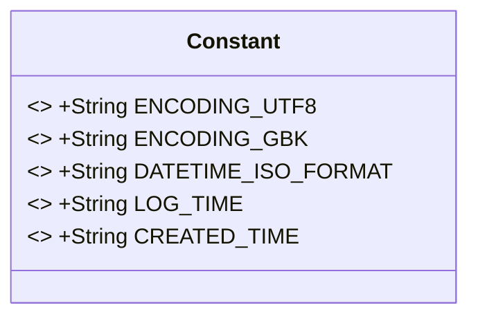
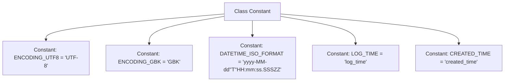

# Basic Information

|      |      |
|------|------|
| Name | Constant |
| Language | .java |
| Code Path | WeFe/common/java/common-lang/src/main/java/com/welab/wefe/common/constant/Constant.java |
| Package Name | com.welab.wefe.common.constant |
| Dependencies | [] |
| Brief Description | Java constant class, defining common encoding formats (UTF-8, GBK), date-time formats, and log time field names. |

# Description

The code defines a public class named Constant, which contains multiple static constant string fields. Among them, ENCODING_UTF8 and ENCODING_GBK represent UTF-8 and GBK encoding formats respectively, while DATETIME_ISO_FORMAT defines the ISO standard datetime format. Additionally, it includes two log-related time field name constants: LOG_TIME and CREATED_TIME. All fields are modified with public static final, indicating globally immutable constant values.

# Class Summary

| Name   | Type  | Description |
|-------|------|-------------|
| Constant | class | Java Constant Class Definition: Includes UTF-8, GBK encoded strings, ISO time format, and field names for log time and creation time. |

## Class Constant

|      |      |
|------|------|
| Access Modifier | public |
| Type | class |
| Name | Constant |
| Description | Java Constant Class Definition: Includes UTF-8, GBK encoded strings, ISO time format, and field names for log time and creation time. |

### UML Class Diagram

This class diagram illustrates a utility class named Constant, which defines five public static constant fields, all marked as final to ensure immutability. These constants include character encoding types (UTF-8 and GBK), a datetime format standard (ISO format), and two timestamp field names (log_time and created_time). As a typical constants container, the class contains no methods and is primarily used to centrally manage fixed string values in the system, ensuring unified handling of magic values and type safety across the codebase. All fields are at the public access level, allowing global direct reference.

### Internal Method Call Graph

This flowchart illustrates the structure of the Constant class, containing 5 static constant definitions. ENCODING_UTF8 and ENCODING_GBK define character encoding formats, DATETIME_ISO_FORMAT specifies the ISO standard datetime format (note the nested quotes handling), while LOG_TIME and CREATED_TIME serve as timestamp field identifiers. All constants are of public static final type, complying with utility class constant design conventions.

### Field List

| Name  | Type  | Description |
|-------|-------|------|
| DATETIME_ISO_FORMAT = "yyyy-MM-dd'T'HH:mm:ss.SSSZZ" | String | Define ISO standard datetime format constants in the format of year-month-dayThour:minute:second.millisecond timezone. |
| ENCODING_UTF8 = "UTF-8" | String | Define a public static constant string with UTF-8 encoding. |
| CREATED_TIME = "created_time" | String | Define the constant string CREATED_TIME with the value "created_time". |
| LOG_TIME = "log_time" | String | Define the static constant LOG_TIME with the value "log_time". |
| ENCODING_GBK = "GBK" | String | Define a static constant ENCODING_GBK with the value "GBK", representing the GBK encoding format. |

### Method List

| Name  | Type  | Description |
|-------|-------|------|

