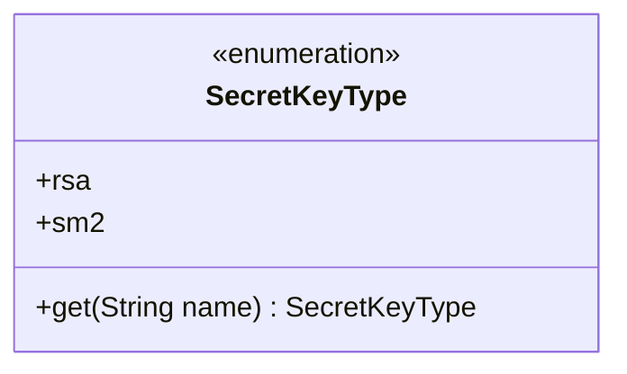
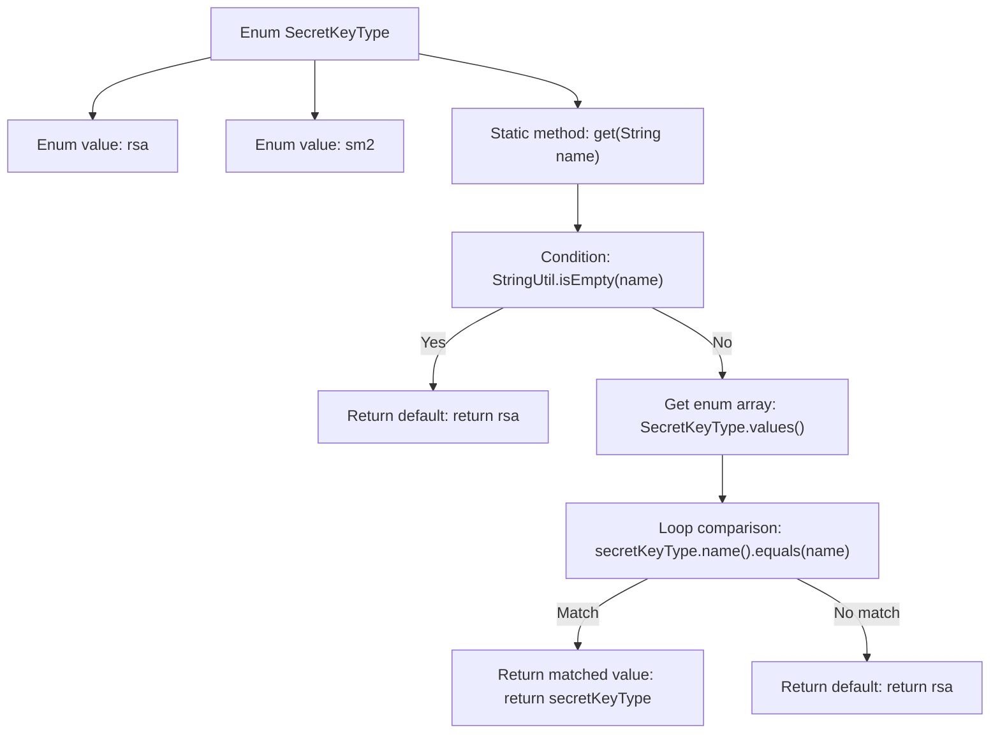

# Basic Information

|      |      |
|------|------|
| Name | SecretKeyType |
| Language | .java |
| Code Path | WeFe/common/java/common-lang/src/main/java/com/welab/wefe/common/constant/SecretKeyType.java |
| Package Name | com.welab.wefe.common.constant |
| Dependencies | ['com.welab.wefe.common.util.StringUtil'] |
| Brief Description | The SecretKeyType enum defines two key types, rsa and sm2, and provides a get method to return the corresponding type based on the name, with rsa being the default return value. |

# Description

This enumeration type defines two key types: RSA and SM2. It includes a static method `get` that returns the corresponding enumeration value based on the input string name. If the input is empty or invalid, it defaults to returning the RSA type. The method ensures the correct key type is returned by iterating through the enumeration values for matching. The entire design is concise and clear, providing a flexible mechanism for key type selection.

# Class Summary

| Name   | Type  | Description |
|-------|------|-------------|
| SecretKeyType | enum | The SecretKeyType enum defines two key types, rsa and sm2, and provides a method to retrieve the corresponding type based on the name, with rsa being the default return value. |

## Class SecretKeyType

|      |      |
|------|------|
| Access Modifier | public |
| Type | enum |
| Name | SecretKeyType |
| Description | The SecretKeyType enum defines two key types, rsa and sm2, and provides a method to retrieve the corresponding type based on the name, with rsa being the default return value. |

### UML Class Diagram

This code defines an enumeration class `SecretKeyType` containing two key types: `rsa` and `sm2`. The class provides a static method `get()` to return the corresponding enum value based on the input string name, defaulting to `rsa` if the input is null or invalid. The enumeration class uses the `values()` method to iterate through all enum values for matching, demonstrating a type-safe enum pattern. The class diagram clearly illustrates the enumeration structure and its sole public method, suitable for standardized key type management scenarios.

### Internal Method Call Graph

This code defines a SecretKeyType enum class containing two key types: rsa and sm2. The core logic is the get() method, which returns the corresponding enum value based on the input string: first checks if the input is empty (returns default rsa), then iterates through enum values for matching. If a match is found, returns the corresponding enum value; otherwise returns default rsa. The flowchart clearly illustrates three key processing stages: null check, enum iteration, and result return, demonstrating robust default value handling.

### Field List

| Name  | Type  | Description |
|-------|-------|------|

### Method List

| Name  | Type  | Description |
|-------|-------|------|

