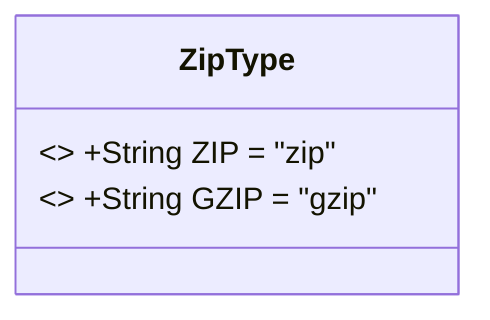
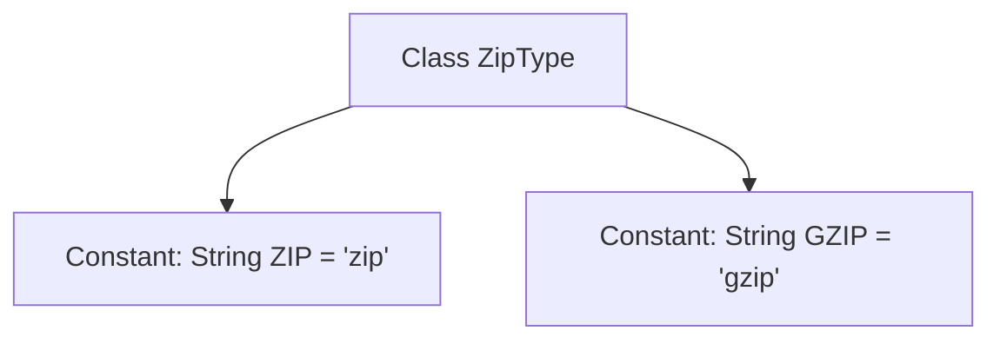

# Basic Information

|      |      |
|------|------|
| Name | ZipType |
| Language | .java |
| Code Path | WeFe/common/java/common-lang/src/main/java/com/welab/wefe/common/constant/ZipType.java |
| Package Name | com.welab.wefe.common.constant |
| Dependencies | [] |
| Brief Description | The ZipType class defines two static constants: ZIP and GZIP, representing zip and gzip compression types respectively. |

# Description

The code defines a public class named ZipType, which contains two static constant string fields: ZIP and GZIP, representing two types of compression formats. The ZIP constant has the value "zip", and the GZIP constant has the value "gzip". These constants can be used to identify or distinguish between different compression formats.

# Class Summary

| Name   | Type  | Description |
|-------|------|-------------|
| ZipType | class | The ZipType class defines two static constants: ZIP and GZIP, representing the zip and gzip compression types respectively. |

## Class ZipType

|      |      |
|------|------|
| Access Modifier | public |
| Type | class |
| Name | ZipType |
| Description | The ZipType class defines two static constants: ZIP and GZIP, representing the zip and gzip compression types respectively. |

### UML Class Diagram

This code defines a simple ZipType class containing two public static constants ZIP and GZIP, representing two compression types. The class has no instance methods or variables and serves solely as a constant container. The class diagram uses the <<final>> notation to indicate immutable constants, with all members being public static fields accessible directly via the class name. This design pattern is commonly used to define global constant values that do not change throughout the program.

### Internal Method Call Graph

This flowchart illustrates the structure of the ZipType class, which is a utility class containing only two static string constants. The ZIP and GZIP constants represent identifiers for two compression formats respectively, commonly used as type markers in file processing scenarios. This design pattern is typically employed to avoid magic strings in code and improve maintainability.

### Field List

| Name  | Type  | Description |
|-------|-------|------|
| ZIP = "zip" | String | Define a static constant string ZIP with the value "zip". |
| GZIP = "gzip" | String | Defined a public static constant string GZIP with the value "gzip". |

### Method List

| Name  | Type  | Description |
|-------|-------|------|

