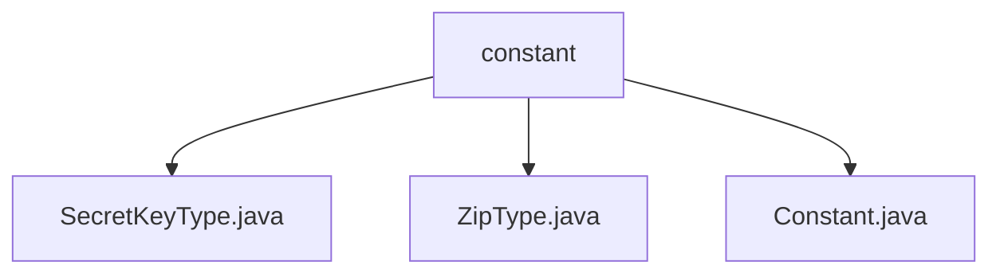

# Basic Information

|      |      |
|------|------|
| Name | constant |
| Language | .java |
| Code Path | WeFe/common/java/common-lang/src/main/java/com/welab/wefe/common/constant |
| Package Name | docs.common.java.common-lang.src.main.java.com.welab.wefe.common.constant |
| Brief Description | Three types of constant classes are defined: the SecretKeyType enum includes RSA and SM2 key types along with their retrieval methods; the ZipType class contains constants for ZIP and GZIP compression formats; the Constant class holds global constants such as encoding, date-time, and others. |

# Description

## Overview  
The core responsibility of this module is to provide basic constant and enumeration type definitions, supporting key type identification, compression format differentiation, and universal encoding standards. The interface specifications include the static method `get` (which returns an enumeration value based on the name) and direct constant access (e.g., `ZIP`/`GZIP`). Key data structures include the enumeration class `SecretKeyType` (RSA/SM2), the constant class `ZipType` (compression formats), and `Constant` (encoding/time formats). There are no external dependencies. For example, `SecretKeyType.get("SM2")` returns the SM2 enumeration, and `Constant.ENCODING_UTF8` provides the UTF-8 encoding identifier.  

## Key Business Scenarios  
The module is used to uniformly manage basic types and format constants, serving a role similar to a configuration center. Business processes include dynamic key type resolution (e.g., matching the input "RSA" to an enumeration), compression format identification (e.g., `ZipType.ZIP`), and standardized encoding/time format calls (e.g., `DATETIME_ISO_FORMAT`). A typical application pattern involves using constants to avoid hardcoding, such as the logging module using the `LOG_TIME` field name or the encryption/decryption module selecting algorithms via `SecretKeyType`. All API types are static methods or constants.

### Package Internal Structure View

This flowchart illustrates the hierarchical structure of the constant directory under the common-lang module in the WeFe project. The parent node "constant" contains three Java files: SecretKeyType.java, ZipType.java, and Constant.java. These files belong to constant definition-related classes, reside under the same package path, and reflect the categorized management of constant types.

# File List

| Name   | Type  | Description |
|-------|------|-------------|
| [SecretKeyType.java](SecretKeyType.md) | file | The SecretKeyType enum defines two key types, rsa and sm2, and provides a get method to return the corresponding type based on the name, with rsa being the default return value. |
| [ZipType.java](ZipType.md) | file | The ZipType class defines two static constants: ZIP and GZIP, representing the zip and gzip compression types respectively. |
| [Constant.java](Constant.md) | file | Java constant class, defining common encoding formats (UTF-8, GBK), date-time formats, and log time field names. |

