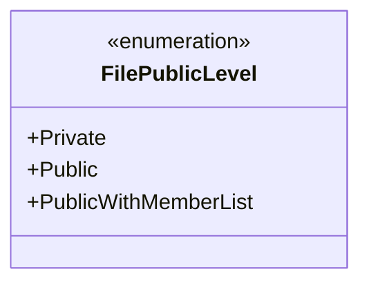
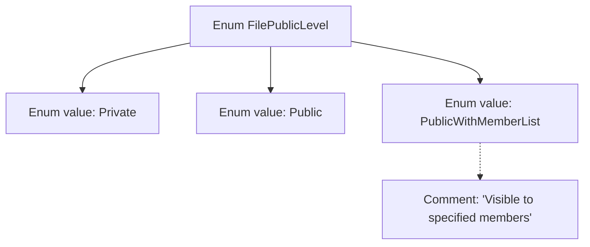

# Basic Information

|      |      |
|------|------|
| Name | FilePublicLevel |
| Language | .java |
| Code Path | WeFe/common/java/common-lang/src/main/java/com/welab/wefe/common/enums/FilePublicLevel.java |
| Package Name | com.welab.wefe.common.enums |
| Dependencies | [] |
| Brief Description | File visibility level enumeration: Private, Public, PublicWithMemberList. |

# Description

The code defines an enumeration type named `FilePublicLevel`, which includes three enum values: `Private` indicates the file is private, `Public` indicates the file is public, and `PublicWithMemberList` indicates the file is visible to specified members. The enumeration provides comments explaining the specific use case of `PublicWithMemberList`.

# Class Summary

| Name   | Type  | Description |
|-------|------|-------------|
| FilePublicLevel | enum | File visibility level enumeration: private, public, visible to specified members. |

## Class FilePublicLevel

|      |      |
|------|------|
| Access Modifier | public |
| Type | enum |
| Name | FilePublicLevel |
| Description | File visibility level enumeration: private, public, visible to specified members. |

### UML Class Diagram

This code defines an enumeration type named FilePublicLevel, which represents the public access levels of files. The enumeration includes three values: Private, Public, and PublicWithMemberList (visible to specified members). This enumeration concisely describes different file access permission levels, suitable for scenarios requiring controlled file visibility. The annotation specifically explains that PublicWithMemberList is intended for "visible to specified members," enhancing the code's readability.

### Internal Method Call Graph

This flowchart illustrates the structure of the FilePublicLevel enum, which contains three enum values (Private, Public, PublicWithMemberList) and their relationships. The PublicWithMemberList value is accompanied by a comment "Visible to specified members" explaining its purpose, indicating that files at this level are visible to designated members. The enum collectively encapsulates three states of file publicity levels, suitable for permission control scenarios.

### Field List

| Name  | Type  | Description |
|-------|-------|------|

### Method List

| Name  | Type  | Description |
|-------|-------|------|

