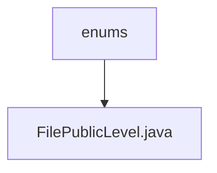

# Basic Information

|      |      |
|------|------|
| Name | enums |
| Language | .java |
| Code Path | WeFe/common/java/common-lang/src/main/java/com/welab/wefe/common/enums |
| Package Name | docs.common.java.common-lang.src.main.java.com.welab.wefe.common.enums |
| Brief Description | File visibility level enumeration: Private, Public, PublicWithMemberList. |

# Description

The code defines an enumeration type named `FilePublicLevel`, which includes three enum values: `Private` indicates the file is private, `Public` indicates the file is public, and `PublicWithMemberList` indicates the file is visible to specified members. The enumeration's comments clarify the specific purpose of `PublicWithMemberList`.

### Package Internal Structure View

This flowchart illustrates the enum class file structure within the common-lang module of the WeFe project. The top-level node represents the "enums" directory, which contains a specific enum class file "FilePublicLevel.java". This structure is a typical organization method for enum types in enterprise-level Java projects, where related enum classes are centrally stored in the enums package to achieve better code management and maintainability.

# File List

| Name   | Type  | Description |
|-------|------|-------------|
| [FilePublicLevel.java](FilePublicLevel.md) | file | File visibility level enumeration: Private, Public, PublicWithMemberList. |

