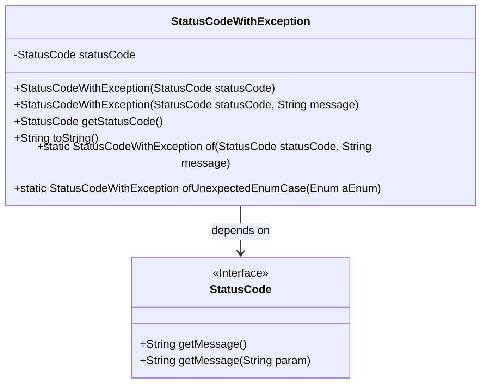
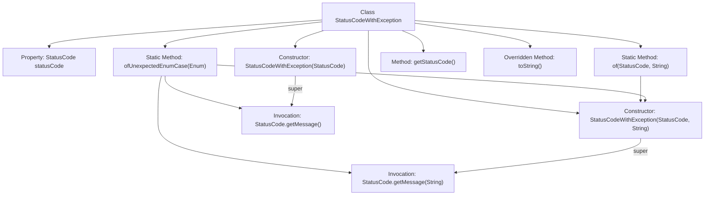

# Basic Information

|      |      |
|------|------|
| Name | StatusCodeWithException |
| Language | .java |
| Code Path | WeFe/common/java/common-lang/src/main/java/com/welab/wefe/common/exception/StatusCodeWithException.java |
| Package Name | com.welab.wefe.common.exception |
| Dependencies | ['com.welab.wefe.common.StatusCode'] |
| Brief Description | The StatusCodeWithException class extends Exception, encapsulates status codes and messages, provides static factory methods to create exception instances, and supports retrieving status codes and formatted output. |

# Description

StatusCodeWithException is a custom exception class that inherits from Exception. It encapsulates status codes and messages, providing two construction methods: directly passing a status code or simultaneously passing a status code and a custom message. The class includes methods for retrieving the status code and an overridden toString method. It also offers two static factory methods: of for creating exception instances with status codes and messages, and ofUnexpectedEnumCase specifically designed to handle unexpected enum cases, automatically generating corresponding messages.

# Class Summary

| Name   | Type  | Description |
|-------|------|-------------|
| StatusCodeWithException | class | StatusCodeWithException is a custom exception class that includes a status code and message, providing static factory methods to create instances and supporting handling of unexpected enum items. |

## Class StatusCodeWithException

|      |      |
|------|------|
| Access Modifier | public |
| Type | class |
| Name | StatusCodeWithException |
| Description | StatusCodeWithException is a custom exception class that includes a status code and message, providing static factory methods to create instances and supporting handling of unexpected enum items. |

### UML Class Diagram

This code demonstrates a custom exception class `StatusCodeWithException`, which extends the `Exception` class and is primarily used to encapsulate status codes and exception messages. The class provides two constructors (using either a status code alone or a status code with a custom message) and two static factory methods (`of` and `ofUnexpectedEnumCase`) to create exception instances. The `ofUnexpectedEnumCase` method specifically handles unexpected enum value scenarios. The class holds an instance of the `StatusCode` interface through composition, which defines methods for retrieving messages. The overall design facilitates unified handling of exceptions with status codes.

### Internal Method Call Graph

The flowchart illustrates the structure and method invocation relationships of the StatusCodeWithException class. This class inherits from Exception and contains two static factory methods (of and ofUnexpectedEnumCase) along with two constructors. Its core functionality involves creating exception instances using status codes and messages. The ofUnexpectedEnumCase method invokes StatusCode's getMessage method to generate error information, ultimately creating exception objects through constructors. The toString method is overridden to format exception information for output.

### Field List

| Name  | Type  | Description |
|-------|-------|------|
| statusCode | StatusCode | Private status code variable `statusCode`. |

### Method List

| Name  | Type  | Description |
|-------|-------|------|
| of | StatusCodeWithException | The static method `of` accepts a status code and a message, then returns a `StatusCodeWithException` object containing both. |
| ofUnexpectedEnumCase | StatusCodeWithException | The static method `ofUnexpectedEnumCase` takes an enum parameter and returns a `StatusCodeWithException` object containing the error code and error message with the enum name. The error code is fixed as `UNEXPECTED_ENUM_CASE`. |
| getStatusCode | StatusCode | Methods to obtain the current status code, returning a value of type StatusCode. |
| toString | String | Override the toString method to return a string representation of the status code and message. |

