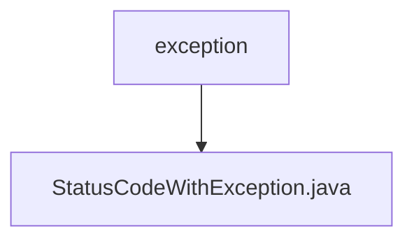

# Basic Information

|      |      |
|------|------|
| Name | exception |
| Language | .java |
| Code Path | WeFe/common/java/common-lang/src/main/java/com/welab/wefe/common/exception |
| Package Name | docs.common.java.common-lang.src.main.java.com.welab.wefe.common.exception |
| Brief Description | The StatusCodeWithException class extends Exception, encapsulates status codes and messages, provides static factory methods to create exception instances, and supports retrieving status codes and formatted output. |

# Description

StatusCodeWithException is a custom exception class that inherits from Exception. It encapsulates status codes and messages, providing two construction methods: directly passing a status code or simultaneously passing a status code and a custom message. The class includes methods for retrieving the status code and an overridden toString method. It also offers two static factory methods: of for creating exception instances with status codes and messages, and ofUnexpectedEnumCase specifically designed for handling unexpected enum cases, automatically generating corresponding messages.

### Package Internal Structure View

This flowchart illustrates the hierarchical structure of the exception handling module in the WeFe project. The root node is the "exception" directory, which contains a specific exception class file "StatusCodeWithException.java". This concise hierarchical relationship reflects the foundational architecture of the exception handling module in the project, consisting solely of a core exception class file for unified management of status code-related exceptions.

# File List

| Name   | Type  | Description |
|-------|------|-------------|
| [StatusCodeWithException.java](StatusCodeWithException.md) | file | The StatusCodeWithException class extends Exception, encapsulates status codes and messages, provides static factory methods to create exception instances, and supports retrieving status codes and formatted output. |

