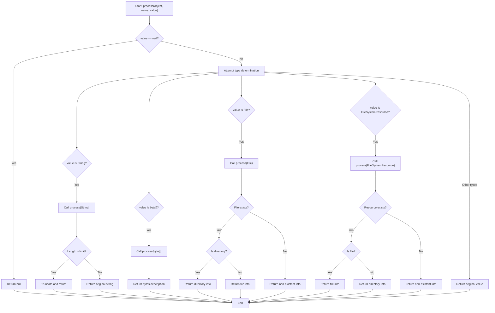
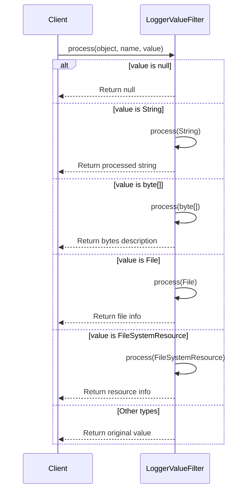
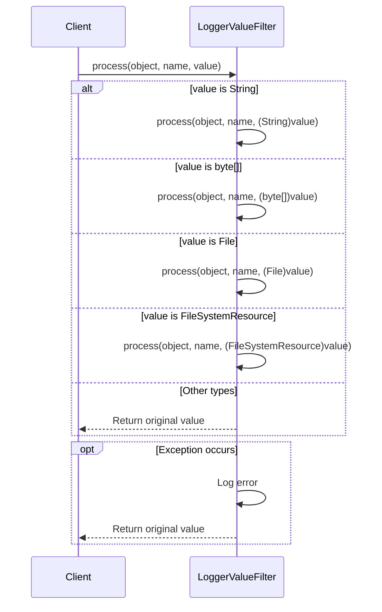

# Basic Information

|      |      |
|------|------|
| Name | LoggerValueFilter |
| Language | .java |
| Code Path | WeFe/common/java/common-lang/src/main/java/com/welab/wefe/common/fastjson/LoggerValueFilter.java |
| Package Name | com.welab.wefe.common.fastjson |
| Dependencies | ['com.alibaba.fastjson.serializer.ValueFilter', 'org.slf4j.Logger', 'org.slf4j.LoggerFactory', 'org.springframework.core.io.FileSystemResource', 'java.io.File', 'java.io.IOException'] |
| Brief Description | The LoggerValueFilter class is used to truncate excessively long values in logs, with a default limit of 1024 characters. It supports processing various types such as strings, files, and byte arrays to prevent oversized logs and debugging inconveniences. |

# Description

LoggerValueFilter is a log value filter primarily used to limit the length of values output in logs. By default, it restricts string length to 1024 characters to prevent excessively long values (such as base64 images or files) from affecting debugging and consuming disk space. This filter supports processing strings, byte arrays, files, and file system resources. For strings exceeding the limit, they are truncated and their length is displayed; for byte arrays, their length is shown; for files and directories, path and size information are displayed. If an exception occurs during processing, an error is logged and the original value is returned.

# Class Summary

| Name   | Type  | Description |
|-------|------|-------------|
| LoggerValueFilter | class | The LoggerValueFilter class is used to limit string length during log output, preventing excessively long content from affecting debugging and disk consumption. It supports processing strings, byte arrays, files, and filesystem resources, with overly long strings being truncated for display. The default length limit is 1024 characters. |


## Class LoggerValueFilter

|      |      |
|------|------|
| Access Modifier | public |
| Type | class |
| Name | LoggerValueFilter |
| Description | The LoggerValueFilter class is used to limit string length during log output, preventing excessively long content from affecting debugging and disk consumption. It supports processing strings, byte arrays, files, and filesystem resources, with overly long strings being truncated for display. The default length limit is 1024 characters. |


### UML Class Diagram

```mermaid
classDiagram
    class LoggerValueFilter {
        -Logger LOG
        +LoggerValueFilter DEFAULT
        -int limitStringLength
        -LoggerValueFilter(int limitStringLength)
        +Object process(Object object, String name, Object value)
        +Object process(Object object, String name, FileSystemResource file) throws IOException
        +Object process(Object object, String name, File file)
        +Object process(Object object, String name, byte[] value)
        +Object process(Object object, String name, String value)
    }
    <<Interface>> ValueFilter {
        +Object process(Object object, String name, Object value)
    }
    LoggerValueFilter ..|> ValueFilter : implements
```





Class diagram description: The LoggerValueFilter class implements the ValueFilter interface and is primarily used for value filtering during log output. It contains processing logic for various types including strings, byte arrays, files, and file system resources, with special handling for excessively long strings by truncating them to prevent overly lengthy log content. The class defines a default instance DEFAULT and a string length limit limitStringLength, implementing formatted output for different data types through multiple overloaded process methods.


### Internal Method Call Graph

```mermaid
graph TD
    A["Class LoggerValueFilter"]
    B["Static Constant: LOG"]
    C["Static Constant: DEFAULT"]
    D["Private Property: limitStringLength"]
    E["Private Constructor: LoggerValueFilter(int)"]
    F["Main Processing Method: process(Object, String, Object)"]
    G["Filesystem Resource Handling: process(Object, String, FileSystemResource)"]
    H["File Handling: process(Object, String, File)"]
    I["Byte Array Handling: process(Object, String, byte[])"]
    J["String Handling: process(Object, String, String)"]

    A --> B
    A --> C
    A --> D
    A --> E
    A --> F
    F -->|String type| J
    F -->|byte[] type| I
    F -->|File type| H
    F -->|FileSystemResource type| G
    F -->|Other types| K["Return original value"]
    F -->|Exception handling| L["Log error"]
```



This code implements a log value filter (LoggerValueFilter), primarily used to control the length and format of log output. Core functionalities include: 1) Truncating string length; 2) Formatting special types like files and byte arrays for output; 3) Providing default instances through singleton pattern. The flowchart shows the class structure and method invocation relationships, while the sequence diagram details the processing flow for different input types. This design effectively prevents excessively large log outputs while maintaining readability of critical information, making it suitable for production environments requiring log volume control.

### Field List

| Name  | Type  | Description |
|-------|-------|------|
| DEFAULT = new LoggerValueFilter(1024) | LoggerValueFilter | Defined a static constant LoggerValueFilter instance named DEFAULT with an initial value of 1024. |
| limitStringLength = 1024 | int | The variable `limitStringLength` defines the maximum string length as 1024. |
| LOG = LoggerFactory.getLogger(LoggerValueFilter.class) | Logger | Declare a static immutable log object LOG for logging in the LoggerValueFilter class. |

### Method List

| Name  | Type  | Description |
|-------|-------|------|
| process | Object | The method handles different types of input values, returning null if the input is null; it supports String, byte[], File, and FileSystemResource types, logs exceptions, and returns the original value in case of errors. |
| process | Object | The method `process` checks if a file exists and returns file or directory information: when it exists, the type (including size for files) and path are displayed; when it does not exist, only the filename is shown. The return format is a string. |
| process | Object | Processing file objects and returning path information: if the path exists, distinguish between directories or files and append their sizes; if it does not exist, only return the path. |
| process | Object | This method takes an object, a string, and a byte array as input, and returns a string description of the byte array length in the format "bytes(length X)", where X is the length of the array. |
| process | Object | The method processes the input object, truncating the first 50 characters and appending an ellipsis with length information if the string value exceeds the limit; otherwise, it returns the original value. |


