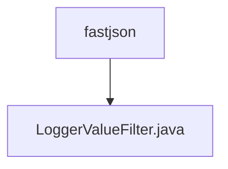

# Basic Information

|      |      |
|------|------|
| Name | fastjson |
| Language | .java |
| Code Path | WeFe/common/java/common-lang/src/main/java/com/welab/wefe/common/fastjson |
| Package Name | docs.common.java.common-lang.src.main.java.com.welab.wefe.common.fastjson |
| Brief Description | The LoggerValueFilter class is used to truncate excessively long values in logs, with a default limit of 1024 characters. It supports processing various types such as strings, files, and byte arrays to prevent excessively large logs and debugging inconvenience. |

# Description

LoggerValueFilter is a log value filter primarily used to limit the length of values output in logs. By default, it restricts string length to 1,024 characters to prevent excessively long values (such as base64 images or files) from affecting debugging and consuming disk space. This filter supports processing strings, byte arrays, files, and filesystem resources. For strings exceeding the limit, they are truncated with the length displayed; for byte arrays, their length is shown; for files and directories, path and size information are displayed. If an exception occurs during processing, the error is logged and the original value is returned.

### Package Internal Structure View

This flowchart illustrates the hierarchical relationship between the fastjson directory and the LoggerValueFilter.java file. The fastjson directory serves as the parent directory, containing a subfile named LoggerValueFilter.java. This structure is commonly found in Java projects to organize class files for specific functionalities, here implementing the logging filter feature for FastJSON.

# File List

| Name   | Type  | Description |
|-------|------|-------------|
| [LoggerValueFilter.java](LoggerValueFilter.md) | file | The LoggerValueFilter class is used to truncate excessively long values in logs, with a default limit of 1024 characters. It supports processing various types such as strings, files, and byte arrays to prevent excessively large logs and debugging inconveniences. |

