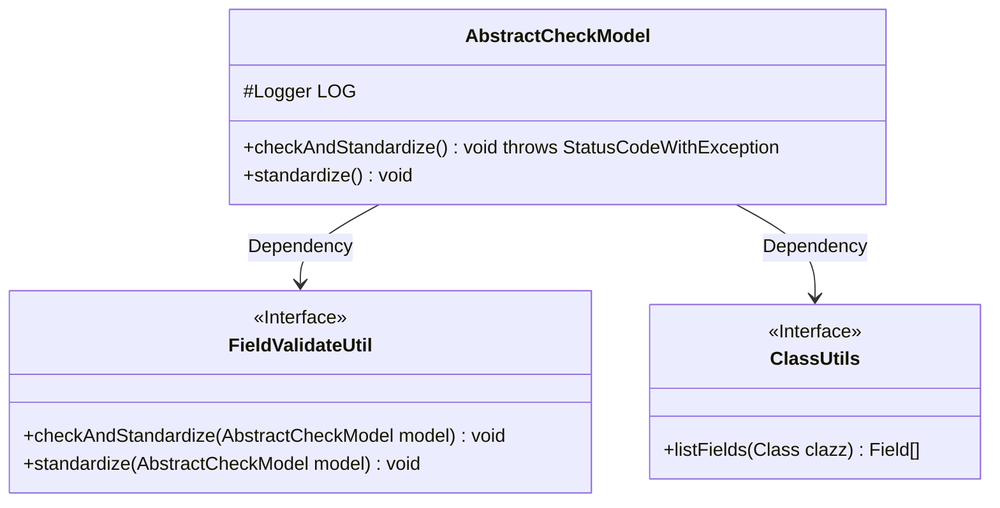
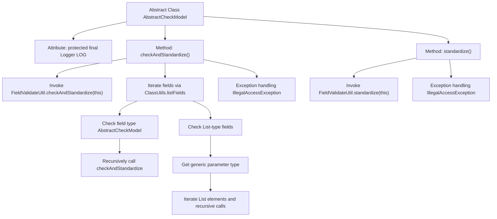

# Basic Information

|      |      |
|------|------|
| Name | AbstractCheckModel |
| Language | .java |
| Code Path | WeFe/common/java/common-lang/src/main/java/com/welab/wefe/common/fieldvalidate/AbstractCheckModel.java |
| Package Name | com.welab.wefe.common.fieldvalidate |
| Dependencies | ['com.welab.wefe.common.exception.StatusCodeWithException', 'com.welab.wefe.common.util.ClassUtils', 'org.slf4j.Logger', 'org.slf4j.LoggerFactory', 'java.lang.reflect.Field', 'java.lang.reflect.ParameterizedType', 'java.lang.reflect.Type', 'java.util.List'] |
| Brief Description | The abstract class AbstractCheckModel provides field validation and standardization functionality, recursively checking nested objects and lists while logging exceptions. |

# Description

AbstractCheckModel is an abstract class that provides model validation and standardization functionality. It includes the checkAndStandardize method, which recursively checks all fields: recursively calling validation for fields of type AbstractCheckModel; for List-type fields, it checks whether the elements are AbstractCheckModel and performs recursive validation. Validation utilizes the FieldValidateUtil utility class. The standardize method only performs standardization operations. Exception handling logs error messages without interrupting the process.

# Class Summary

| Name   | Type  | Description |
|-------|------|-------------|
| AbstractCheckModel | class | The abstract class AbstractCheckModel provides field validation and normalization methods, recursively checking nested objects and lists for instances of AbstractCheckModel, while logging exceptions. |

## Class AbstractCheckModel

|      |      |
|------|------|
| Access Modifier | public abstract |
| Type | class |
| Name | AbstractCheckModel |
| Description | The abstract class AbstractCheckModel provides field validation and normalization methods, recursively checking nested objects and lists for instances of AbstractCheckModel, while logging exceptions. |

### UML Class Diagram

This code demonstrates an abstract class `AbstractCheckModel`, which provides field validation and standardization functionality. The class checks field types through reflection and recursively processes fields inherited from `AbstractCheckModel` or List collections containing such elements. It relies on `FieldValidateUtil` for specific validation operations and `ClassUtils` to obtain field lists. The class diagram clearly illustrates these relationships, with `FieldValidateUtil` and `ClassUtils` marked as interfaces, reflecting sound abstract design.

### Internal Method Call Graph

This flowchart illustrates the core logic of the AbstractCheckModel class. As an abstract validation model, it provides field validation and standardization capabilities. Key processes include: 1) Initial validation through FieldValidateUtil; 2) Recursive inspection of all fields with recursive validation calls for AbstractCheckModel-type fields; 3) Special handling of List-type fields including generic parameter checks and iterative validation; 4) Dedicated standardize() method for normalization. Exception handling is implemented throughout the process with error logging via Logger. This design enables automated validation of nested object structures with recursive processing support for complex object graphs.

### Field List

| Name  | Type  | Description |
|-------|-------|------|
| LOG = LoggerFactory.getLogger(this.getClass()) | Logger | Declare a protected final logger object for logging in the current class. |

### Method List

| Name  | Type  | Description |
|-------|-------|------|
| checkAndStandardize | void | The method recursively checks and normalizes the object and its nested fields, including AbstractCheckModel types and their list elements, handles exceptions, and logs error messages. |
| standardize | void | The method invokes the standardize method of FieldValidateUtil to process the current object, catches the IllegalAccessException, and logs an error message. |

