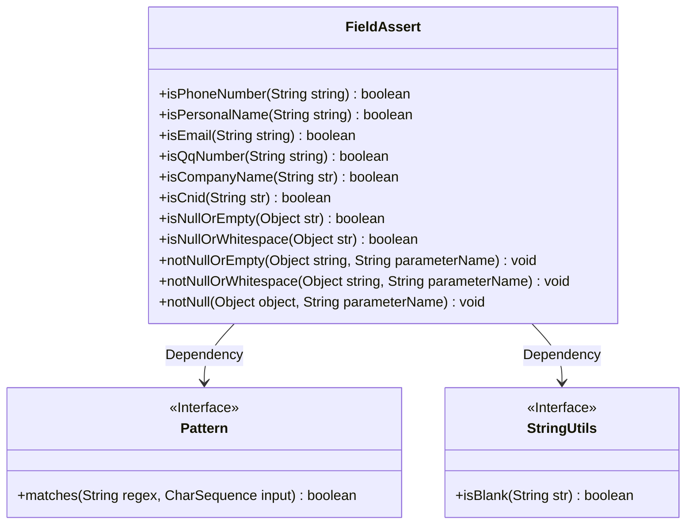

# Basic Information

|      |      |
|------|------|
| Name | FieldAssert |
| Language | .java |
| Code Path | WeFe/common/java/common-lang/src/main/java/com/welab/wefe/common/fieldvalidate/FieldAssert.java |
| Package Name | com.welab.wefe.common.fieldvalidate |
| Dependencies | ['org.apache.commons.lang.StringUtils', 'java.util.regex.Pattern'] |
| Brief Description | The FieldAssert class provides multiple static methods to validate string formats, including phone numbers, names, email addresses, QQ numbers, company names, ID card numbers, etc., and includes non-null checks and exception-throwing functionality. |

# Description

The FieldAssert class provides a series of static methods for validating string formats and object validity. It includes validation for mobile numbers (11-digit numbers), Chinese names (2-10 Chinese characters or dots), email addresses (standard format), QQ numbers (5-12-digit numbers), company names (a combination of Chinese, English, numbers, and symbols within 50 characters), and Chinese ID cards (15 or 18-digit compliant formats). It also offers null-check methods: `isNullOrEmpty` checks for null objects or empty strings, while `isNullOrWhitespace` additionally checks for pure whitespace; `notNullOrEmpty` and `notNullOrWhitespace` throw exceptions for invalid parameters, and `notNull` specifically checks for non-null objects. All validations are implemented using regular expressions.

# Class Summary

| Name   | Type  | Description |
|-------|------|-------------|
| FieldAssert | class | The FieldAssert class provides multiple static methods for validating string formats (such as phone numbers, names, email addresses, QQ numbers, company names, ID card numbers) and checking for null or blank strings, throwing exceptions when invalid. |

## Class FieldAssert

|      |      |
|------|------|
| Access Modifier | public |
| Type | class |
| Name | FieldAssert |
| Description | The FieldAssert class provides multiple static methods for validating string formats (such as phone numbers, names, email addresses, QQ numbers, company names, ID card numbers) and checking for null or blank strings, throwing exceptions when invalid. |

### UML Class Diagram

This code demonstrates a utility class named FieldAssert, primarily used for validating the format of various strings. The class contains multiple static methods for verifying formats such as phone numbers, personal names, email addresses, QQ numbers, company names, Chinese ID cards, etc., along with null-checking functionalities. The class diagram illustrates FieldAssert's dependency relationships with two interfaces: Pattern (for regex matching) and StringUtils (for blank string checks). All methods are public static, reflecting the design characteristics of a utility class.

### Internal Method Call Graph

```mermaid
graph TD
    A["Class FieldAssert"]
    B["Method: isPhoneNumber(String string)"]
    C["Method: isPersonalName(String string)"]
    D["Method: isEmail(String string)"]
    E["Method: isQqNumber(String string)"]
    F["Method: isCompanyName(String str)"]
    G["Method: isCnid(String str)"]
    H["Method: isNullOrEmpty(Object str)"]
    I["Method: isNullOrWhitespace(Object str)"]
    J["Method: notNullOrEmpty(Object string, String parameterName)"]
    K["Method: notNullOrWhitespace(Object string, String parameterName)"]
    L["Method: notNull(Object object, String parameterName)"]

    A --> B
    A --> C
    A --> D
    A --> E
    A --> F
    A --> G
    A --> H
    A --> I
    A --> J
    A --> K
    A --> L

    B --> B1["Check if string is null"]
    B --> B2["Regex match: ^\\d{11}$"]
    C --> C1["Check if string is null"]
    C --> C2["Regex match: ^[·\u4e00-\u9fa5]{2,10}$"]
    D --> D1["Check if string is null"]
    D --> D2["Regex match: ^[\\w-\\.]+@([\\w-]+\\.)+[a-z]{2,3}$"]
    E --> E1["Check if string is null"]
    E --> E2["Regex match: ^\\d{5,12}$"]
    F --> F1["Check if str is empty or length>50"]
    F --> F2["Regex match: Company name pattern"]
    G --> G1["Check if str is null"]
    G --> G2["Check length is 15/18"]
    G --> G3["Select regex based on length"]
    H --> H1["Check if str is null or empty string"]
    I --> I1["Check if str is null/empty/whitespace"]
    J --> J1["Check if string is null or empty"]
    J --> J2["Throw IllegalArgumentException"]
    K --> K1["Call isNullOrWhitespace"]
    K --> K2["Throw IllegalArgumentException"]
    L --> L1["Check if object is null"]
    L --> L2["Throw IllegalArgumentException"]
```

This code represents the FieldAssert class, which contains multiple static methods for validating different string formats (such as phone numbers, names, emails, etc.) and performing non-null checks on objects. Each validation method first performs a null check, then uses regular expressions to match specific formats. The notNull series methods throw exceptions when validation fails. The flowchart illustrates the class structure and method call relationships, highlighting the core logic of null checks and regex matching.

### Field List

| Name  | Type  | Description |
|-------|-------|------|

### Method List

| Name  | Type  | Description |
|-------|-------|------|
| isPhoneNumber | boolean | Check if the string is an 11-digit phone number, return false if it is empty. |
| isQqNumber | boolean | This method checks whether the string is a 5 to 12-digit pure numeric QQ number, returning false if it is empty. |
| isPersonalName | boolean | This method checks whether the string is a Chinese personal name, requiring 2-10 Chinese characters or middle dots, and returns false for null values. |
| isNullOrWhitespace | boolean | This method checks whether the input object is null, an empty string, or contains only whitespace, returning true if any of these conditions are met. |
| isCompanyName | boolean | Check if the string is a valid company name: non-empty and length ≤ 50, containing only Chinese/English characters, numbers, parentheses, commas, periods, and ampersand symbols. |
| isNullOrEmpty | boolean | Check if the string is null or empty. |
| notNullOrEmpty | void | Methods to check if a string is non-empty: If the input is null or an empty string, throw an exception indicating that the parameter name cannot be empty. |
| isEmail | boolean | This method checks whether a string is a valid email address, first verifying if it is empty and then validating the format via a regular expression. It returns true if the criteria are met, otherwise false. |
| isCnid | boolean | Check if the string is a Chinese ID number: 15 or 18 digits, non-empty, and conforms to the regular expression rules. |
| notNullOrWhitespace | void | Static method checks if the string is non-empty and non-whitespace, otherwise throws an exception with the parameter name as the prompt. |
| notNull | void | This is a static method used to check if an object is null. If the object is null, it throws an illegal argument exception with the parameter name. |

