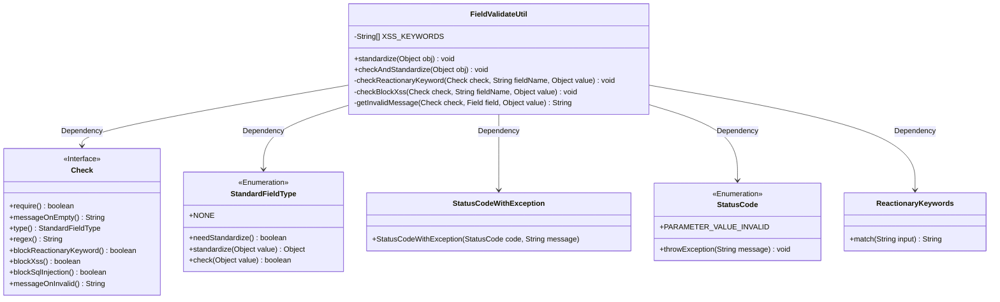
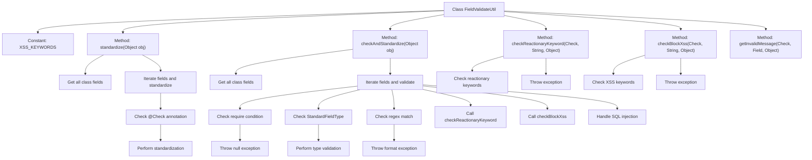

# Basic Information

|      |      |
|------|------|
| Name | FieldValidateUtil |
| Language | .java |
| Code Path | WeFe/common/java/common-lang/src/main/java/com/welab/wefe/common/fieldvalidate/FieldValidateUtil.java |
| Package Name | com.welab.wefe.common.fieldvalidate |
| Dependencies | ['com.alibaba.fastjson.JSON', 'com.welab.wefe.common.StatusCode', 'com.welab.wefe.common.exception.StatusCodeWithException', 'com.welab.wefe.common.fieldvalidate.annotation.Check', 'com.welab.wefe.common.util.ClassUtils', 'com.welab.wefe.common.util.StringUtil', 'org.apache.commons.lang3.StringUtils', 'java.lang.reflect.Field', 'java.util.Map', 'java.util.Set', 'java.util.regex.Pattern'] |
| Brief Description | The FieldValidateUtil class provides field validation functionalities, including standardization, non-null checks, regex matching, XSS/SQL injection prevention, and filtering of sensitive keywords. It configures validation rules through annotations to ensure input security and compliance. |

# Description

FieldValidateUtil is a utility class designed for field validation and normalization, with core functionalities including standardizing field values, checking field validity, preventing XSS attacks, and SQL injection. It uses the `@Check` annotation to mark fields requiring validation and supports various validation types such as non-null checks, regex matching, and filtering of sensitive keywords. The normalization methods automatically process values based on field types, throwing a `StatusCodeWithException` upon validation failure. Additionally, the utility class includes SQL injection protection for string fields by replacing hazardous characters like quotes and comment symbols. The overall design leverages reflection to traverse object fields and combines annotation configurations to achieve flexible validation logic.

# Class Summary

| Name   | Type  | Description |
|-------|------|-------------|
| FieldValidateUtil | class | The FieldValidateUtil class provides field validation functionalities, including standardization, non-null checks, regex matching, XSS/SQL injection prevention, and filtering of sensitive keywords. Rules are configured via the Check annotation, and validation failures throw exceptions. |

## Class FieldValidateUtil

|      |      |
|------|------|
| Access Modifier | public |
| Type | class |
| Name | FieldValidateUtil |
| Description | The FieldValidateUtil class provides field validation functionalities, including standardization, non-null checks, regex matching, XSS/SQL injection prevention, and filtering of sensitive keywords. Rules are configured via the Check annotation, and validation failures throw exceptions. |

### UML Class Diagram

Class Diagram Description:
FieldValidateUtil is a utility class primarily used for field validation and standardization. It relies on the Check interface to obtain field validation rules, uses the StandardFieldType enumeration for field standardization, handles exceptions via StatusCode and StatusCodeWithException, and checks for reactionary keywords with ReactionaryKeywords. The class provides two core functionalities: standardization and validation, supporting various security measures such as regex validation, XSS protection, and SQL injection prevention.

### Internal Method Call Graph

This code represents the FieldValidateUtil utility class, primarily used for field validation and standardization. The flowchart illustrates the class structure and main method invocation relationships, including functionalities such as field standardization, mandatory validation, regex matching, reactionary keyword checking, XSS protection, and SQL injection handling. The core process involves iterating through object fields and executing different validation logic based on @Check annotation configurations, throwing exceptions for non-compliant fields or performing standardization to ensure input data security and compliance.

### Field List

| Name  | Type  | Description |
|-------|-------|------|
| XSS_KEYWORDS = {">", "<"} | String[] | Define a static constant string array XSS_KEYWORDS containing XSS filtering keywords ">" and "<". |

### Method List

| Name  | Type  | Description |
|-------|-------|------|
| checkBlockXss | void | Check if the input value contains XSS keywords. If the check is enabled and keywords are found, throw an exception indicating unsafe input. Supports handling Map type conversion to strings. |
| checkReactionaryKeyword | void | Check if the input value contains sensitive keywords. If the check is enabled and a keyword is matched, throw an exception indicating the field name and the violating keyword. |
| standardize | void | Static method `standardize` handles object field standardization: iterates through all fields, checks for `Check` annotations, invokes standardization methods by type, and updates field values accordingly. |
| checkAndStandardize | void | Method checks the legality of object fields and standardizes them: validates non-null, type matching, regular expressions, prevents XSS and SQL injection, and automatically standardizes field values. |
| getInvalidMessage | String | Generate invalid field prompt messages, prioritizing custom messages, with the default format being "invalid field name: value". |

