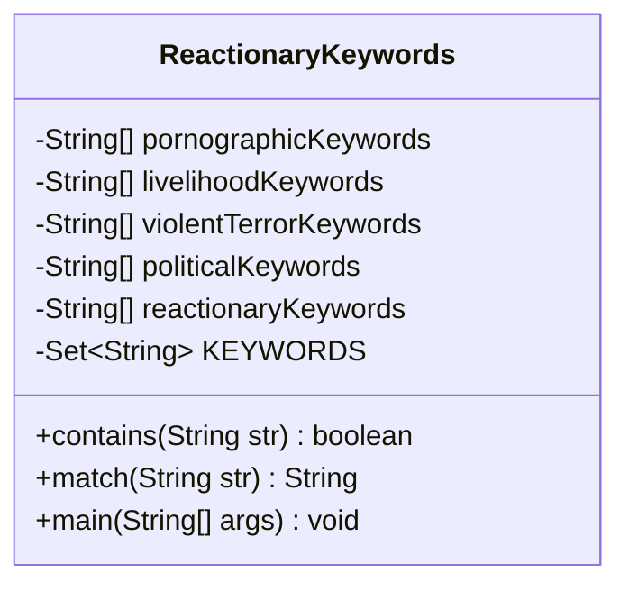
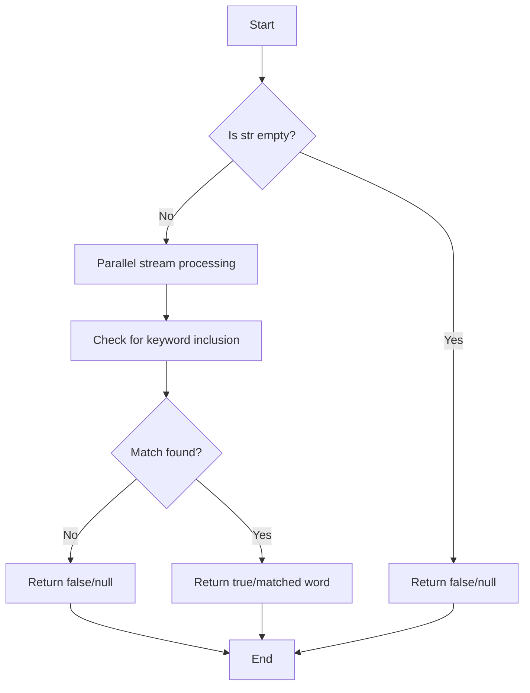
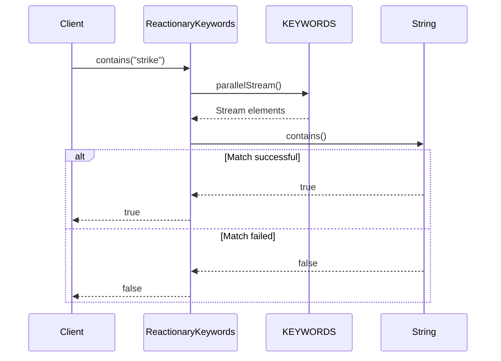
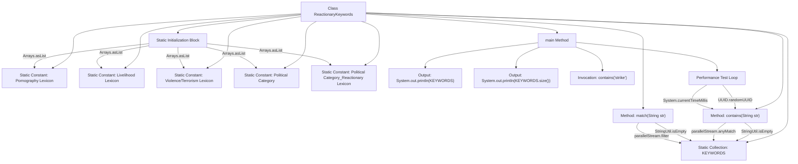

# Basic Information

|      |      |
|------|------|
| Name | ReactionaryKeywords |
| Language | .java |
| Code Path | WeFe/common/java/common-lang/src/main/java/com/welab/wefe/common/fieldvalidate/ReactionaryKeywords.java |
| Package Name | com.welab.wefe.common.fieldvalidate |
| Dependencies | ['com.welab.wefe.common.util.StringUtil', 'java.util.Arrays', 'java.util.HashSet', 'java.util.Set', 'java.util.UUID'] |
| Brief Description | The reaction lexicon category includes keywords related to pornography, livelihood, violent terrorism, politics, etc., providing methods to check whether a text contains sensitive words and to match the first sensitive word. |

# Description

This Java class defines a public opinion keyword detection tool, containing lexicons for categories such as pornography, livelihood, violent terrorism, and politics. All keywords are stored in HashSet collections through static initialization. It provides two core methods: contains() checks whether the text contains keywords, and match() returns the first matched keyword. The main method demonstrates operational processes including lexicon initialization and performance testing.

# Class Summary

| Name   | Type  | Description |
|-------|------|-------------|
| ReactionaryKeywords | class | This Java class defines a sensitive word library (including pornography, civil issues, violent terrorism, politics, etc.), providing methods to check if a text contains sensitive words (contains) and to match the first sensitive word (match), with performance optimized using parallel streams. The main method tests functionality and execution time. |

## Class ReactionaryKeywords

|      |      |
|------|------|
| Access Modifier | public |
| Type | class |
| Name | ReactionaryKeywords |
| Description | This Java class defines a sensitive word library (including pornography, civil issues, violent terrorism, politics, etc.), providing methods to check if a text contains sensitive words (contains) and to match the first sensitive word (match), with performance optimized using parallel streams. The main method tests functionality and execution time. |

### UML Class Diagram

This code implements a public opinion keyword detection utility class containing multiple categories of sensitive word libraries such as pornography, livelihood, violent terrorism, and politics. Through static initialization, all keywords are merged into a HashSet collection, providing two core methods: contains() and match(), used to determine whether text contains sensitive words and retrieve the first matched word respectively. It employs parallel stream processing to enhance detection efficiency and includes a main method for performance testing. The class structure is simple yet functionally clear, suitable for content security filtering scenarios.

### Internal Method Call Graph

This code implements a public opinion keyword detection system. Through a static initialization block, it consolidates multiple categorized lexicons into a unified KEYWORDS collection. It primarily provides two core methods: contains() and match(). The former checks whether text contains sensitive words, while the latter returns the first matched sensitive word. The main method demonstrates the lexicon initialization process, basic detection, and performance testing workflow. It utilizes parallel streams to enhance detection efficiency, making it suitable for real-time monitoring needs of large-scale text processing.

### Field List

| Name  | Type  | Description |
|-------|-------|------|
| 暴恐词库 = {"枪出售"} | String[] | The violent and terrorist lexicon includes the sensitive term "gun for sale." |
| 政治类 = {"习近平"} | String[] | Political Keywords: Xi Jinping |
| KEYWORDS = new HashSet<>() | Set<String> | Define a private static constant set KEYWORDS, initialized as an empty HashSet. |
| 民生词库 = {"打人"} | String[] | The civil affairs lexicon includes the sensitive term "beating people" for content filtering. |
| 政治类_反动词库 = {"共产党"} | String[] | The sensitive word database contains the politically prohibited term "Communist Party". |
| 色情词库 = {"二奶"} | String[] | The pornographic lexicon includes sensitive vocabulary examples such as "mistress". |

### Method List

| Name  | Type  | Description |
|-------|-------|------|
| main | void | Java main method prints the size of a keyword collection, checks if it contains "strike", tests the execution time of the contains method with 20 random UUID strings, and outputs the result. |
| match | String | The static method `match` checks whether the input string `str` contains any of the predefined keywords in `KEYWORDS`. If `str` is empty, it returns `null`; otherwise, it returns the first matched keyword or `null`. |
| contains | boolean | Check if the string contains a keyword, return false for empty strings, and use parallel streams to improve efficiency. |

