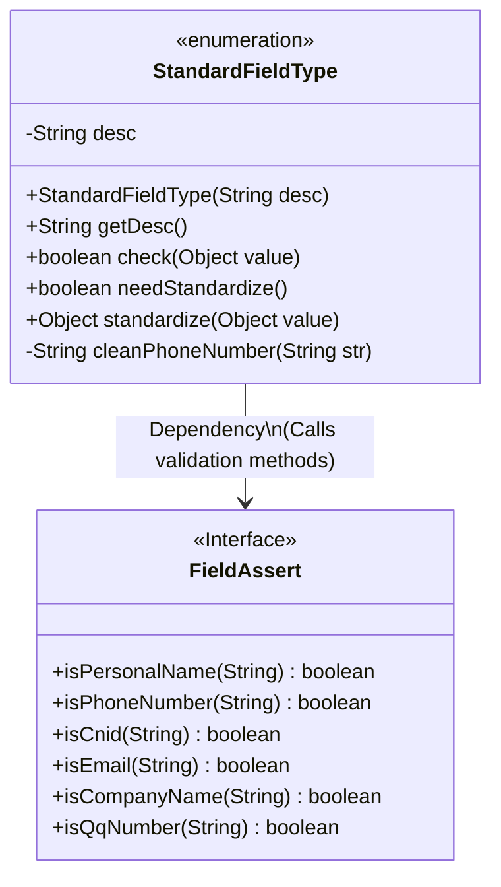
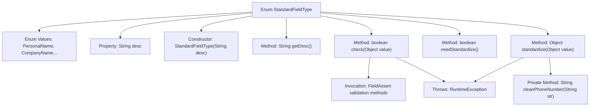
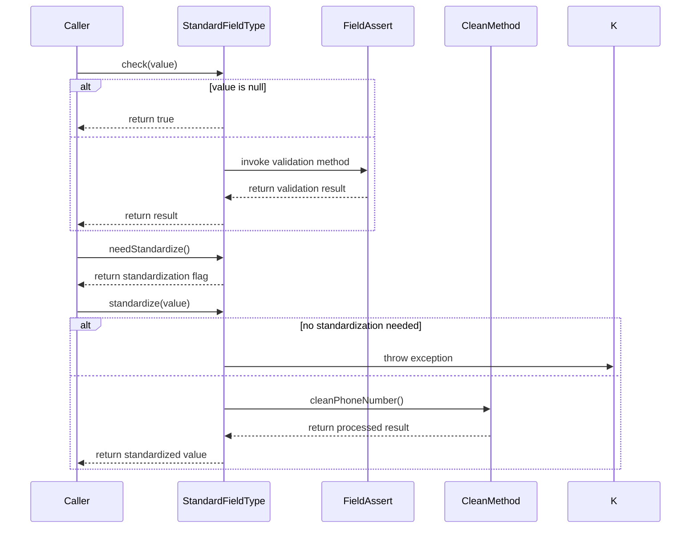

# Basic Information

|      |      |
|------|------|
| Name | StandardFieldType |
| Language | .java |
| Code Path | WeFe/common/java/common-lang/src/main/java/com/welab/wefe/common/fieldvalidate/StandardFieldType.java |
| Package Name | com.welab.wefe.common.fieldvalidate |
| Dependencies | [] |
| Brief Description | The enumeration StandardFieldType defines standard field types, including name, organization, email, etc., and provides validation and standardization methods, such as removing non-numeric characters from phone numbers, converting emails to lowercase, and converting ID cards to uppercase. |

# Description

This is an enumeration class StandardFieldType, which defines various standard field types and their related operations. It includes field types such as name, company name, email, ID number, phone number, QQ number, etc., each with corresponding Chinese descriptions. It provides three main methods: `check` is used to verify whether the field value complies with the specifications, `needStandardize` determines whether the field requires standardization processing, and `standardize` performs standardization processing on the field value. Among them, phone numbers, emails, and ID numbers require standardization: phone numbers will remove non-numeric characters, emails will be converted to lowercase, and ID numbers will be converted to uppercase.

# Class Summary

| Name   | Type  | Description |
|-------|------|-------------|
| StandardFieldType | enum | The enumeration StandardFieldType defines standard field types, including name, organization, email, etc., and provides field validation and standardization functions, such as removing non-numeric characters from phone numbers, converting emails to lowercase, and converting ID cards to uppercase. |

## Class StandardFieldType

|      |      |
|------|------|
| Access Modifier | public |
| Type | enum |
| Name | StandardFieldType |
| Description | The enumeration StandardFieldType defines standard field types, including name, organization, email, etc., and provides field validation and standardization functions, such as removing non-numeric characters from phone numbers, converting emails to lowercase, and converting ID cards to uppercase. |

### UML Class Diagram

This code defines an enumeration class StandardFieldType to represent different types of standard fields and their related operations. Each enumeration value corresponds to a field type (e.g., name, phone number, etc.), containing field descriptions, validation logic, standardization requirement checks, and standardization processing methods. The class relies on the FieldAssert interface to execute specific field validation logic, achieving centralized management of field types and extensibility of related operations. The enumeration type design makes the definition and usage of field types clearer and safer.

### Internal Method Call Graph

The flowchart illustrates the complete structure of the StandardFieldType enum class, including 7 standard field enum values, description property, constructor, and 4 core methods. The sequence diagram details the invocation flows of three key methods: field validation (check) delegates to FieldAssert utility class, standardization judgment (needStandardize) directly returns boolean, and field standardization (standardize) executes different processing logic based on type. All methods incorporate comprehensive null handling and exception throwing mechanisms, particularly phone number cleaning which removes all non-digit characters.

### Field List

| Name  | Type  | Description |
|-------|-------|------|

### Method List

| Name  | Type  | Description |
|-------|-------|------|

