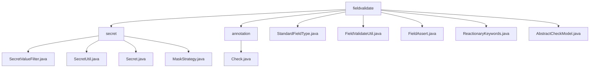

# Basic Information

|      |      |
|------|------|
| Name | fieldvalidate |
| Language | .java |
| Code Path | WeFe/common/java/common-lang/src/main/java/com/welab/wefe/common/fieldvalidate |
| Package Name | docs.common.java.common-lang.src.main.java.com.welab.wefe.common.fieldvalidate |
| Brief Description | This module implements data desensitization and field validation, including annotation marking, policy execution, and reflection processing. It supports standardization and validation of fields such as phone numbers and email addresses, integrating XSS protection and anti-verb filtering. Utility classes provide regex validation and non-null checks, while abstract classes implement recursive validation. |

# Description

## Overview  
This module is a comprehensive field validation and data processing platform, with core responsibilities including sensitive data desensitization, format validation, and security protection, functioning similarly to a data governance middleware. The interface specifications cover Check annotation declarations, StandardFieldType enumeration operations, and FieldValidateUtil utility class invocations. Key data structures include a regular expression rule library, a keyword HashSet collection, and a recursive validation model AbstractCheckModel. External dependencies involve Java reflection mechanisms and regular expression engines. For example, mobile number validation follows an 11-digit rule, while ID card numbers support 15/18-digit format validation.  

## Core Business Scenarios  
The complete workflow is divided into three stages: field tagging (e.g., @Check), type validation (StandardFieldType), and protection handling (XSS/SQL filtering). The interaction mode combines annotation-driven and strategy enumeration approaches, resembling a configuration center model. Typical applications include user registration information validation (e.g., email format verification), sensitive data desensitization (e.g., partial hiding of ID card numbers), and content security review (e.g., detection of prohibited keywords). API types include annotation configuration (e.g., regex), utility methods (FieldAssert.notNull), and recursive validation (AbstractCheckModel). For example, FieldValidateUtil simultaneously handles mobile number standardization (removing non-numeric characters) and SQL injection protection (escaping single quotes).

### Package Internal Structure View

This flowchart illustrates the hierarchical structure of the fieldvalidate module, which includes two subdirectories (secret and annotation) along with multiple files directly under fieldvalidate. The secret directory contains four utility classes for handling sensitive information, while the annotation directory holds one validation annotation class. The overall structure clearly reflects the code organization approach for field validation functionality.

# File List

| Name   | Type  | Description |
|-------|------|-------------|
| [StandardFieldType.java](StandardFieldType.md) | file | The enumeration StandardFieldType defines standard field types, including name, organization, email, etc., and provides validation and standardization methods, such as removing non-numeric characters from phone numbers, converting emails to lowercase, and converting ID cards to uppercase. |
| [FieldValidateUtil.java](FieldValidateUtil.md) | file | The FieldValidateUtil class provides field validation functionalities, including standardization, non-null checks, regex matching, XSS/SQL injection prevention, and filtering of sensitive keywords. It configures validation rules through annotations to ensure secure and compliant input. |
| [FieldAssert.java](FieldAssert.md) | file | The FieldAssert class provides multiple static methods to validate string formats, including phone numbers, names, email addresses, QQ numbers, company names, ID card numbers, etc., and includes non-null checks and exception-throwing functionality. |
| [ReactionaryKeywords.java](ReactionaryKeywords.md) | file | The reaction lexicon class contains keywords related to pornography, civil affairs, violent terrorism, politics, etc., providing methods to check whether a text contains sensitive words and to match the first sensitive word. |
| [AbstractCheckModel.java](AbstractCheckModel.md) | file | The abstract class AbstractCheckModel provides field validation and standardization functionality, recursively checking nested objects and lists while logging exceptions. |
| [secret](secret/_module.md) | package | SecretValueFilter filters sensitive data, SecretUtil manages fields annotated with @Secret, the Secret annotation defines masking strategies, and the MaskStrategy enum implements four masking methods. |
| [annotation](annotation/_module.md) | package | The Java annotation @Check is used for field validation, including configuration items such as parameter name, description, required check, regex validation, standard data types, XSS/SQL injection protection, etc. It supports custom error messages and frontend hiding. |

