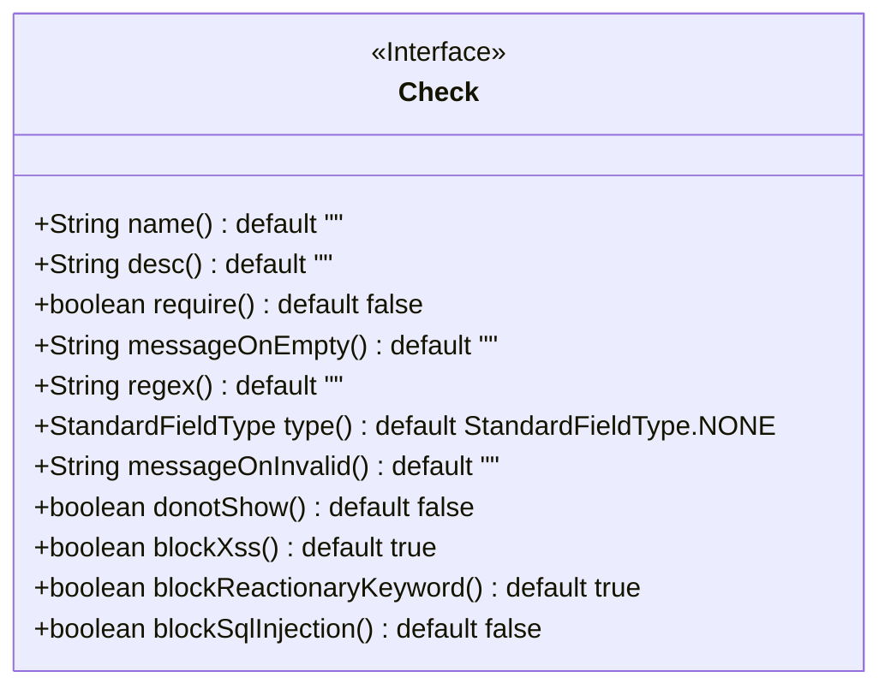

# Basic Information

|      |      |
|------|------|
| Name | Check |
| Language | .java |
| Code Path | WeFe/common/java/common-lang/src/main/java/com/welab/wefe/common/fieldvalidate/annotation/Check.java |
| Package Name | com.welab.wefe.common.fieldvalidate.annotation |
| Dependencies | ['com.welab.wefe.common.fieldvalidate.StandardFieldType', 'java.lang.annotation.ElementType', 'java.lang.annotation.Retention', 'java.lang.annotation.RetentionPolicy', 'java.lang.annotation.Target'] |
| Brief Description | The Java annotation @Check is used for field validation, including configuration items such as parameter name, description, mandatory check, regex validation, standard data types, XSS/SQL injection protection, etc. It supports custom error messages and frontend hiding. |

# Description

This is a Java annotation named Check, designed for field-level parameter validation. It includes multiple configuration items: `name` and `desc` define the parameter name and description; `require` controls whether null values are allowed; `messageOnEmpty` and `messageOnInvalid` set prompt messages for empty and invalid values respectively; `regex` supports regular expression validation; `type` specifies standard data type validation; `donotShow` controls frontend visibility. Security features include XSS attack detection, sensitive keyword filtering, and SQL injection protection switches, where XSS and sensitive word checks are enabled by default, while SQL injection protection is disabled by default.

# Class Summary

| Name   | Type  | Description |
|-------|------|-------------|
| Check | annotation | The Java annotation @Check is used for field validation, supporting configurations such as parameter name, description, non-null check, regex validation, standard data types, XSS protection, filtering of sensitive keywords, and SQL injection prevention. |

## Class Check

|      |      |
|------|------|
| Access Modifier | @Retention(RetentionPolicy.RUNTIME);@Target(ElementType.FIELD);public |
| Type | annotation |
| Name | Check |
| Description | The Java annotation @Check is used for field validation, supporting configurations such as parameter name, description, non-null check, regex validation, standard data types, XSS protection, filtering of sensitive keywords, and SQL injection prevention. |

### UML Class Diagram

This code defines a Java annotation interface named `Check` for field-level data validation configuration. The interface contains 12 configurable items, including basic attributes (name/desc), null value validation rules (require/messageOnEmpty), regex validation (regex), standard field type (type), validation failure prompts (messageOnInvalid), and security protections (blockXss/blockReactionaryKeyword/blockSqlInjection). All attributes have default values, with security-related configurations defaulting to enable XSS and reactionary keyword blocking, while SQL injection protection is disabled by default. This annotation implements runtime field validation through retention policy (RUNTIME) and target (FIELD).

### Internal Method Call Graph

```mermaid
graph TD
    A["Annotation @Check"]
    B["Attribute: String name() default ''"]
    C["Attribute: String desc() default ''"]
    D["Attribute: boolean require() default false"]
    E["Attribute: String messageOnEmpty() default ''"]
    F["Attribute: String regex() default ''"]
    G["Attribute: StandardFieldType type() default NONE"]
    H["Attribute: String messageOnInvalid() default ''"]
    I["Attribute: boolean donotShow() default false"]
    J["Attribute: boolean blockXss() default true"]
    K["Attribute: boolean blockReactionaryKeyword() default true"]
    L["Attribute: boolean blockSqlInjection() default false"]

    A --> B
    A --> C
    A --> D
    A --> E
    A --> F
    A --> G
    A --> H
    A --> I
    A --> J
    A --> K
    A --> L
```

This code defines a Java annotation named `@Check`, primarily used for field validation and security checks. The annotation includes 12 configurable attributes covering basic validation (such as non-empty checks and regex matching), security protection (like XSS prevention and SQL injection blocking), and standardization features. Each attribute has a default value that can be overridden as needed. The annotation is specified with `@Retention(RetentionPolicy.RUNTIME)` to be retained at runtime, and `@Target(ElementType.FIELD)` to restrict its usage to fields only.

### Field List

| Name  | Type  | Description |
|-------|-------|------|
| donotShow | boolean | Method parameters are not displayed by default, with the default value being false. |
| desc | String | The method returns an empty string description by default. |
| type | StandardFieldType | Define the field type with a default of NONE. |
| blockXss | boolean | XSS protection is enabled by default, with a boolean value of true. |
| regex | String | Define the default value of the regular expression for string type as an empty string. |
| name | String | The method defaults to returning the name attribute as an empty string. |
| require | boolean | The default value of the boolean parameter require is false. |
| messageOnInvalid | String | Define the default prompt message string for invalid input. |
| blockReactionaryKeyword | boolean | The reactionary keyword blocking feature is enabled by default. |
| blockSqlInjection | boolean | SQL injection protection is disabled by default. |
| messageOnEmpty | String | Define the default return string when the value is null, which is empty by default. |

### Method List

| Name  | Type  | Description |
|-------|-------|------|

