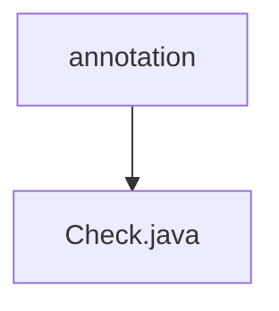

# Basic Information

|      |      |
|------|------|
| Name | annotation |
| Language | .java |
| Code Path | WeFe/common/java/common-lang/src/main/java/com/welab/wefe/common/fieldvalidate/annotation |
| Package Name | docs.common.java.common-lang.src.main.java.com.welab.wefe.common.fieldvalidate.annotation |
| Brief Description | The Java annotation @Check is used for field validation, including configuration items such as parameter name, description, required check, regex validation, standard data types, XSS/SQL injection protection, etc. It supports custom error messages and frontend hiding. |

# Description

This is a Java annotation named Check, designed for field-level parameter validation. It includes multiple configuration items: name and desc define the parameter name and description respectively; require controls whether null values are allowed; messageOnEmpty and messageOnInvalid set prompt messages for empty values and invalid values respectively; regex supports regular expression validation; type specifies standard data type validation; donotShow controls frontend visibility. Security features include XSS attack detection, sensitive keyword filtering, and SQL injection protection switches, where XSS and sensitive keyword checks are enabled by default, while SQL injection protection is disabled by default.

### Package Internal Structure View

This flowchart illustrates the field validation annotation structure in the common-lang module of the WeFe project. The annotation folder serves as the parent node, containing a Check.java annotation file. Such a structure is commonly used in Java projects to organize custom annotations, ensuring code cleanliness and maintainability.

# File List

| Name   | Type  | Description |
|-------|------|-------------|
| [Check.java](Check.md) | file | The Java annotation `@Check` is used for field validation, including configuration items such as parameter name, description, required check, regex validation, standard data types, XSS/SQL injection protection, etc. It supports custom error messages and frontend hiding. |

