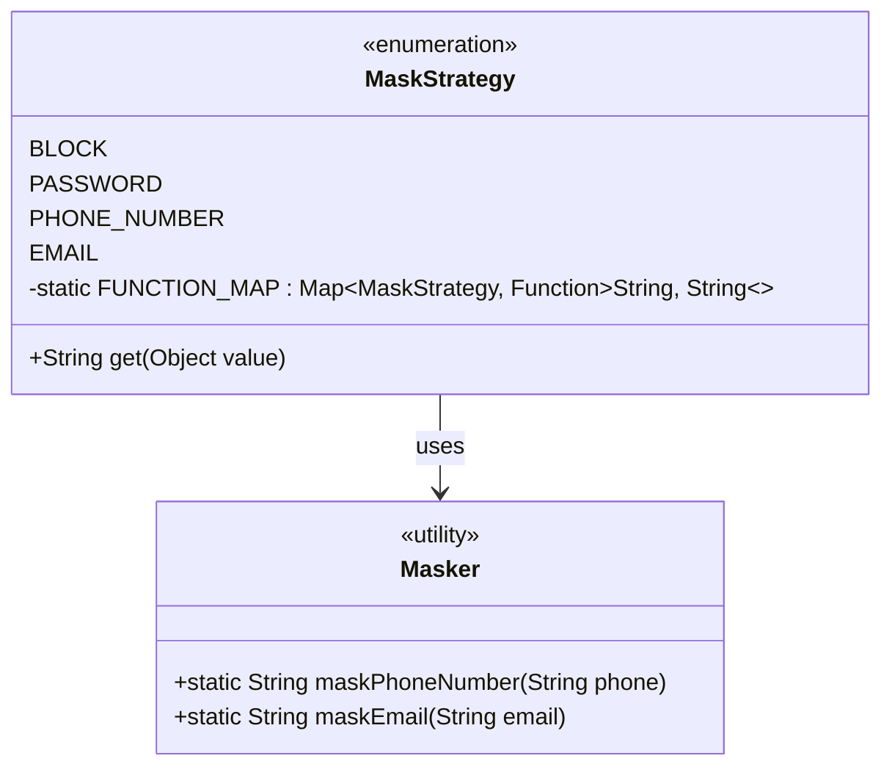
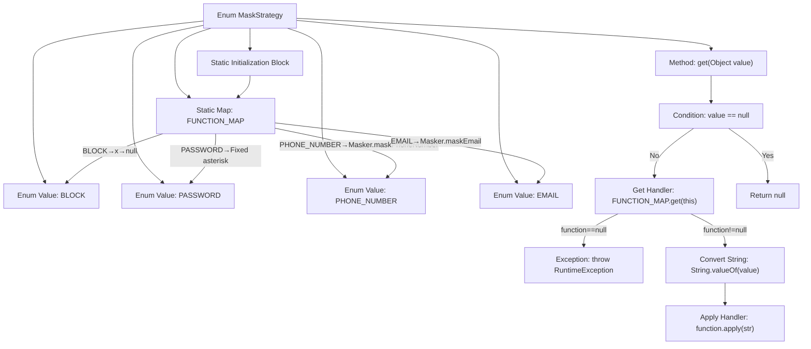

# Basic Information

|      |      |
|------|------|
| Name | MaskStrategy |
| Language | .java |
| Code Path | WeFe/common/java/common-lang/src/main/java/com/welab/wefe/common/fieldvalidate/secret/MaskStrategy.java |
| Package Name | com.welab.wefe.common.fieldvalidate.secret |
| Dependencies | ['com.welab.wefe.common.util.Masker', 'java.util.HashMap', 'java.util.Map', 'java.util.function.Function'] |
| Brief Description | The MaskStrategy enum defines four data masking strategies: BLOCK (outputs null), PASSWORD (fixed asterisks), PHONE_NUMBER, and EMAIL (calls corresponding processing methods). A static mapping table implements the string processing logic for each strategy. |

# Description

The content defines an enumeration class `MaskStrategy`, which is used to implement masking strategies for different fields. The enumeration includes four strategies: `BLOCK` blocks the field from outputting any bytes and returns `null`; `PASSWORD` returns a fixed-length string of asterisks; `PHONE_NUMBER` and `EMAIL` call the corresponding methods of the `Masker` class for processing. Internally, the class binds enumeration values to processing functions through a static `Map`. In the `get` method, the corresponding function is called to process the input value based on the enumeration value. If the input is `null` or no function is bound to the enumeration value, appropriate handling is performed.

# Class Summary

| Name   | Type  | Description |
|-------|------|-------------|
| MaskStrategy | enum | The MaskStrategy enum defines four data masking strategies: BLOCK returns null, PASSWORD returns fixed asterisks, while PHONE_NUMBER and EMAIL invoke corresponding methods for processing. The FUNCTION_MAP maps strategies to specific functions, and the get method executes the masking transformation. |

## Class MaskStrategy

|      |      |
|------|------|
| Access Modifier | public |
| Type | enum |
| Name | MaskStrategy |
| Description | The MaskStrategy enum defines four data masking strategies: BLOCK returns null, PASSWORD returns fixed asterisks, while PHONE_NUMBER and EMAIL invoke corresponding methods for processing. The FUNCTION_MAP maps strategies to specific functions, and the get method executes the masking transformation. |

### UML Class Diagram

This code demonstrates an enumeration class MaskStrategy, which defines four data masking strategies (BLOCK, PASSWORD, PHONE_NUMBER, EMAIL). Through the static mapping FUNCTION_MAP, each strategy is associated with its corresponding processing function, where the PHONE_NUMBER and EMAIL strategies utilize the static methods of the Masker utility class. The get method invokes the appropriate function for masking based on the input value and the current enumeration strategy, achieving flexible application of the strategy pattern.

### Internal Method Call Graph

This flowchart illustrates the core logic of the MaskStrategy enum. The enum defines four data masking strategies (BLOCK/PASSWORD/PHONE_NUMBER/EMAIL), with corresponding handler functions preconfigured via a static Map. The get method selects processing flow based on input: null values return null directly, non-null values undergo respective masking via preset functions, and unmatched strategies throw exceptions. The static initialization block establishes binding mappings between strategies and handler functions.

### Field List

| Name  | Type  | Description |
|-------|-------|------|

### Method List

| Name  | Type  | Description |
|-------|-------|------|

