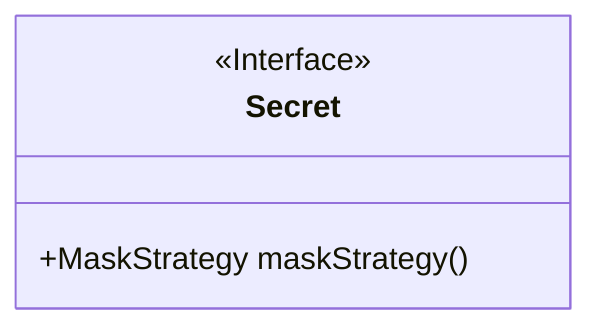
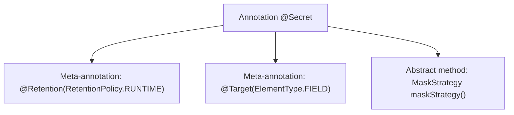

# Basic Information

|      |      |
|------|------|
| Name | Secret |
| Language | .java |
| Code Path | WeFe/common/java/common-lang/src/main/java/com/welab/wefe/common/fieldvalidate/secret/Secret.java |
| Package Name | com.welab.wefe.common.fieldvalidate.secret |
| Dependencies | ['java.lang.annotation.ElementType', 'java.lang.annotation.Retention', 'java.lang.annotation.RetentionPolicy', 'java.lang.annotation.Target'] |
| Brief Description | The Java annotation `@Secret` is used for fields, retained at runtime, and requires specifying a `MaskStrategy` masking strategy. |

# Description

This is a Java annotation definition named `Secret`, designed for field-level usage. It employs the RUNTIME retention policy to ensure annotation information is accessible via reflection during runtime. The annotation includes a mandatory attribute `maskStrategy`, which specifies the masking strategy for field values. Specifically designed for sensitive data processing, it supports diverse masking approaches through the strategy pattern.

# Class Summary

| Name   | Type  | Description |
|-------|------|-------------|
| Secret | annotation | The Java annotation @Secret is used for fields, retained at runtime, and requires specifying a masking strategy MaskStrategy. |

## Class Secret

|      |      |
|------|------|
| Access Modifier | @Retention(RetentionPolicy.RUNTIME);@Target(ElementType.FIELD);public |
| Type | annotation |
| Name | Secret |
| Description | The Java annotation @Secret is used for fields, retained at runtime, and requires specifying a masking strategy MaskStrategy. |

### UML Class Diagram

This class diagram describes a Java annotation interface named `Secret`, marked with `<<Interface>>` to indicate its annotation feature. The annotation contains a public method `maskStrategy()` with a return type of `MaskStrategy`. The annotation is specified with `@Retention(RetentionPolicy.RUNTIME)` to be retained at runtime and restricted by `@Target(ElementType.FIELD)` to be applicable only to field declarations. Its core functionality is to provide dynamic masking strategy configuration for fields, commonly used in scenarios involving sensitive data processing, such as log desensitization or data serialization protection.

### Internal Method Call Graph

This flowchart illustrates the structure of the Java annotation `@Secret`. The annotation is configured with `@Retention` to be retained at runtime, uses `@Target` to restrict its application to fields only, and declares an abstract method `maskStrategy()` that returns a `MaskStrategy` type. The entire structure demonstrates the metadata definition and functional constraints of the annotation, which is used for configuring field-level data masking strategies.

### Field List

| Name  | Type  | Description |
|-------|-------|------|
| maskStrategy | MaskStrategy | Methods for Obtaining Mask Policies. |

### Method List

| Name  | Type  | Description |
|-------|-------|------|

