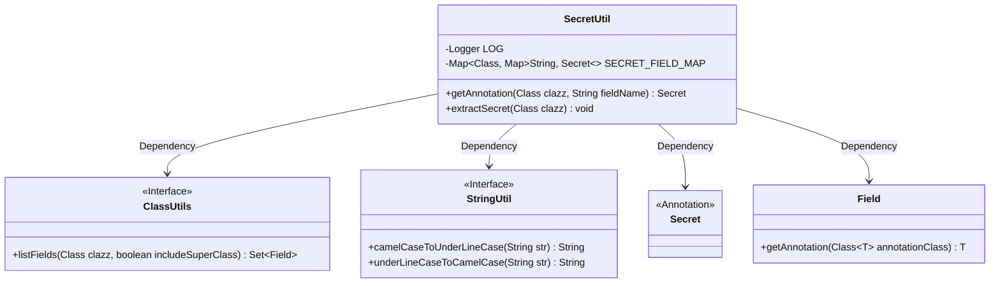
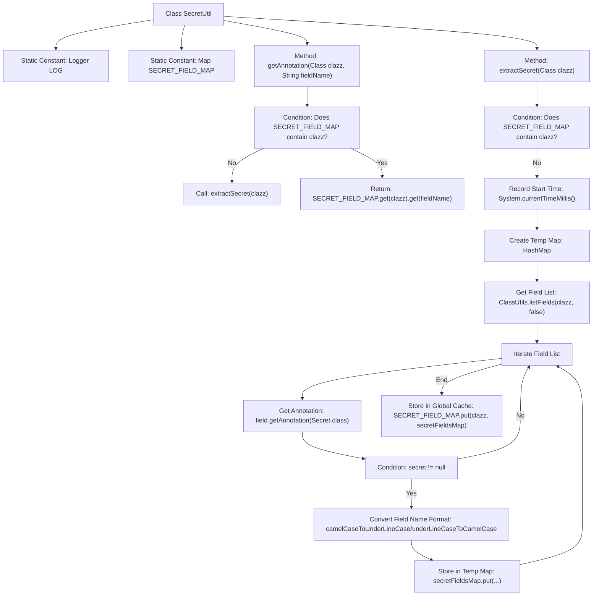

# Basic Information

|      |      |
|------|------|
| Name | SecretUtil |
| Language | .java |
| Code Path | WeFe/common/java/common-lang/src/main/java/com/welab/wefe/common/fieldvalidate/secret/SecretUtil.java |
| Package Name | com.welab.wefe.common.fieldvalidate.secret |
| Dependencies | ['com.welab.wefe.common.util.ClassUtils', 'com.welab.wefe.common.util.StringUtil', 'org.slf4j.Logger', 'org.slf4j.LoggerFactory', 'java.lang.reflect.Field', 'java.security.Security', 'java.util.HashMap', 'java.util.Map', 'java.util.Set'] |
| Brief Description | The `SecretUtil` class is designed to manage fields annotated with `@Secret`, improving access efficiency through caching while supporting reflection-based extraction and compatibility with both camelCase and underscore naming conventions. |

# Description

The `SecretUtil` class is designed to manage and cache fields annotated with `@Secret`. It includes a static Map `SECRET_FIELD_MAP` for storing annotation information of classes and their fields. The `getAnnotation` method retrieves the `@Secret` annotation of a specified field, invoking the `extractSecret` method if the class is not cached. The `extractSecret` method uses reflection to inspect all fields of a class, caches those annotated with `@Secret`, and supports both camelCase and underscore formats for field names. The entire process is thread-safe and logs execution time.

# Class Summary

| Name   | Type  | Description |
|-------|------|-------------|
| SecretUtil | class | The SecretUtil class is designed to manage fields annotated with @Secret, enhancing access efficiency through caching while supporting reflection-based extraction and compatibility with both camelCase and underscore naming conventions. |

## Class SecretUtil

|      |      |
|------|------|
| Access Modifier | public |
| Type | class |
| Name | SecretUtil |
| Description | The SecretUtil class is designed to manage fields annotated with @Secret, enhancing access efficiency through caching while supporting reflection-based extraction and compatibility with both camelCase and underscore naming conventions. |

### UML Class Diagram

This code demonstrates a utility class `SecretUtil` for managing fields annotated with `@Secret`. It uses a static cache `SECRET_FIELD_MAP` to store mappings between classes and field annotations, provides the `getAnnotation` method to retrieve field annotations, and initializes the cache via the `synchronized extractSecret` method. The class depends on `ClassUtils` and `StringUtil` utility interfaces for reflection and string conversion operations, while interacting with the `Secret` annotation and `Field` class. The design employs lazy loading and thread-safe mechanisms, supporting bidirectional mapping between camelCase and underscore_named fields.

### Internal Method Call Graph

This code implements a cached Secret annotation processor. The flowchart illustrates two core methods: getAnnotation retrieves field annotations and calls extractSecret if cache is missing; extractSecret scans class fields via reflection, caching fields with @Secret annotation in two naming formats. The global cache SECRET_FIELD_MAP uses a dual Map structure - outer layer keyed by Class, inner layer storing field name to Secret annotation mappings, supporting both camelCase and under_score field name queries. The process employs lazy loading and synchronization to ensure thread safety.

### Field List

| Name  | Type  | Description |
|-------|-------|------|
| SECRET_FIELD_MAP = new HashMap<>() | Map<Class, Map<String, Secret>> | Define a static constant SECRET_FIELD_MAP, using HashMap to store mappings from classes and field names to Secret objects. |
| LOG = LoggerFactory.getLogger(Security.class) | Logger | Define a static constant LOG for logging in the Security class. |

### Method List

| Name  | Type  | Description |
|-------|-------|------|
| getAnnotation | Secret | The static method `getAnnotation` retrieves annotations based on the class and field name. If the class is not cached, it first extracts the annotations and finally returns the corresponding field's annotations. |
| extractSecret | void | The synchronous static method `extractSecret` inspects class fields and caches field names annotated with `@Secret` (supporting both camelCase and underscore naming conventions) to avoid repeated processing. |

