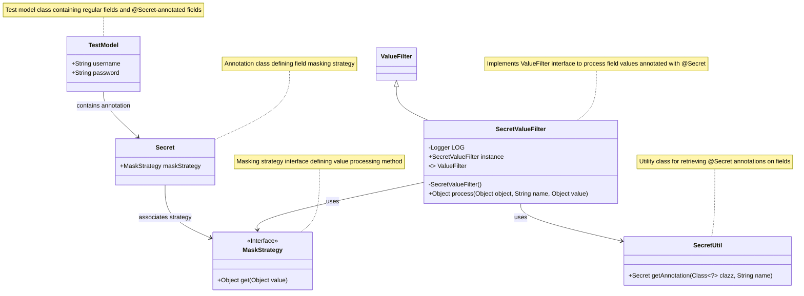
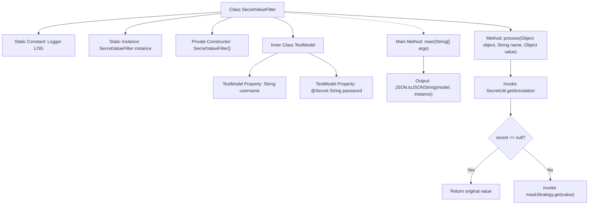

# Basic Information

|      |      |
|------|------|
| Name | SecretValueFilter |
| Language | .java |
| Code Path | WeFe/common/java/common-lang/src/main/java/com/welab/wefe/common/fieldvalidate/secret/SecretValueFilter.java |
| Package Name | com.welab.wefe.common.fieldvalidate.secret |
| Dependencies | ['com.alibaba.fastjson.JSON', 'com.alibaba.fastjson.serializer.ValueFilter', 'org.slf4j.Logger', 'org.slf4j.LoggerFactory'] |
| Brief Description | The `SecretValueFilter` class implements the `ValueFilter` interface and is used to process field values annotated with `@Secret`, masking them according to a specified strategy. The `TestModel` example demonstrates the masking functionality for password fields. |

# Description

SecretValueFilter is a class that implements the ValueFilter interface, designed to filter sensitive data. It retrieves the Secret annotation on fields via SecretUtil and processes sensitive values according to the masking strategy specified by the annotation. The class includes a static inner class TestModel to demonstrate functionality: the username field is output normally, while the password field is masked. The main method illustrates how to use this filter to serialize an instance of TestModel.

# Class Summary

| Name   | Type  | Description |
|-------|------|-------------|
| SecretValueFilter | class | The `SecretValueFilter` class implements the `ValueFilter` interface and is used to filter sensitive fields. Fields requiring desensitization, such as passwords, are marked with the `@Secret` annotation, and a desensitization strategy is specified. The example `TestModel` demonstrates the username and password fields, where the password field is desensitized using the `PASSWORD` strategy. The `main` method illustrates how to use this filter to serialize an object. |

## Class SecretValueFilter

|      |      |
|------|------|
| Access Modifier | public |
| Type | class |
| Name | SecretValueFilter |
| Description | The `SecretValueFilter` class implements the `ValueFilter` interface and is used to filter sensitive fields. Fields requiring desensitization, such as passwords, are marked with the `@Secret` annotation, and a desensitization strategy is specified. The example `TestModel` demonstrates the username and password fields, where the password field is desensitized using the `PASSWORD` strategy. The `main` method illustrates how to use this filter to serialize an object. |

### UML Class Diagram

This code implements an annotation-based sensitive data filtering mechanism. SecretValueFilter, as an implementation of the ValueFilter interface, checks for @Secret annotations on object fields and processes field values according to the specified masking strategy in the annotation. TestModel is a test class containing both regular fields and sensitive fields annotated with @Secret. The SecretUtil utility class retrieves annotation information, and the actual value masking operation is ultimately performed by concrete implementations of the MaskStrategy interface. The entire design achieves decoupling between sensitive data and processing logic, supporting flexible extension of different masking strategies.

### Internal Method Call Graph

The flowchart illustrates the structure and execution flow of the SecretValueFilter class. This class implements the ValueFilter interface and processes field values marked with @Secret annotation through the process method. When detecting a field with @Secret annotation, it applies the specified masking strategy to the value; otherwise, it returns the original value. The TestModel inner class demonstrates functionality, while the main method shows how to serialize an object through this filter into JSON. The entire process exemplifies a typical pattern for sensitive data filtering.

### Field List

| Name  | Type  | Description |
|-------|-------|------|
| instance = new SecretValueFilter() | SecretValueFilter | The static constant instance SecretValueFilter is used for filtering sensitive values. |
| LOG = LoggerFactory.getLogger(SecretValueFilter.class) | Logger | Define a static log object LOG for the SecretValueFilter class, created using LoggerFactory. |

### Method List

| Name  | Type  | Description |
|-------|-------|------|
| main | void | Create a TestModel instance in the Java main method, convert it to a JSON string with sensitive values filtered using a JSON library, and then output the result. |
| process | Object | The method processes object property values, returning the original value if the property has no Secret annotation, otherwise processing the value according to the masking strategy specified in the annotation. |

