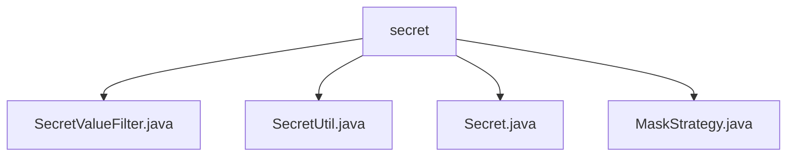

# Basic Information

|      |      |
|------|------|
| Name | secret |
| Language | .java |
| Code Path | WeFe/common/java/common-lang/src/main/java/com/welab/wefe/common/fieldvalidate/secret |
| Package Name | docs.common.java.common-lang.src.main.java.com.welab.wefe.common.fieldvalidate.secret |
| Brief Description | SecretValueFilter filters sensitive data, SecretUtil manages fields annotated with @Secret, the Secret annotation defines masking strategies, and the MaskStrategy enum implements four masking methods. |

# Description

## Overview  
The core responsibility of this module is to implement automated filtering and masking of sensitive data, functioning as a data desensitization middleware. The interface specifications include the ValueFilter interface implementation, Secret annotation parsing, and the MaskStrategy policy enumeration. Key data structures consist of the SECRET_FIELD_MAP cache for annotated fields, the TestModel test case, and a strategy function mapping table. External dependencies are limited to the Java reflection mechanism. For example, during serialization via SecretValueFilter, the password field is replaced with an asterisk string.  

## Main Business Scenarios  
The primary workflow is divided into three stages: annotation marking (e.g., @Secret), field parsing (SecretUtil), and policy execution (MaskStrategy). The interaction mode adopts a strategy enumeration bound to handler functions, resembling an event bus pattern. Typical applications include user information desensitization (e.g., masking the middle four digits of a phone number) and log-sensitive field filtering. API types encompass annotation declarations (e.g., maskStrategy), enumeration invocations (e.g., PASSWORD strategy), and filter integration. For instance, TestModel demonstrates the contrast between displaying the username in plaintext and masking the password.

### Package Internal Structure View

This flowchart illustrates the hierarchical structure of the `secret` package under the `common-lang` module in the WeFe project. The `secret` node serves as the parent, encompassing four child files: `SecretValueFilter.java`, `SecretUtil.java`, `Secret.java`, and `MaskStrategy.java`. These files are all related to field validation and secret value processing, forming a clear organizational structure within the package.

# File List

| Name   | Type  | Description |
|-------|------|-------------|
| [SecretValueFilter.java](SecretValueFilter.md) | file | The `SecretValueFilter` class implements the `ValueFilter` interface and is used to process field values marked with the `@Secret` annotation, masking them according to specified strategies. The `TestModel` example demonstrates the masking functionality for password fields. |
| [SecretUtil.java](SecretUtil.md) | file | The `SecretUtil` class is designed to manage fields annotated with `@Secret`, improving access efficiency through caching. It supports reflection-based extraction and compatibility with both camelCase and underscore naming conventions. |
| [Secret.java](Secret.md) | file | The Java annotation `@Secret` is used for fields, retained at runtime, and requires specifying a `MaskStrategy` masking strategy. |
| [MaskStrategy.java](MaskStrategy.md) | file | The MaskStrategy enum defines four data masking strategies: BLOCK (outputs null), PASSWORD (fixed asterisks), PHONE_NUMBER, and EMAIL (calls corresponding processing methods). A static mapping table implements the string processing logic for each strategy. |

