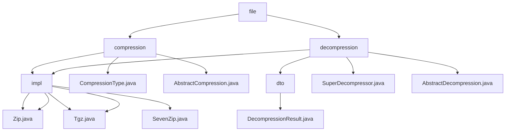

# Basic Information

|      |      |
|------|------|
| Name | file |
| Language | .java |
| Code Path | WeFe/common/java/common-lang/src/main/java/com/welab/wefe/common/file |
| Package Name | docs.common.java.common-lang.src.main.java.com.welab.wefe.common.file |
| Brief Description | This module implements multi-format file compression and decompression, supporting formats such as ZIP/TAR.GZ/7z. It adopts an abstract class and factory pattern design, relies on libraries like Apache Commons, and is suitable for scenarios like log packaging and file transfer. It provides synchronous APIs and command-line tools. |

# Description

## Overview  
The core responsibility of this module is to provide unified processing for multi-format file compression and decompression, supporting formats such as ZIP, TAR.GZ, and 7z (e.g., recursive folder handling, skipping symbolic links). The interface specification is based on an abstract class pattern, where the compression side requires the implementation of the `doCompression` method, and the decompression side must adhere to the `doDecompression` specification. Key data structures include stream-processed entry objects (e.g., `ZipEntry`, `TarEntry`) and result containers (e.g., `DecompressionResult`). External dependencies include Apache Commons Compress, Java's native `ZipFile`, and third-party libraries like `SevenZFile`—for instance, TAR.GZ uses a dual-layer stream combination, while 7z employs block stream processing. Compression types are mapped to file extensions (e.g., `.zip`, `.7z`) via enumeration.  

## Primary Business Scenarios  
The module adopts an archive-hub-like pattern, with typical applications including log packaging (compression) and distributed file preprocessing (decompression). The compression workflow follows: initialization → traversal → filtering → writing → closing, while decompression uses a pipeline of validation → traversal → creation → release. The interaction mode is synchronous blocking API—for example, `SuperDecompressor` automatically invokes the corresponding decompressor based on file extensions. Integration examples can be seen in command-line demonstrations (e.g., `main` method processing directories), with ZIP adapted for Windows and TAR.GZ for Linux, supporting recursive operations and automatic format recognition.

### Package Internal Structure View

This flowchart illustrates the hierarchical structure of the file compression and decompression module in the WeFe project. The root node "file" branches into two main components: compression and decompression. Each component contains concrete implementation classes (impl), abstract base classes (Abstract), and auxiliary classes (dto). The compression module supports Zip/Tgz formats, while the decompression module additionally supports 7z format, reflecting a modular design philosophy. All implementation classes inherit from their corresponding abstract base classes, adhering to object-oriented design principles.

# File List

| Name   | Type  | Description |
|-------|------|-------------|
| [decompression](decompression/_module.md) | package | This module implements decompression of multi-format archive files, supporting formats such as ZIP/7z/tgz, and handles extraction tasks through a unified interface. The core components include the AbstractDecompression base class, decompression result objects, and file entry iterators. It supports batch decompression, path safety validation, and resource release, and is applicable to scenarios like log analysis and file preprocessing. |
| [compression](compression/_module.md) | package | This module provides compression functionality in ZIP and TAR.GZ formats, supporting recursive directory processing and stream operations. Core classes include the AbstractCompression abstract class and Zip/Tgz implementation classes, relying on the Apache Commons library. It is suitable for scenarios such as log packaging and file transfer optimization. |

