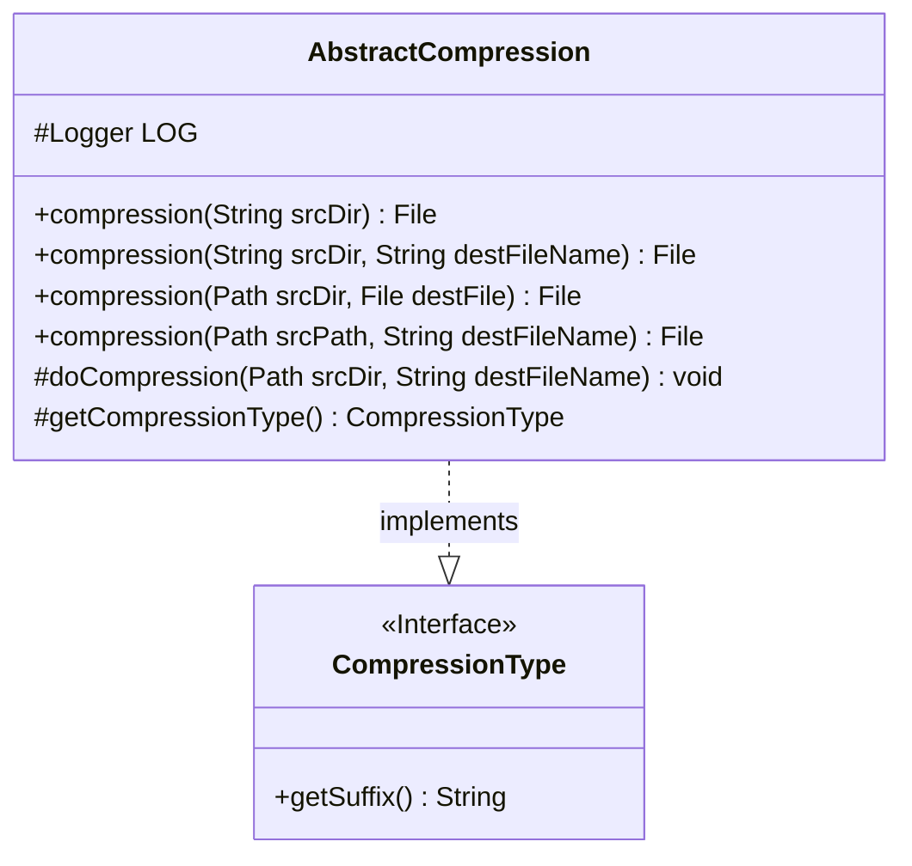
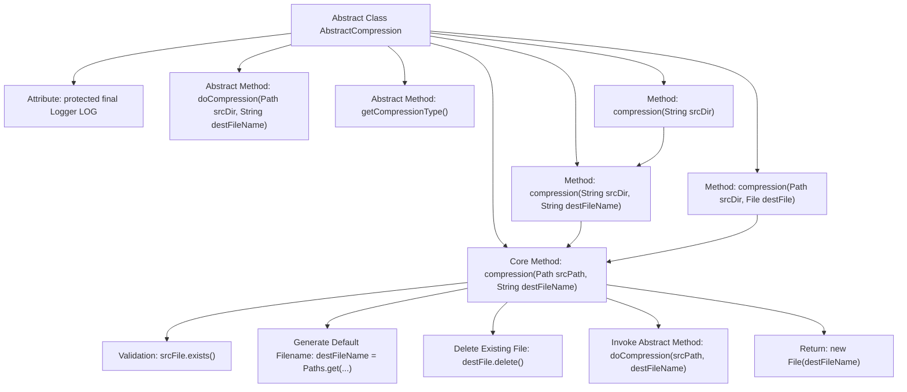

# Basic Information

|      |      |
|------|------|
| Name | AbstractCompression |
| Language | .java |
| Code Path | WeFe/common/java/common-lang/src/main/java/com/welab/wefe/common/file/compression/AbstractCompression.java |
| Package Name | com.welab.wefe.common.file.compression |
| Dependencies | ['com.welab.wefe.common.util.StringUtil', 'org.slf4j.Logger', 'org.slf4j.LoggerFactory', 'java.io.File', 'java.io.IOException', 'java.nio.file.Path', 'java.nio.file.Paths'] |
| Brief Description | The abstract compression class provides folder compression functionality, supporting multiple path inputs, automatic handling of target filenames, including existence checks and cleanup logic, requiring subclasses to implement specific compression methods. |

# Description

This is an abstract compression class AbstractCompression that provides folder compression functionality. It contains an abstract method doCompression for concrete compression implementation, and an abstract method getCompressionType to retrieve the compression type. The class provides multiple overloaded compression methods supporting different parameter forms for compression operations, including handling source path validation, target filename generation, and existing file deletion logic. All compression operations are ultimately delegated to the doCompression method for execution.

# Class Summary

| Name   | Type  | Description |
|-------|------|-------------|
| AbstractCompression | class | The abstract compression class provides folder compression functionality, supporting multiple path inputs, automatically handling target filenames, and includes existence checks and cleanup logic, requiring subclasses to implement specific compression methods. |

## Class AbstractCompression

|      |      |
|------|------|
| Access Modifier | public abstract |
| Type | class |
| Name | AbstractCompression |
| Description | The abstract compression class provides folder compression functionality, supporting multiple path inputs, automatically handling target filenames, and includes existence checks and cleanup logic, requiring subclasses to implement specific compression methods. |

### UML Class Diagram

This code demonstrates an abstract compression class `AbstractCompression` and its relationship with the `CompressionType` interface. `AbstractCompression` provides multiple overloaded `compression` methods to handle compression requests with different parameter types, all ultimately calling the protected abstract method `doCompression` to perform the actual compression operation. The class includes preprocessing logic such as source file existence checks, destination filename generation, and existing file deletion, reflecting robust design. The `CompressionType` interface defines the method to obtain compression suffixes, which are implemented by concrete subclasses for different compression types. The overall structure is clear with well-defined responsibilities, implementing the template method pattern through abstract methods.

### Internal Method Call Graph

Flowchart Description: This flowchart illustrates the complete structure and workflow of the AbstractCompression abstract class. Starting from the entry method compression(String), it ultimately converges to the core method compression(Path, String) through method overloading. This core method sequentially performs source file validation, target filename generation, and existing file cleanup before invoking the abstract method doCompression to complete the actual compression, finally returning the result file. All compression operations are uniformly processed through this core method, demonstrating the Template Method design pattern.

### Field List

| Name  | Type  | Description |
|-------|-------|------|
| LOG = LoggerFactory.getLogger(this.getClass()) | Logger | A protected final log object LOG is defined in the class for recording the log information of the current class. |

### Method List

| Name  | Type  | Description |
|-------|-------|------|
| compression | File | Java Method: Compresses the specified directory and returns a File object. A null parameter can be passed to invoke the overloaded method. May throw an IOException. |
| compression | File | Java Method: Compress the specified directory to the target file, with parameters being the source directory path and the target filename, may throw an IO exception. |
| getCompressionType | CompressionType | Abstract method, returns the compression type. |
| doCompression | void | Abstract method for compressing the specified directory into a target file, which may throw an IO exception. |
| compression | File | Java Method: Compress the specified directory into a file, with parameters being the source directory path and the target file object, and throws IOException. |
| compression | File | This method compresses the specified path folder into a file, automatically handling path checks, default naming, and overwrite issues, and returns the compressed file object. |

