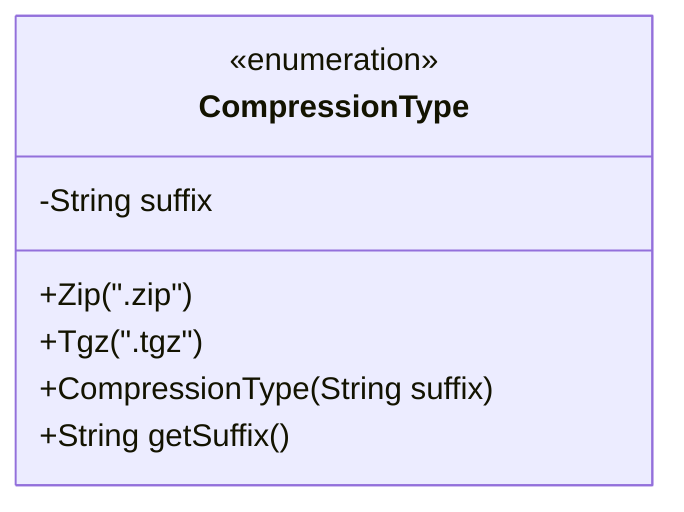
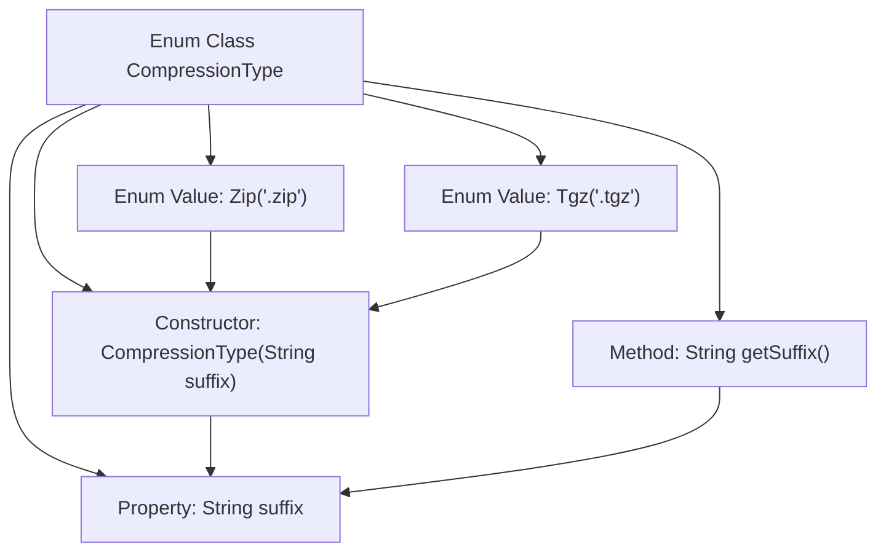

# Basic Information

|      |      |
|------|------|
| Name | CompressionType |
| Language | .java |
| Code Path | WeFe/common/java/common-lang/src/main/java/com/welab/wefe/common/file/compression/CompressionType.java |
| Package Name | com.welab.wefe.common.file.compression |
| Dependencies | [] |
| Brief Description | The enumeration CompressionType defines two compression types: Zip and Tgz, corresponding to the suffixes .zip and .tgz respectively, and provides a method getSuffix to retrieve the suffix. |

# Description

The code defines an enumeration type `CompressionType`, which includes two enum values `Zip` and `Tgz`, corresponding to the file extensions `.zip` and `.tgz` respectively. The enum class contains a private string field `suffix` to store the extension, initialized via the constructor. A public method `getSuffix()` is provided to retrieve the extension. The entire structure concisely implements the mapping relationship between compression types and file extensions.

# Class Summary

| Name   | Type  | Description |
|-------|------|-------------|
| CompressionType | enum | The enumeration CompressionType defines two compression types: Zip and Tgz, corresponding to the suffixes .zip and .tgz respectively, and provides a method getSuffix to retrieve the suffix. |

## Class CompressionType

|      |      |
|------|------|
| Access Modifier | public |
| Type | enum |
| Name | CompressionType |
| Description | The enumeration CompressionType defines two compression types: Zip and Tgz, corresponding to the suffixes .zip and .tgz respectively, and provides a method getSuffix to retrieve the suffix. |

### UML Class Diagram

This code defines an enumeration class `CompressionType` to represent different compression types. The enumeration includes two instances: `Zip` and `Tgz`, corresponding to the suffixes ".zip" and ".tgz" respectively. Each enumeration instance is associated with a string suffix via the constructor and provides access through the `getSuffix()` method. This design is commonly used in file processing scenarios to manage suffixes of different compression formats in a type-safe manner, avoiding maintenance issues caused by hard-coded strings. The private field and public methods of the enumeration demonstrate good encapsulation.

### Internal Method Call Graph

This flowchart illustrates the structure of the enum class CompressionType, which contains two enum values Zip and Tgz. Each enum value initializes the suffix property through a constructor and provides a getSuffix method to retrieve the suffix value. The arrows represent the relationships between class members, clearly showing the complete path from enum definition to property operations.

### Field List

| Name  | Type  | Description |
|-------|-------|------|

### Method List

| Name  | Type  | Description |
|-------|-------|------|

