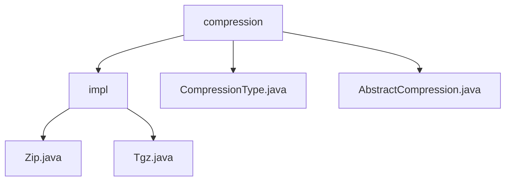

# Basic Information

|      |      |
|------|------|
| Name | compression |
| Language | .java |
| Code Path | WeFe/common/java/common-lang/src/main/java/com/welab/wefe/common/file/compression |
| Package Name | docs.common.java.common-lang.src.main.java.com.welab.wefe.common.file.compression |
| Brief Description | This module provides compression functionality in ZIP and TAR.GZ formats, supporting recursive directory processing and stream operations. Core classes include the AbstractCompression abstract class and Zip/Tgz implementation classes, relying on the Apache Commons library. It is suitable for scenarios such as log packaging and file transfer optimization. |

# Description

## Overview  
The core responsibility of this module is to implement multi-format file compression, supporting directory/file compression in ZIP and TAR.GZ formats (e.g., recursive folder processing, skipping symbolic links). The interface specification is based on the AbstractCompression abstract class, requiring subclasses to implement the core method doCompression and the identifier getCompressionType. Key data structures include stream-processed ZIP entries and TAR archive entries. External dependencies include the Apache Commons Compress library for handling TAR.GZ format, such as the Zip class using ZipOutputStream and the Tgz class combining TarArchiveOutputStream and GzipCompressorOutputStream. Compression types are mapped to file extensions (e.g., .zip/.tgz) via the CompressionType enum class.

## Primary Business Scenarios  
Typical applications include log packaging and file size optimization before transmission (similar to an archive transfer station pattern). The complete workflow is: initialize streams → traverse directories → filter non-regular files → write entries → close resources. It supports programmatic calls and command-line demonstrations (e.g., a main method to compress directories and output information). As a synchronous processor API, it is integrated into the data preprocessing stage, with ZIP suited for Windows and TAR.GZ adapted for Linux. The abstract class provides a polymorphic compression method, handling common logic such as path validation and filename generation, ultimately delegating to doCompression for specific compression implementation.

### Package Internal Structure View

This flowchart illustrates the hierarchical structure of the file compression module. The root node "compression" contains three child nodes: the "impl" folder, the "CompressionType.java" file, and the "AbstractCompression.java" file. The "impl" folder further includes two concrete implementation classes: "Zip.java" and "Tgz.java". The entire structure clearly reflects the relationship between abstraction and concrete implementation in the compression module.

# File List

| Name   | Type  | Description |
|-------|------|-------------|
| [CompressionType.java](CompressionType.md) | file | The enumeration `CompressionType` defines two compression types: Zip and Tgz, corresponding to the suffixes `.zip` and `.tgz` respectively, and provides a method `getSuffix` to retrieve the suffix. |
| [AbstractCompression.java](AbstractCompression.md) | file | The abstract compression class provides folder compression functionality, supports multiple path inputs, automatically handles target filenames, includes existence checks and cleanup logic, and requires subclasses to implement specific compression methods. |
| [impl](impl/_module.md) | package | Java class implements ZIP and tar.gz compression functionality, recursively processing folders and files, generating compressed files and outputting their paths and sizes. |

