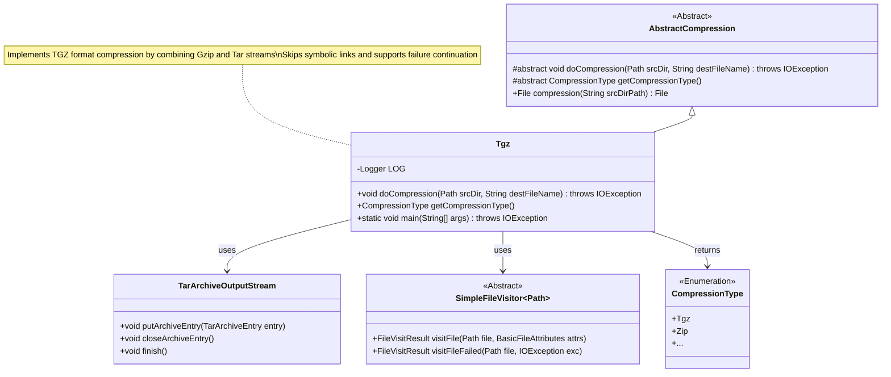
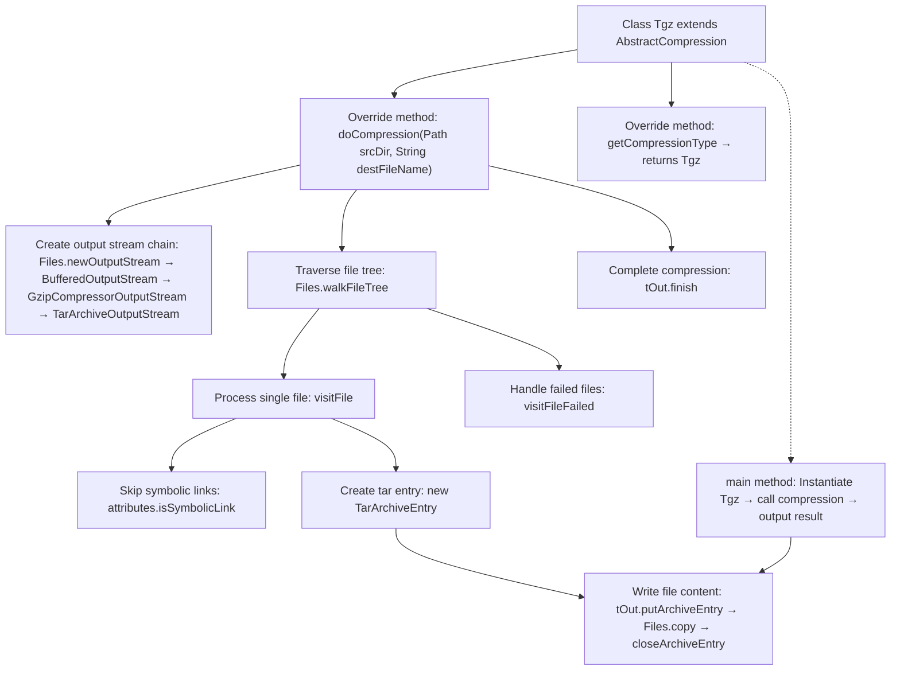

# Basic Information

|      |      |
|------|------|
| Name | Tgz |
| Language | .java |
| Code Path | WeFe/common/java/common-lang/src/main/java/com/welab/wefe/common/file/compression/impl/Tgz.java |
| Package Name | com.welab.wefe.common.file.compression.impl |
| Dependencies | ['com.welab.wefe.common.file.compression.AbstractCompression', 'com.welab.wefe.common.file.compression.CompressionType', 'org.apache.commons.compress.archivers.tar.TarArchiveEntry', 'org.apache.commons.compress.archivers.tar.TarArchiveOutputStream', 'org.apache.commons.compress.compressors.gzip.GzipCompressorOutputStream', 'java.io.BufferedOutputStream', 'java.io.File', 'java.io.IOException', 'java.io.OutputStream', 'java.nio.file', 'java.nio.file.attribute.BasicFileAttributes'] |
| Brief Description | The Tgz class inherits from AbstractCompression and implements the doCompression method to package a directory into a tar.gz file, skipping symbolic links and logging failures. The main method tests the compression functionality and outputs the file path and size. |

# Description

The code defines a Tgz class, which inherits from the AbstractCompression abstract class and implements compression functionality in the tar.gz format. The main logic involves traversing all files in the source directory, then using TarArchiveOutputStream and GzipCompressorOutputStream to package and compress the files into the tar.gz format. During processing, symbolic link files are skipped, and error logs are recorded if access failures occur. Finally, the main method demonstrates the usage of the compression functionality, outputting the path and size of the compressed file.

# Class Summary

| Name   | Type  | Description |
|-------|------|-------------|
| Tgz | class | The Tgz class inherits from AbstractCompression and implements the doCompression method to package a directory into a tar.gz file, skipping symbolic links, logging failures, and supporting compression type retrieval. |

## Class Tgz

|      |      |
|------|------|
| Access Modifier | public |
| Type | class |
| Name | Tgz |
| Description | The Tgz class inherits from AbstractCompression and implements the doCompression method to package a directory into a tar.gz file, skipping symbolic links, logging failures, and supporting compression type retrieval. |

### UML Class Diagram

Class diagram description: This diagram illustrates a TGZ compression implementation where the Tgz class inherits from the abstract class AbstractCompression. It achieves directory traversal compression by combining TarArchiveOutputStream and SimpleFileVisitor. The core process includes file access control, exception handling, and stream closure, with an enumeration type distinguishing compression formats. The diagram clearly demonstrates the design of the template method pattern combined with stream processing.

### Internal Method Call Graph

Flowchart description: This flowchart illustrates the core process of the Tgz compression utility, starting from initializing the output stream chain, recursively traversing the source directory to process each file (skipping symbolic links), packaging file data into tar format with gzip compression, and finally handling exceptions to complete compression. The main method demonstrates the actual invocation process including result output. Key aspects include the streaming architecture and file tree traversal mechanism.

### Field List

| Name  | Type  | Description |
|-------|-------|------|

### Method List

| Name  | Type  | Description |
|-------|-------|------|
| getCompressionType | CompressionType | Method override, returns the compression type as Tgz. |
| doCompression | void | This method compresses the specified directory into a tar.gz file, skips symbolic links, traverses files and packages them one by one, logs exceptions and continues execution. |
| main | void | The Java main method uses the Tgz class to compress a specified directory and outputs the compressed file path and size (MB). |

