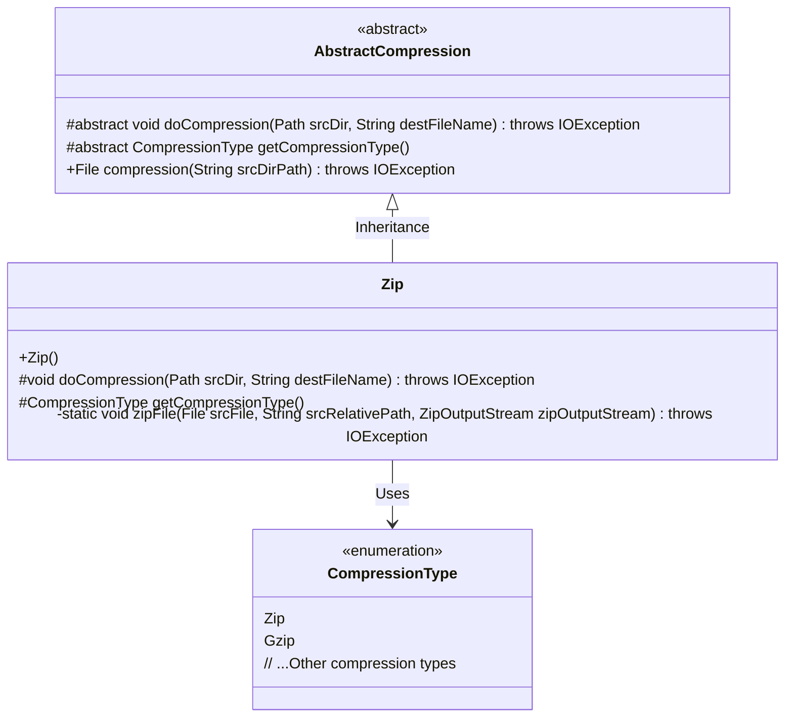
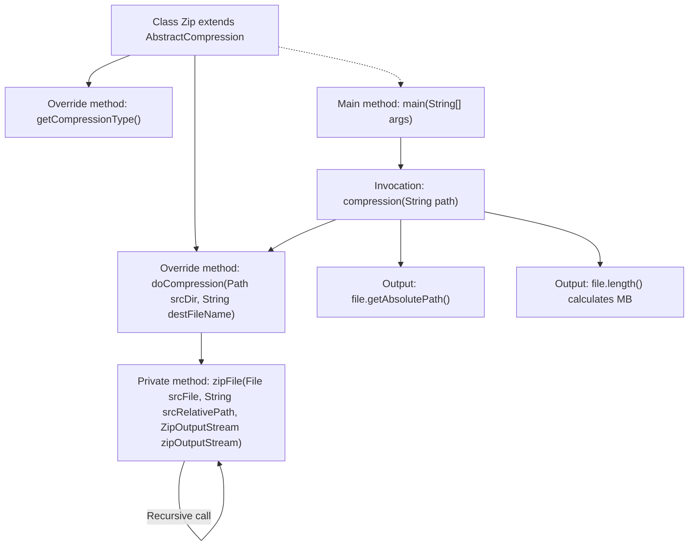

# Basic Information

|      |      |
|------|------|
| Name | Zip |
| Language | .java |
| Code Path | WeFe/common/java/common-lang/src/main/java/com/welab/wefe/common/file/compression/impl/Zip.java |
| Package Name | com.welab.wefe.common.file.compression.impl |
| Dependencies | ['com.welab.wefe.common.file.compression.AbstractCompression', 'com.welab.wefe.common.file.compression.CompressionType', 'java.io.File', 'java.io.FileInputStream', 'java.io.FileOutputStream', 'java.io.IOException', 'java.nio.file.Path', 'java.util.zip.ZipEntry', 'java.util.zip.ZipOutputStream'] |
| Brief Description | The Zip class inherits from AbstractCompression and implements recursive folder compression functionality, supporting directory traversal and file compression, outputting files in ZIP format. |

# Description

This is a Java class that implements ZIP compression functionality, inheriting from an abstract compression class. Its main features include recursively compressing folders and files into ZIP format. The class contains two core methods: doCompression initializes the output stream and starts the compression process, while the zipFile method recursively processes directory structures, creating ZIP entries for each file and writing data. The class also implements a method to obtain the compression type, returning a ZIP format identifier. Finally, the main method demonstrates compressing a specified directory and outputs the resulting file path and size.

# Class Summary

| Name   | Type  | Description |
|-------|------|-------------|
| Zip | class | The Zip class inherits from AbstractCompression and implements the functionality of recursively compressing folders into zip files, including compression type retrieval and main method testing. |

## Class Zip

|      |      |
|------|------|
| Access Modifier | public |
| Type | class |
| Name | Zip |
| Description | The Zip class inherits from AbstractCompression and implements the functionality of recursively compressing folders into zip files, including compression type retrieval and main method testing. |

### UML Class Diagram

This code demonstrates the implementation of a ZIP compression utility, where the Zip class inherits from the abstract base class AbstractCompression and implements specific compression logic. The class diagram clearly illustrates this inheritance relationship, as well as the association between the Zip class and the CompressionType enumeration. The Zip class processes file and directory compression recursively, with its core method being the private zipFile(), which adopts different compression strategies based on file types (directory or regular file). The overall design embodies the Template Method pattern, where the abstract base class defines the algorithmic framework, and concrete subclasses implement specific compression logic.

### Internal Method Call Graph

The flowchart illustrates the core logic of the Zip compression class: Initializing the compression stream via the doCompression method, recursively invoking zipFile to process directories/files, and ultimately outputting results. The zipFile method creates empty entries for directories (recursing through sub-items) and writes byte streams for files. The main method triggers the compression workflow and prints result information, demonstrating the complete control flow and data transfer path of the compression process.

### Field List

| Name  | Type  | Description |
|-------|-------|------|

### Method List

| Name  | Type  | Description |
|-------|-------|------|
| zipFile | void | Recursively compress files or directories into a ZipOutputStream, adding separators when processing directories and recursively handling subfiles, while reading byte streams and writing Zip entries for files. |
| doCompression | void | This method recursively compresses the specified folder into the target ZIP file, implemented using ZipOutputStream. |
| getCompressionType | CompressionType | Method override, returns the compression type as Zip. |
| main | void | Java code example: Compress a specified folder path using the Zip class, and output the absolute path of the compressed file along with its size (converted from KB to MB). |

