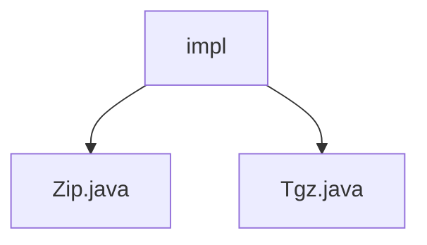

# Basic Information

|      |      |
|------|------|
| Name | impl |
| Language | .java |
| Code Path | WeFe/common/java/common-lang/src/main/java/com/welab/wefe/common/file/compression/impl |
| Package Name | docs.common.java.common-lang.src.main.java.com.welab.wefe.common.file.compression.impl |
| Brief Description | Java class implements ZIP and tar.gz compression functionality, recursively processing folders and files, generating compressed files and outputting their paths and sizes. |

# Description

## Overview  
This module implements multi-format file compression functionality, with its core responsibility being to provide directory/file compression capabilities in ZIP and TAR.GZ formats (e.g., recursive folder processing, skipping symbolic links). The interface specifications uniformly inherit the AbstractCompression abstract class, requiring the implementation of the core doCompression method and the retrieval of compression type identifiers. Key data structures include ZIP entries and TAR archive entries, both processed in a streaming manner. External dependencies include the Apache Commons Compress library for TAR.GZ format compression. For example, the Zip class implements compression via ZipOutputStream, while the Tgz class combines TarArchiveOutputStream and GzipCompressorOutputStream.  

## Primary Business Scenarios  
Typical scenarios include batch log packaging or volume optimization before distributed file transfers (similar to an archive relay mode). The complete workflow is: initialize the output stream → recursively traverse the directory → skip non-regular files → write compression entries → close resources. The interaction mode supports programmatic calls and command-line demonstrations, such as using the main method to showcase compressing a specified directory and outputting file information. The API type is a synchronous processor, with integration examples visible in raw file packaging during the data preprocessing stage. The two compression formats are respectively suited for Windows environments (ZIP) and Linux systems (TAR.GZ).

### Package Internal Structure View

This flowchart illustrates two concrete implementation classes under the compression feature directory: Zip.java and Tgz.java. Both classes reside under the impl directory at the same hierarchical level, each implementing distinct compression algorithm functionalities. The structure clearly reflects the organization of implementation classes, facilitating an understanding of the module dependencies.

# File List

| Name   | Type  | Description |
|-------|------|-------------|
| [Zip.java](Zip.md) | file | The Zip class inherits from AbstractCompression and implements recursive folder compression functionality, supporting directory traversal and file compression, outputting files in ZIP format. |
| [Tgz.java](Tgz.md) | file | The Tgz class inherits from AbstractCompression and implements the doCompression method to package a directory into a tar.gz file, skipping symbolic links while logging failures. The main method tests the compression functionality and outputs the file path and size. |

