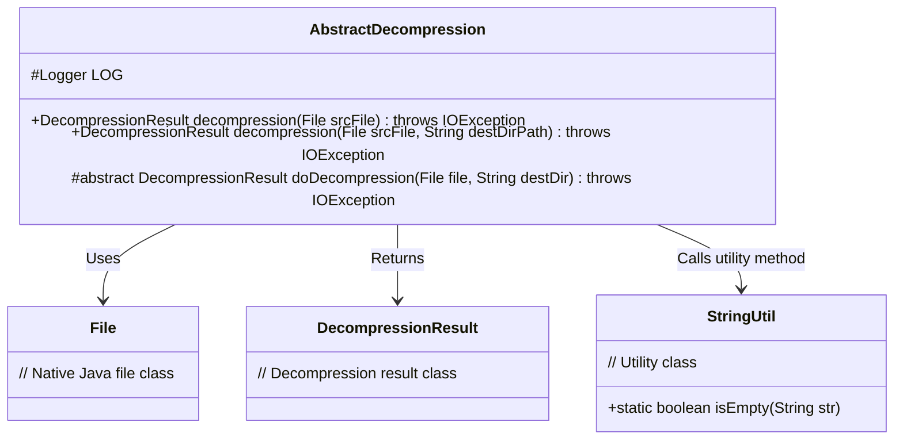
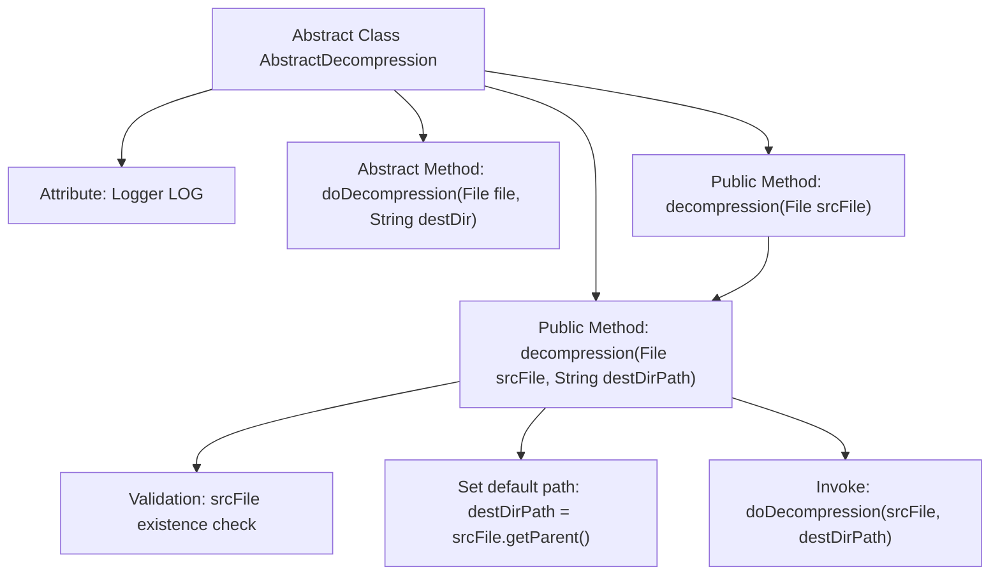

# Basic Information

|      |      |
|------|------|
| Name | AbstractDecompression |
| Language | .java |
| Code Path | WeFe/common/java/common-lang/src/main/java/com/welab/wefe/common/file/decompression/AbstractDecompression.java |
| Package Name | com.welab.wefe.common.file.decompression |
| Dependencies | ['com.welab.wefe.common.file.decompression.dto.DecompressionResult', 'com.welab.wefe.common.util.StringUtil', 'org.slf4j.Logger', 'org.slf4j.LoggerFactory', 'java.io.File', 'java.io.IOException'] |
| Brief Description | The abstract decompression class provides file decompression functionality, including verifying file existence, handling default paths, and abstract methods for subclasses to implement specific decompression logic. |

# Description

This is an abstract decompression class that provides file decompression functionality. The class includes an abstract method `doDecompression` for concrete decompression implementation, along with two overloaded public methods `decompression` to handle the decompression process. Key features include checking whether the source file exists, automatically determining the target directory (using the source file's directory when unspecified), and delegating the actual decompression operation to subclass implementations. All methods may throw IO exceptions, and decompression results are returned via a `DecompressionResult` object. The class also contains a protected logger.

# Class Summary

| Name   | Type  | Description |
|-------|------|-------------|
| AbstractDecompression | class | The abstract class AbstractDecompression provides file decompression functionality, including validation logic and default path handling. Its core method doDecompression requires implementation by subclasses. |

## Class AbstractDecompression

|      |      |
|------|------|
| Access Modifier | public abstract |
| Type | class |
| Name | AbstractDecompression |
| Description | The abstract class AbstractDecompression provides file decompression functionality, including validation logic and default path handling. Its core method doDecompression requires implementation by subclasses. |

### UML Class Diagram

This class diagram illustrates the core structure of an abstract decompression class AbstractDecompression, which includes two overloaded public decompression methods and one protected abstract method. The class relies on Java's File class for file operations, utilizes the StringUtil utility class for string validation, and returns a custom DecompressionResult object. The abstract method doDecompression enforces subclasses to implement specific decompression logic, demonstrating the Template Method design pattern.

### Internal Method Call Graph

This code describes the workflow of an abstract decompression class. The class contains a core abstract method doDecompression and two overloaded public methods decompression, which implement file existence validation and default target path setting logic. The flowchart illustrates the complete call chain starting from the entry method decompression, passing through parameter validation and path processing, and ultimately invoking the abstract method doDecompression, demonstrating the application of the Template Method design pattern.

### Field List

| Name  | Type  | Description |
|-------|-------|------|
| LOG = LoggerFactory.getLogger(this.getClass()) | Logger | Define a protected final logger instance LOG used by the current class, obtained through LoggerFactory. |

### Method List

| Name  | Type  | Description |
|-------|-------|------|
| doDecompression | DecompressionResult | Abstract method, extracts files to the target directory, returns the extraction result, may throw an IO exception. |
| decompression | DecompressionResult | The Java method `decompression` takes a `File` parameter, decompresses the file, and returns the result, potentially throwing an `IOException`. It calls an overloaded method with the second parameter set to `null`. |
| decompression | DecompressionResult | The method decompresses the file, checks if the source file exists, uses the source file directory if the target path is empty, and finally performs the decompression operation. |

