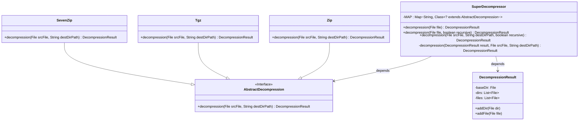
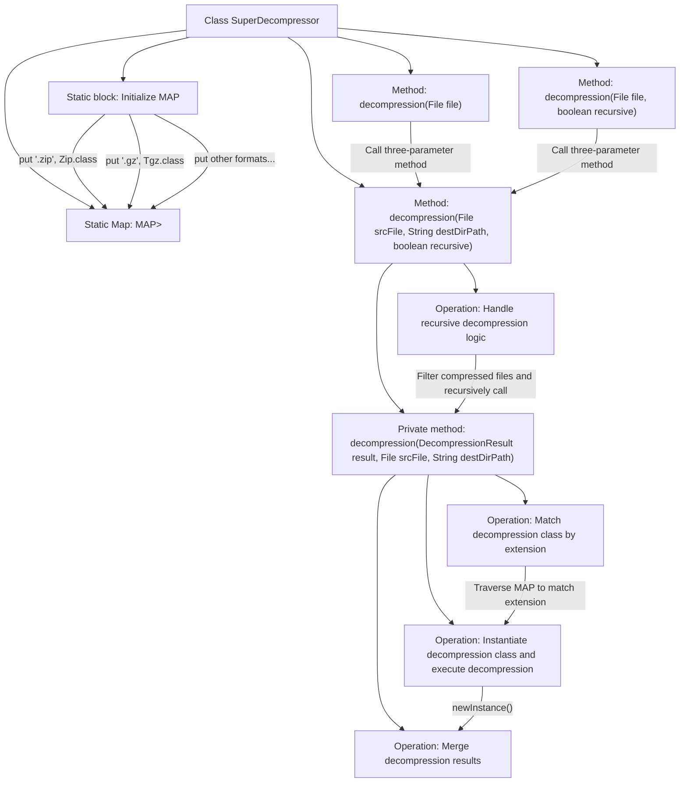

# Basic Information

|      |      |
|------|------|
| Name | SuperDecompressor |
| Language | .java |
| Code Path | WeFe/common/java/common-lang/src/main/java/com/welab/wefe/common/file/decompression/SuperDecompressor.java |
| Package Name | com.welab.wefe.common.file.decompression |
| Dependencies | ['com.welab.wefe.common.file.decompression.dto.DecompressionResult', 'com.welab.wefe.common.file.decompression.impl.SevenZip', 'com.welab.wefe.common.file.decompression.impl.Tgz', 'com.welab.wefe.common.file.decompression.impl.Zip', 'com.welab.wefe.common.util.FileUtil', 'java.io.File', 'java.io.IOException', 'java.util.HashMap', 'java.util.Map'] |
| Brief Description | The SuperDecompressor class supports decompression of multiple formats, including zip, gz, tar.gz, tgz, and 7z, with options to specify output directories and enable recursive decompression. |

# Description

SuperDecompressor is a decompression utility class that supports multiple compression formats, associating file extensions with corresponding decompression implementation classes through a static mapping table. It provides three decompression methods: default decompression, specified recursive decompression, and custom output directory decompression. The core logic implements recursive decompression through private methods, automatically identifying compression formats and invoking the corresponding decompressors, ultimately returning a result object containing decompressed files and directories. It supports .zip, .gz, .tar.gz, .tgz, and .7z formats, with the option to delete original compressed files during decompression.

# Class Summary

| Name   | Type  | Description |
|-------|------|-------------|
| SuperDecompressor | class | The SuperDecompressor class implements multi-format file decompression, supports recursive decompression, automatically matches compression types, and outputs decompression results. |

## Class SuperDecompressor

|      |      |
|------|------|
| Access Modifier | public |
| Type | class |
| Name | SuperDecompressor |
| Description | The SuperDecompressor class implements multi-format file decompression, supports recursive decompression, automatically matches compression types, and outputs decompression results. |

### UML Class Diagram

Class diagram description: SuperDecompressor is a decompression utility class that associates file extensions with corresponding decompression implementations (Zip/Tgz/SevenZip) through a static mapping table MAP. It provides multiple overloaded decompression methods supporting recursive decompression and returns a DecompressionResult object containing the decompression results. AbstractDecompression is the abstract interface for decompression algorithms, with concrete implementations provided by subclasses.

### Internal Method Call Graph

This code implements an intelligent decompression utility class supporting multiple compression formats. The core mechanism maintains a mapping between file extensions and decompression classes through a static Map, providing three overloaded decompression methods that support both regular and recursive decompression. The main workflow includes: initializing the file type mapping table, selecting the decompressor based on file extension, executing the decompression operation, handling recursive decompression logic, and finally merging the decompression results. The code collects decompression outputs through the DecompressionResult object and employs the strategy pattern to enable extensibility for different compression algorithms.

### Field List

| Name  | Type  | Description |
|-------|-------|------|
| MAP = new HashMap<>() | Map<String, Class<? extends AbstractDecompression>> | Define a static constant MAP, using HashMap to store the mapping between strings and AbstractDecompression subclass types. |

### Method List

| Name  | Type  | Description |
|-------|-------|------|
| decompression | DecompressionResult | Java static method decompression, which takes a File parameter, returns DecompressionResult, may throw exceptions, internally calls an overloaded method. |
| decompression | DecompressionResult | The method selects the decompression class based on the file extension, performs the decompression operation, and returns the result. If no matching class is found, it directly returns the original result. After decompression, it adds directories and files to the result. |
| decompression | DecompressionResult | This is a Java static method used for decompressing files. The method takes a file object and a recursive flag parameter, and returns the decompression result. It may throw exceptions. Internally, it calls another decompression method and passes null parameters. |
| decompression | DecompressionResult | The static method `decompression` extracts files to the target directory, supports recursive extraction of nested compressed files, and returns the extraction result. Parameters include the source file, target path, and recursive flag. During processing, it deletes the extracted compressed files. |

