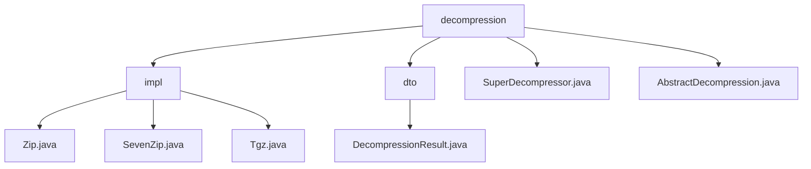

# Basic Information

|      |      |
|------|------|
| Name | decompression |
| Language | .java |
| Code Path | WeFe/common/java/common-lang/src/main/java/com/welab/wefe/common/file/decompression |
| Package Name | docs.common.java.common-lang.src.main.java.com.welab.wefe.common.file.decompression |
| Brief Description | This module implements decompression of multi-format archive files, supporting formats such as ZIP/7z/tgz, and handles extraction tasks through a unified interface. The core components include the AbstractDecompression base class, decompression result objects, and file entry iterators. It supports batch decompression, path safety validation, and resource release, and is applicable to scenarios like log analysis and file preprocessing. |

# Description

## Overview  
This module implements unified decompression functionality for multi-format compressed files. Its core responsibility is to handle decompression tasks for formats like ZIP/7z/tgz through the abstract factory pattern. The interface specification adheres to the constraints of the AbstractDecompression base class, requiring subclasses to implement the doDecompression method and use DecompressionResult to store decompression outcomes. Key data structures include file entry iterators (e.g., ZipEntry/TarEntry), a 2048-byte buffer, and a decompression result object containing baseDir/dirs/files. External dependencies involve Java's native ZipFile, Apache Commons Compress, and the third-party SevenZFile library. For instance, the Zip class constructs directory trees, while the SevenZip class processes 7z compressed blocks via streaming.

## Primary Business Scenarios  
The module adopts a batch decompression pipeline-like workflow: validation → traversal → creation → security check → release. The interaction mode is uniformly designed as a synchronous blocking API following the "file input-directory output" model. For example, the Tgz class combines Gzip and Tar streams to achieve dual-layer decompression. Typical applications include log analysis and distributed file preprocessing, supporting recursive decompression and automatic format recognition. Integration examples can be found in the main methods of each implementation class, such as SuperDecompressor, which calls corresponding decompressors via an extension mapping table and supports extended features like deleting source files.

### Package Internal Structure View

This flowchart illustrates the hierarchical structure of the file decompression module. The top level is the `decompression` directory, which includes the `impl` subdirectory for implementations, the `dto` subdirectory for data transfer objects, and two core class files. The `impl` directory contains decompression implementation classes for three compression formats, while the `dto` directory holds the decompression result class. The overall structure clearly reflects a modular design philosophy.

# File List

| Name   | Type  | Description |
|-------|------|-------------|
| [SuperDecompressor.java](SuperDecompressor.md) | file | The SuperDecompressor class supports decompression of multiple archive formats, including zip, gz, tar.gz, tgz, and 7z, with options to specify output directory and enable recursive extraction. |
| [AbstractDecompression.java](AbstractDecompression.md) | file | The abstract decompression class provides file decompression functionality, including verifying file existence, handling default paths, and abstract methods for subclasses to implement specific decompression logic. |
| [dto](dto/_module.md) | package | The DecompressionResult class is used to store decompression results, including the base directory, decompressed directories, and file collections. It provides methods for adding directories/files, supports deleting all decompressed resources, and enables formatted output of result information. |
| [impl](impl/_module.md) | package | The Zip class implements ZIP decompression, handling directories and files with exception handling. The SevenZip class processes 7z file decompression, traverses entries, and records results. The Tgz class decompresses tgz files, detects path traversal, and handles directory and file replacement. All inherit from AbstractDecompression and include resource release. |

