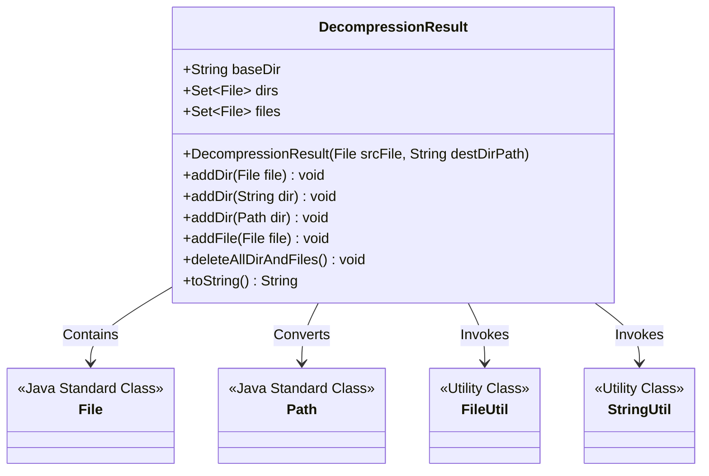
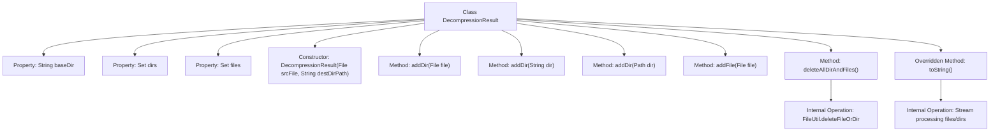

# Basic Information

|      |      |
|------|------|
| Name | DecompressionResult |
| Language | .java |
| Code Path | WeFe/common/java/common-lang/src/main/java/com/welab/wefe/common/file/decompression/dto/DecompressionResult.java |
| Package Name | com.welab.wefe.common.file.decompression.dto |
| Dependencies | ['com.welab.wefe.common.util.FileUtil', 'com.welab.wefe.common.util.StringUtil', 'java.io.File', 'java.nio.file.Path', 'java.nio.file.Paths', 'java.util.HashSet', 'java.util.List', 'java.util.Set', 'java.util.stream.Collectors'] |
| Brief Description | The DecompressionResult class is used to store decompression results, including the base directory, decompressed directories, and file collections. It provides methods for adding directories/files, supports deleting all decompressed resources, and enables formatted output of result information. |

# Description

The `DecompressionResult` class is used to store the result information of decompression operations. It contains three main members: `baseDir` represents the base directory path after decompression, `dirs` stores the collection of all directories after decompression, and `files` stores the collection of all files after decompression. The class provides multiple methods for adding directories and files, supporting parameters of type `File`, `String`, and `Path`. The `deleteAllDirAndFiles` method can delete all decompressed resources, including the base directory and its contents. The `toString` method returns all decompression result information as a formatted string, including the file list, directory list, and base directory path.

# Class Summary

| Name   | Type  | Description |
|-------|------|-------------|
| DecompressionResult | class | The DecompressionResult class is used to store decompression results, including the base directory, the collection of decompressed files and directories. It provides methods for adding files and directories, supports deleting all decompressed resources, and overrides the toString method to output detailed information. |

## Class DecompressionResult

|      |      |
|------|------|
| Access Modifier | public |
| Type | class |
| Name | DecompressionResult |
| Description | The DecompressionResult class is used to store decompression results, including the base directory, the collection of decompressed files and directories. It provides methods for adding files and directories, supports deleting all decompressed resources, and overrides the toString method to output detailed information. |

### UML Class Diagram

This class diagram illustrates the structure of the DecompressionResult class and its relationships with external classes. DecompressionResult manages the results of decompression operations, including the base directory path (baseDir), a collection of decompressed directories (dirs), and a collection of files (files). It provides methods for adding directories/files and can delete all resources. File operations and string processing are handled through the FileUtil and StringUtil utility classes, interacting with Java standard classes File and Path. This class encapsulates the storage and cleanup functionality of decompression results, with the toString() method offering structured output capabilities.

### Internal Method Call Graph

This flowchart illustrates the complete structure of the DecompressionResult class, containing 3 core properties (baseDir/dirs/files) and 6 main methods. The constructor calculates the base path using Paths and FileUtil, three overloaded addDir methods uniformly manage directory collections, and deleteAllDirAndFiles() recursively removes all resources. The toString() method employs stream processing to format file/directory paths into multiline strings, demonstrating encapsulation capabilities for filesystem operations and collection handling. Arrows clearly indicate relationships between properties & methods, as well as internal method invocations.

### Field List

| Name  | Type  | Description |
|-------|-------|------|
| dirs = new HashSet<>() | Set<File> | Declare an immutable file collection variable `dirs`, initialized as an empty HashSet. |
| files = new HashSet<>() | Set<File> | Declare an immutable file collection variable `files`, initialized as an empty HashSet. |
| baseDir | String | Declare an immutable string variable baseDir. |

### Method List

| Name  | Type  | Description |
|-------|-------|------|
| addDir | void | The method `addDir` converts the `Path` type parameter `dir` into a `File` object and adds it to the `dirs` collection. |
| toString | String | Rewrite the toString method to format and output the list of absolute paths for files and directories, including information about files, dirs, and base_dir. |
| deleteAllDirAndFiles | void | This method removes the base directory and all files and subdirectories beneath it. It iterates through the specified array of directories and files, deleting each directory and file one by one. |
| addDir | void | The method `addDir` accepts a string parameter `dir`, converts it into a `File` object, and adds it to the `dirs` collection. |
| addDir | void | The method `addDir` adds a File object to the `dirs` collection. |
| addFile | void | The method `addFile` adds a file object to the `files` collection. |

