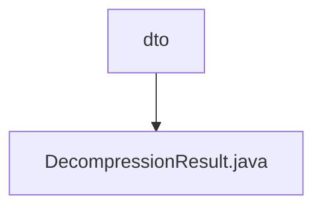

# Basic Information

|      |      |
|------|------|
| Name | dto |
| Language | .java |
| Code Path | WeFe/common/java/common-lang/src/main/java/com/welab/wefe/common/file/decompression/dto |
| Package Name | docs.common.java.common-lang.src.main.java.com.welab.wefe.common.file.decompression.dto |
| Brief Description | The DecompressionResult class is used to store decompression results, including the base directory, decompressed directories, and file collections. It provides methods for adding directories/files, supports deleting all decompressed resources, and enables formatted output of result information. |

# Description

The `DecompressionResult` class is used to store the result information of decompression operations. It contains three main members: `baseDir` represents the base directory path after decompression, `dirs` stores the collection of all directories after decompression, and `files` stores the collection of all files after decompression. The class provides multiple methods for adding directories and files, supporting parameters of type `File`, `String`, and `Path`. The `deleteAllDirAndFiles` method can delete all decompressed resources, including the base directory and its contents. The `toString` method returns all decompression result information as a formatted string, including the file list, directory list, and base directory path.

### Package Internal Structure View

This flowchart illustrates the DTO layer structure of the file decompression module in the WeFe project, where the dto directory contains a DecompressionResult.java file used to store the result data of decompression operations. This concise hierarchical relationship exemplifies the typical organization of data transfer objects in modular design.

# File List

| Name   | Type  | Description |
|-------|------|-------------|
| [DecompressionResult.java](DecompressionResult.md) | file | The DecompressionResult class is used to store decompression results, including the base directory, decompressed directories, and file collections. It provides methods for adding directories/files, supports deleting all decompressed resources, and enables formatted output of result information. |

