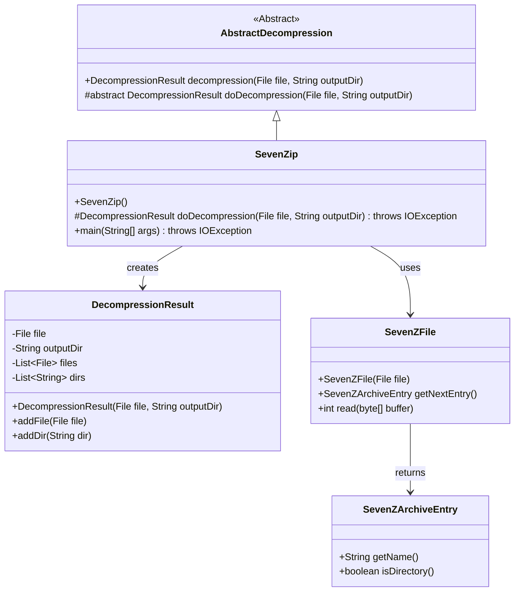
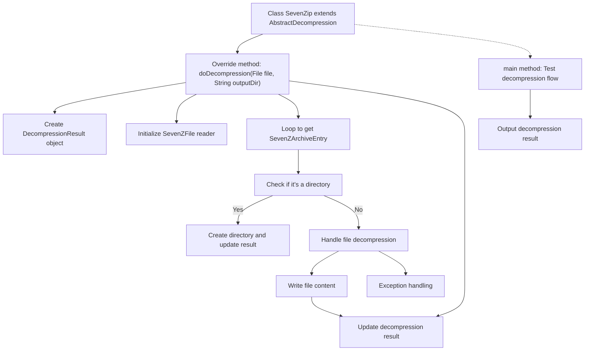

# Basic Information

|      |      |
|------|------|
| Name | SevenZip |
| Language | .java |
| Code Path | WeFe/common/java/common-lang/src/main/java/com/welab/wefe/common/file/decompression/impl/SevenZip.java |
| Package Name | com.welab.wefe.common.file.decompression.impl |
| Dependencies | ['com.welab.wefe.common.file.decompression.AbstractDecompression', 'com.welab.wefe.common.file.decompression.dto.DecompressionResult', 'org.apache.commons.compress.archivers.sevenz.SevenZArchiveEntry', 'org.apache.commons.compress.archivers.sevenz.SevenZFile', 'java.io.File', 'java.io.FileOutputStream', 'java.io.IOException', 'java.io.OutputStream'] |
| Brief Description | The SevenZip class inherits from AbstractDecompression and implements 7z file decompression functionality, supporting directory creation and file writing, while returning the decompression result. |

# Description

The `SevenZip` class inherits from `AbstractDecompression` and implements the decompression functionality for 7z files. The core logic resides in the `doDecompression` method, which takes the input compressed file and output directory as parameters, returning the decompression result. The method reads entries from the 7z file via `SevenZFile`, iteratively processing each entry: if it's a directory, the corresponding directory is created and the result is recorded; if it's a file, the content is written to the output directory and the result is logged. The `main` method demonstrates how to use this class to decompress a specified 7z file to a target directory. The entire process includes exception handling and resource cleanup.

# Class Summary

| Name   | Type  | Description |
|-------|------|-------------|
| SevenZip | class | The `SevenZip` class inherits from `AbstractDecompression` and implements the 7z file decompression functionality, including directory creation and file writing, returning the decompression result. The main method demonstrates the decompression process. |

## Class SevenZip

|      |      |
|------|------|
| Access Modifier | public |
| Type | class |
| Name | SevenZip |
| Description | The `SevenZip` class inherits from `AbstractDecompression` and implements the 7z file decompression functionality, including directory creation and file writing, returning the decompression result. The main method demonstrates the decompression process. |

### UML Class Diagram

This code demonstrates the implementation class `SevenZip` for 7z file decompression, which inherits from the abstract class `AbstractDecompression`. The core process includes: creating a decompression result object, iterating through 7z file entries, handling directory creation, and file decompression. The class diagram shows inheritance relationships, dependency relationships, and key method calls. `SevenZip` reads the compressed package content via `SevenZFile` and records decompression results using `DecompressionResult`, reflecting clear separation of responsibilities.

### Internal Method Call Graph

This flowchart illustrates the 7z file decompression process of the SevenZip class. Starting from the main entry point, the core decompression logic is implemented via the doDecompression method, which includes key steps such as file reading, directory creation, content writing, and exception handling. When processing each entry in the compressed package cyclically, it intelligently distinguishes between directory and file types, handling them with mkdirs or file stream writing respectively, and finally aggregates the decompression results. The entire process strictly handles IO exceptions to ensure proper resource release.

### Field List

| Name  | Type  | Description |
|-------|-------|------|

### Method List

| Name  | Type  | Description |
|-------|-------|------|
| main | void | Java code example: Using the SevenZip class to extract the flower.7z file to a specified directory and print the extraction result. |
| doDecompression | DecompressionResult | This method extracts 7z files to the specified directory, handles directory creation and file writing, and returns the extraction result. |

