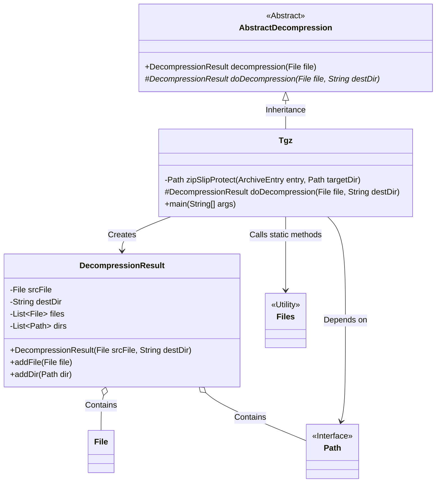
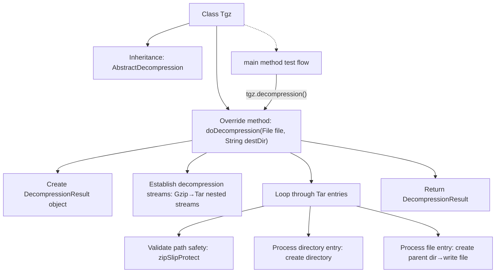

# Basic Information

|      |      |
|------|------|
| Name | Tgz |
| Language | .java |
| Code Path | WeFe/common/java/common-lang/src/main/java/com/welab/wefe/common/file/decompression/impl/Tgz.java |
| Package Name | com.welab.wefe.common.file.decompression.impl |
| Dependencies | ['com.welab.wefe.common.file.decompression.AbstractDecompression', 'com.welab.wefe.common.file.decompression.dto.DecompressionResult', 'org.apache.commons.compress.archivers.ArchiveEntry', 'org.apache.commons.compress.archivers.tar.TarArchiveInputStream', 'org.apache.commons.compress.compressors.gzip.GzipCompressorInputStream', 'java.io.BufferedInputStream', 'java.io.File', 'java.io.IOException', 'java.io.InputStream', 'java.nio.file.Files', 'java.nio.file.Path', 'java.nio.file.Paths', 'java.nio.file.StandardCopyOption'] |
| Brief Description | The Tgz class implements the functionality to decompress TGZ files, including path traversal validation, supports decompression of directories and files, and returns the decompression result. |

# Description

The Tgz class inherits from AbstractDecompression and implements file decompression functionality. The main method doDecompression handles the tgz file extraction process: it reads compressed content through Gzip and Tar streams, verifies file integrity, and extracts to the target directory. The zipSlipProtect method checks for corrupted archive files to prevent path traversal attacks. The decompression process creates directory structures, handles file replacement, and logs extraction results. The main method demonstrates how to use this class to decompress a specified tgz file.

# Class Summary

| Name   | Type  | Description |
|-------|------|-------------|
| Tgz | class | The Tgz class implements decompression functionality by processing file streams through Gzip and Tar, verifying directory security, and extracting to the target path while returning the decompression result. It includes corruption prevention checks and exception handling. |

## Class Tgz

|      |      |
|------|------|
| Access Modifier | public |
| Type | class |
| Name | Tgz |
| Description | The Tgz class implements decompression functionality by processing file streams through Gzip and Tar, verifying directory security, and extracting to the target path while returning the decompression result. It includes corruption prevention checks and exception handling. |

### UML Class Diagram

This code demonstrates a class structure for processing `.tgz` file decompression. `Tgz` inherits from the abstract class `AbstractDecompression` and implements core decompression logic, including path validation to prevent ZipSlip attacks, directory creation, and file copying functionality. The `DecompressionResult` class stores decompression results, containing the source file, target directory, and lists of decompressed files and directories. It utilizes utility classes `Files` and `Path` for filesystem operations. The overall design adheres to the Single Responsibility Principle and incorporates security mechanisms during decompression.

### Internal Method Call Graph

Flowchart description: This flowchart illustrates the core processing flow of the Tgz decompression class. Starting from the inheritance relationship, it details the execution process of the doDecompression method: initializing the result object, establishing Gzip and Tar dual-layer decompression streams, performing path safety validation when processing each compressed entry, handling directory creation and file writing operations separately, and finally returning the decompression result. The main method demonstrates the actual invocation process, reflecting the complete decompression control flow and exception protection mechanism.

### Field List

| Name  | Type  | Description |
|-------|-------|------|

### Method List

| Name  | Type  | Description |
|-------|-------|------|
| doDecompression | DecompressionResult | This method decompresses a Gzip-compressed Tar file to the target directory, processes directories and files, verifies path security, and returns the decompression result. |
| zipSlipProtect | Path | Prevent zip extraction path traversal attacks by checking if the target path is within the specified directory, otherwise throw an exception. |
| main | void | Java code example: Using the Tgz class to decompress a .tgz file at the specified path and print the decompression result. |

