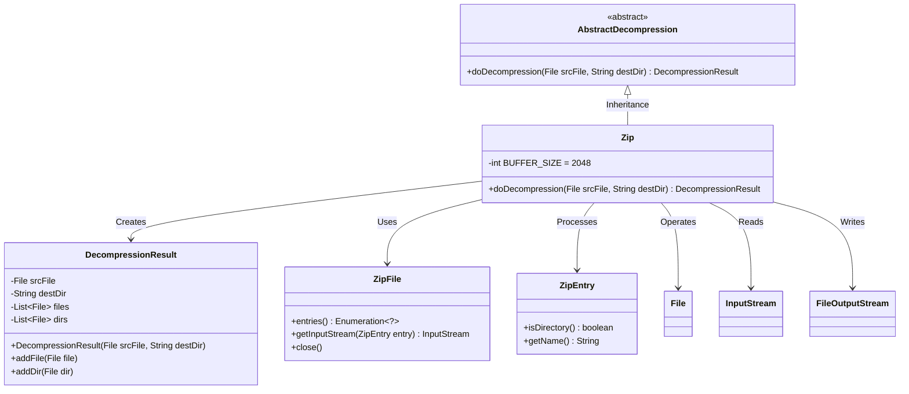
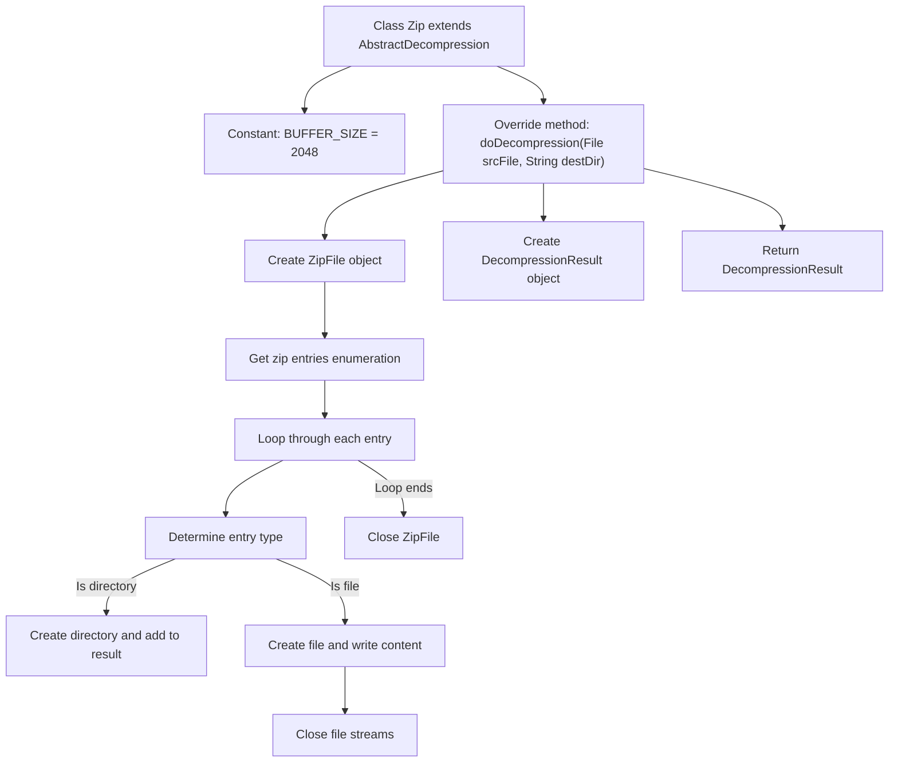

# Basic Information

|      |      |
|------|------|
| Name | Zip |
| Language | .java |
| Code Path | WeFe/common/java/common-lang/src/main/java/com/welab/wefe/common/file/decompression/impl/Zip.java |
| Package Name | com.welab.wefe.common.file.decompression.impl |
| Dependencies | ['com.welab.wefe.common.file.decompression.AbstractDecompression', 'com.welab.wefe.common.file.decompression.dto.DecompressionResult', 'java.io.File', 'java.io.FileOutputStream', 'java.io.IOException', 'java.io.InputStream', 'java.util.Enumeration', 'java.util.zip.ZipEntry', 'java.util.zip.ZipFile'] |
| Brief Description | Zip decompression class, inherits from AbstractDecompression, implements the doDecompression method to handle folder and file decompression, uses buffers to improve efficiency, and ensures resource closure. |

# Description

The code defines a Zip class, which inherits from AbstractDecompression, to implement the decompression functionality for ZIP files. A constant BUFFER_SIZE is defined in the class as 2048 bytes. The main method, doDecompression, takes source file and target directory parameters and returns the decompression result. The method first creates a ZipFile object, iterates through all entries in the compressed file, and processes directories and files separately: directories are created as corresponding folders, while files are created as target files with content written. A buffer is used for copying file content, and finally, all streams are closed, returning a result object containing the decompressed files and directories. The entire process includes exception handling and resource release.

# Class Summary

| Name   | Type  | Description |
|-------|------|-------------|
| Zip | class | The Zip extraction class inherits from the abstract extraction class, handles ZIP file decompression, includes directory creation, file and content writing, and uses a buffer to improve efficiency while ensuring resource closure. |

## Class Zip

|      |      |
|------|------|
| Access Modifier | public |
| Type | class |
| Name | Zip |
| Description | The Zip extraction class inherits from the abstract extraction class, handles ZIP file decompression, includes directory creation, file and content writing, and uses a buffer to improve efficiency while ensuring resource closure. |

### UML Class Diagram

This code demonstrates the implementation of a ZIP file decompression class `Zip`, which inherits from the abstract class `AbstractDecompression`. The `Zip` class processes compressed file contents through `ZipFile` and `ZipEntry`, uses I/O streams to write files to the target directory, and records decompression results in the `DecompressionResult` object. The entire process includes directory creation, stream-based read/write operations, and resource cleanup, reflecting a complete decompression workflow with exception handling mechanisms.

### Internal Method Call Graph

This code flowchart illustrates the complete processing flow of the Zip decompression class. Starting from initializing constants to overriding the parent class's decompression method, it details the entire process of handling ZIP files: including creating result objects, traversing ZIP entries, distinguishing between directory and file processing, copying file contents, releasing resources, and other key steps. The flow particularly emphasizes exception-safe handling to ensure all opened streams are properly closed, finally returning an object containing all decompression results.

### Field List

| Name  | Type  | Description |
|-------|-------|------|
| BUFFER_SIZE = 2 * 1024 | int | Define a static constant BUFFER_SIZE with a value of 2048 bytes. |

### Method List

| Name  | Type  | Description |
|-------|-------|------|
| doDecompression | DecompressionResult | This method implements the ZIP file decompression functionality, iterates through entries in the compressed package, automatically creates directories or files, and copies content via stream, ultimately returning the decompression result. It ensures resource closure in case of exceptions. |

