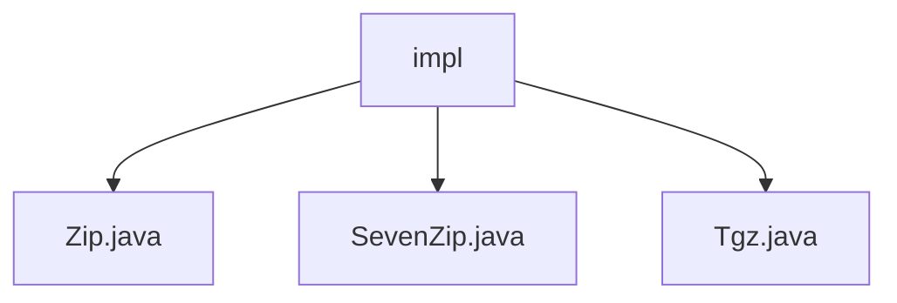

# Basic Information

|      |      |
|------|------|
| Name | impl |
| Language | .java |
| Code Path | WeFe/common/java/common-lang/src/main/java/com/welab/wefe/common/file/decompression/impl |
| Package Name | docs.common.java.common-lang.src.main.java.com.welab.wefe.common.file.decompression.impl |
| Brief Description | The Zip class implements ZIP decompression, handling directories and files with exception handling. The SevenZip class processes 7z file decompression, traverses entries, and records results. The Tgz class decompresses tgz files, detects path traversal, and handles directory and file replacement. All inherit from AbstractDecompression and include resource release. |

# Description

## Overview  
This module implements multi-format compressed file decompression functionality, with its core responsibility being to handle decompression tasks for formats such as ZIP/7z/tgz through a unified interface. The interface specification adheres to the constraints of the AbstractDecompression base class, requiring subclasses to implement the doDecompression method, which accepts source file and target directory parameters and returns an object containing the decompression results. Key data structures include the decompression result object, file entry iterators (e.g., ZipEntry/TarEntry), and a 2048-byte buffer. External dependencies involve the native Java ZipFile, third-party SevenZFile, and the Apache Commons Compress library. For example, the Zip class handles ZIP files by creating a directory tree, while the SevenZip class processes 7z compressed blocks through entry streams.

## Main Business Scenarios  
The module supports batch decompression scenarios, similar to a pipeline workflow: verifying the integrity of the compressed file → iterating through internal entries → creating directories/files by type → preventing path traversal attacks → releasing resources. The interaction mode is uniformly "file input-directory output," such as the Tgz class combining Gzip and Tar streams to achieve double-layer decompression. Typical applications include log decompression analysis and distributed file preprocessing, with all APIs being synchronous and blocking. Integration examples can be seen in the main methods of each implementation class, such as SevenZip demonstrating file extraction from a 7z archive to a specified path.

### Package Internal Structure View

This flowchart displays three Java files under the `impl` directory: `Zip.java`, `SevenZip.java`, and `Tgz.java`, all of which are implementation classes for file decompression functionality. These files reside at the same level without deeper nested structures, clearly illustrating the parallel relationship among the implementation classes.

# File List

| Name   | Type  | Description |
|-------|------|-------------|
| [Zip.java](Zip.md) | file | Zip decompression class, inherits from AbstractDecompression, implements the doDecompression method to handle folder and file extraction, uses buffers to improve efficiency, and ensures resource closure. |
| [SevenZip.java](SevenZip.md) | file | The SevenZip class inherits from AbstractDecompression and implements the 7z file decompression functionality, supporting directory creation and file writing, while returning the decompression result. |
| [Tgz.java](Tgz.md) | file | The Tgz class implements the functionality to decompress TGZ files, including path traversal validation, supports decompression of directories and files, and returns the decompression results. |

