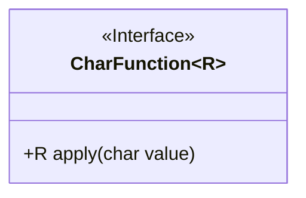
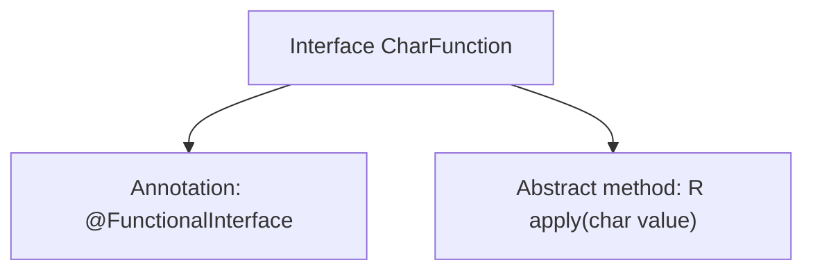

# Basic Information

|      |      |
|------|------|
| Name | CharFunction |
| Language | .java |
| Code Path | WeFe/common/java/common-lang/src/main/java/com/welab/wefe/common/function/CharFunction.java |
| Package Name | com.welab.wefe.common.function |
| Dependencies | [] |
| Brief Description | CharFunction is a functional interface that takes a char parameter and returns a generic result R, with the core method being apply. |

# Description

This is a functional interface named CharFunction, marked with the @FunctionalInterface annotation. The interface defines an abstract method `apply`, which takes a parameter `value` of type char and returns a result of generic type R. As a functional interface, it can only contain one abstract method, making it suitable for Lambda expressions or method reference scenarios. This interface is primarily used for functional operations that process character-type input and return results of a specified type.

# Class Summary

| Name   | Type  | Description |
|-------|------|-------------|
| CharFunction | interface | CharFunction is a functional interface that takes a char parameter and returns a generic result R, containing only the apply method. |

## Class CharFunction

|      |      |
|------|------|
| Access Modifier | @FunctionalInterface;public |
| Type | interface |
| Name | CharFunction |
| Description | CharFunction is a functional interface that takes a char parameter and returns a generic result R, containing only the apply method. |

### UML Class Diagram

This class diagram illustrates a generic functional interface `CharFunction<R>`, marked with `<<Interface>>` to indicate it is an interface. The interface defines an abstract method `apply`, which takes a `char` type parameter and returns a result of generic type `R`. The use of `@FunctionalInterface` annotation signifies that this is a functional interface, allowing only one abstract method, making it suitable for lambda expressions and method references. The design is concise and clear, aligning with the core principle of functional programming—defining behavioral contracts through a single abstract method.

### Internal Method Call Graph

This flowchart illustrates the structure of the Java functional interface `CharFunction<R>`. It is a generic interface with type parameter R, annotated with `@FunctionalInterface` to indicate it can contain only one abstract method. The core method `apply(char value)` takes a char parameter and returns a result of generic type R. This design is commonly used for Lambda expressions and method references, providing a unified functional contract for character processing operations.

### Field List

| Name  | Type  | Description |
|-------|-------|------|

### Method List

| Name  | Type  | Description |
|-------|-------|------|
| apply | R | The function R apply(char value) takes a character parameter value and returns a result of type R. |

