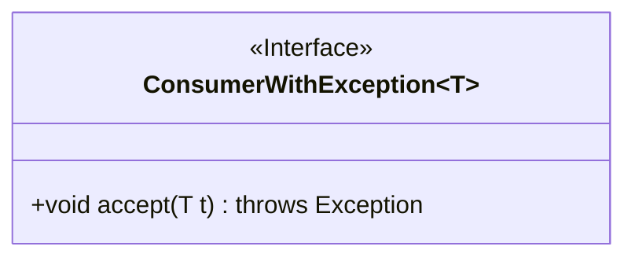
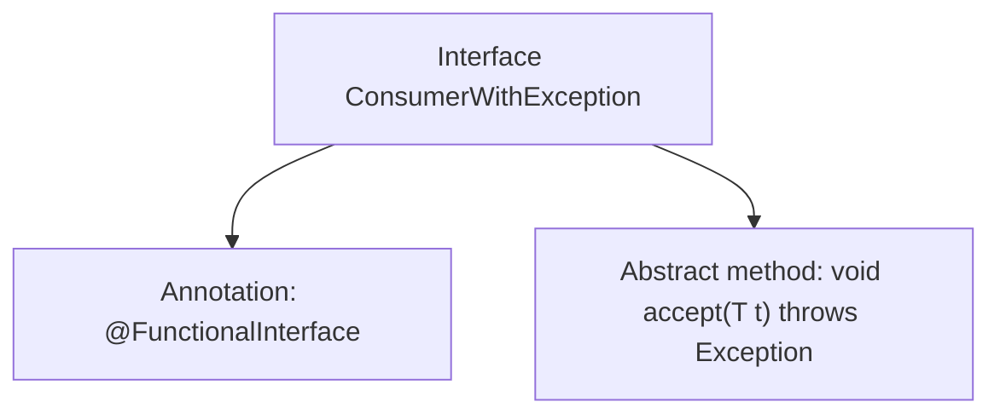

# Basic Information

|      |      |
|------|------|
| Name | ConsumerWithException |
| Language | .java |
| Code Path | WeFe/common/java/common-lang/src/main/java/com/welab/wefe/common/function/ConsumerWithException.java |
| Package Name | com.welab.wefe.common.function |
| Dependencies | [] |
| Brief Description | Java functional interface, a consumer interface with exception, accepts generic parameter T, performs operations that may throw exceptions. |

# Description

This is a generic functional interface named ConsumerWithException, which defines an accept method that may throw an exception. The interface is marked with the @FunctionalInterface annotation, indicating it is a functional interface and can only contain one abstract method. The accept method takes a generic parameter T, returns void, and declares that it may throw an Exception. This interface is suitable for scenarios requiring consumer behavior handling with exceptions.

# Class Summary

| Name   | Type  | Description |
|-------|------|-------------|
| ConsumerWithException | interface | Define a functional interface with exception, generic type parameter T, where the accept method can throw an exception. |

## Class ConsumerWithException

|      |      |
|------|------|
| Access Modifier | @FunctionalInterface;public |
| Type | interface |
| Name | ConsumerWithException |
| Description | Define a functional interface with exception, generic type parameter T, where the accept method can throw an exception. |

### UML Class Diagram

This class diagram illustrates a generic functional interface `ConsumerWithException<T>`, which defines a single abstract method `accept`. The method takes a parameter of generic type T and may throw an exception. As a functional interface, it is primarily used to implement Lambda expressions or method references, particularly suited for consumer operations that need to handle checked exceptions. The interface is explicitly marked with `<<Interface>>`, the generic parameter T is denoted by tildes, and the method declaration fully displays the parameter type and exception specification.

### Internal Method Call Graph

This flowchart illustrates the definition of a generic functional interface. Key elements include: 1) Marked as a functional interface with @FunctionalInterface annotation; 2) Defines a single abstract method accept() that takes a generic parameter T and may throw Exception. The interface complies with Java functional programming specifications, enabling usage in lambda expressions and method references while supporting checked exception handling.

### Field List

| Name  | Type  | Description |
|-------|-------|------|

### Method List

| Name  | Type  | Description |
|-------|-------|------|
| accept | void | Accepts a parameter of type T and may throw an exception. |

