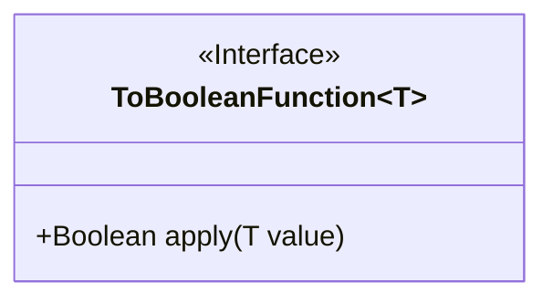
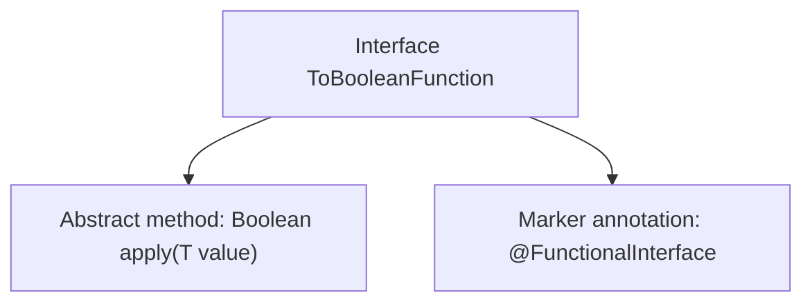

# Basic Information

|      |      |
|------|------|
| Name | ToBooleanFunction |
| Language | .java |
| Code Path | WeFe/common/java/common-lang/src/main/java/com/welab/wefe/common/function/ToBooleanFunction.java |
| Package Name | com.welab.wefe.common.function |
| Dependencies | [] |
| Brief Description | This is a functional interface ToBooleanFunction<T>, which defines an abstract method apply that accepts a parameter of type T and returns a Boolean value. |

# Description

This is a Java functional interface named ToBooleanFunction, marked with the @FunctionalInterface annotation. The interface defines a generic method `apply` that takes a parameter `value` of generic type T and returns a Boolean value. As a functional interface, it can only contain one abstract method, making it suitable for lambda expressions and method references. This interface is primarily used to convert values of any type T to a boolean value, commonly applied in conditional checks and boolean conversion scenarios.

# Class Summary

| Name   | Type  | Description |
|-------|------|-------------|
| ToBooleanFunction | interface | This is a functional interface that defines a method `apply` which accepts a generic parameter T and returns a boolean value. |

## Class ToBooleanFunction

|      |      |
|------|------|
| Access Modifier | @FunctionalInterface;public |
| Type | interface |
| Name | ToBooleanFunction |
| Description | This is a functional interface that defines a method `apply` which accepts a generic parameter T and returns a boolean value. |

### UML Class Diagram

This code defines a generic functional interface `ToBooleanFunction<T>`, marked with the `@FunctionalInterface` annotation. The interface contains a single abstract method `apply` that takes a parameter of generic type T and returns a Boolean result. As a functional interface, it is primarily used for Lambda expressions and method references to implement logic that converts values of any type T to boolean values. The interface design is concise and clear, complying with Java functional programming specifications, making it suitable for scenarios requiring conditional checks or boolean conversions.

### Internal Method Call Graph

This code defines a generic functional interface `ToBooleanFunction<T>`, marked with the `@FunctionalInterface` annotation, indicating that the interface can contain only one abstract method. Its core functionality is to convert an input of type `T` into a boolean value via the `apply` method. The flowchart illustrates the structural relationships of the interface, highlighting its characteristics as a functional interface, suitable for scenarios requiring conversion of any type to a boolean value.

### Field List

| Name  | Type  | Description |
|-------|-------|------|

### Method List

| Name  | Type  | Description |
|-------|-------|------|
| apply | Boolean | Boolean method that accepts a generic parameter T and returns a boolean value. |

