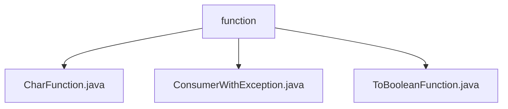

# Basic Information

|      |      |
|------|------|
| Name | function |
| Language | .java |
| Code Path | WeFe/common/java/common-lang/src/main/java/com/welab/wefe/common/function |
| Package Name | docs.common.java.common-lang.src.main.java.com.welab.wefe.common.function |
| Brief Description | The CharFunction interface processes character input and returns a generic result. The ConsumerWithException interface handles consumer behavior with exceptions. The ToBooleanFunction interface converts any type to a boolean value. |

# Description

## Overview  
This module is a set of Java functional interfaces, with the core responsibility of providing type-safe functional operations for scenarios such as character processing, exception consumption, and Boolean conversion. The interface specifications uniformly adopt the `@FunctionalInterface` annotation to ensure the single abstract method constraint, making them suitable for Lambda expressions and method references. Key data structures include generic parameters T/R and primitive types char/Boolean. The only external dependency is the Java standard library. For example, `CharFunction` handles character conversion, `ConsumerWithException` supports exception handling, and `ToBooleanFunction` maps types to Boolean values.  

## Primary Use Cases  
The module is suitable for value transformation and conditional judgment in functional programming, similar to intermediate operations in the Stream API. Typical scenarios include: character processing pipelines (e.g., `CharFunction`), resource consumption with exceptions (e.g., `ConsumerWithException`), and dynamic condition filtering (e.g., `ToBooleanFunction`). The interaction pattern is uniformly implemented through method references, such as applying `ToBooleanFunction` for collection filtering or combining `CharFunction` with Stream.map(). All interfaces support functional chaining calls.

### Package Internal Structure View

This flowchart illustrates the package structure of the `function` module under `common-lang` in the WeFe project. The parent node `function` contains three child files: `CharFunction.java`, `ConsumerWithException.java`, and `ToBooleanFunction.java`, all of which belong to functional programming utility classes. The entire structure is clear and concise, reflecting the typical organization of utility packages in Java projects, where all files are directly under the `function` directory without deeper nesting.

# File List

| Name   | Type  | Description |
|-------|------|-------------|
| [CharFunction.java](CharFunction.md) | file | CharFunction is a functional interface that takes a char parameter and returns a generic result R, with its core method being apply. |
| [ConsumerWithException.java](ConsumerWithException.md) | file | Java functional interface, a consumer interface with exceptions, accepts generic parameter T, performs operations that may throw exceptions. |
| [ToBooleanFunction.java](ToBooleanFunction.md) | file | This is a functional interface ToBooleanFunction<T>, which defines an abstract method apply that accepts a parameter of type T and returns a Boolean value. |

