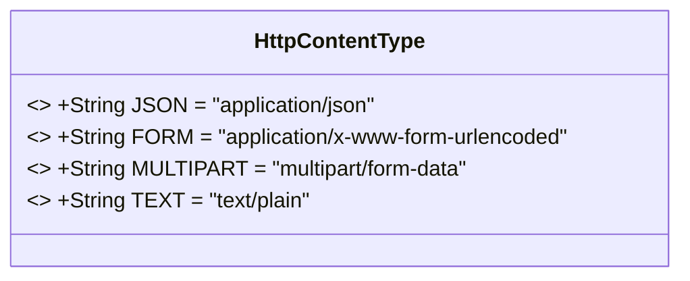
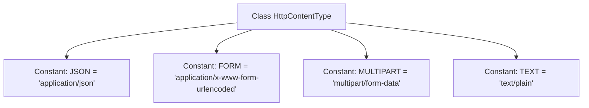

# Basic Information

|      |      |
|------|------|
| Name | HttpContentType |
| Language | .java |
| Code Path | WeFe/common/java/common-lang/src/main/java/com/welab/wefe/common/http/HttpContentType.java |
| Package Name | com.welab.wefe.common.http |
| Dependencies | [] |
| Brief Description | The HttpContentType class defines four HTTP content type constants: JSON, FORM, MULTIPART, and TEXT. |

# Description

The HttpContentType class defines four commonly used HTTP content type constants: JSON represents JSON-format data, FORM represents form-encoded data, MULTIPART represents multipart form data, and TEXT represents plain text data. These constants are used to identify the content type of HTTP requests or responses.

# Class Summary

| Name   | Type  | Description |
|-------|------|-------------|
| HttpContentType | class | The HttpContentType class defines four HTTP content type constants: JSON, FORM, MULTIPART, and TEXT. |

## Class HttpContentType

|      |      |
|------|------|
| Access Modifier | public |
| Type | class |
| Name | HttpContentType |
| Description | The HttpContentType class defines four HTTP content type constants: JSON, FORM, MULTIPART, and TEXT. |

### UML Class Diagram

This class diagram describes a utility class named HttpContentType, which contains only four public static constant fields representing four common HTTP content types: JSON format, form format, multipart form format, and plain text format. All fields are declared as final, indicating these constant values cannot be modified at runtime. The class defines no methods and is primarily used to centrally manage standard values for Content-Type headers in HTTP requests/responses, avoiding hard-coded string constants in the code. This design pattern is commonly employed for content type standardization management in network programming.

### Internal Method Call Graph

This flowchart illustrates the structure of the HttpContentType class, which is a utility class containing four public static constants defining common HTTP content types (JSON, form, multipart form, and plain text). Each constant stores the corresponding MIME type string used to identify the data format of network requests or responses. This class contains no methods and serves solely as a centralized container for content type definitions.

### Field List

| Name  | Type  | Description |
|-------|-------|------|
| TEXT = "text/plain" | String | Define a static constant TEXT with the value "text/plain", representing the plain text type. |
| FORM = "application/x-www-form-urlencoded" | String | Define the constant FORM with the value of the form URL-encoded type "application/x-www-form-urlencoded". |
| JSON = "application/json" | String | Define a static constant JSON with the value "application/json", representing the MIME type for JSON format. |
| MULTIPART = "multipart/form-data" | String | Defined a public static constant string MULTIPART with the value "multipart/form-data". |

### Method List

| Name  | Type  | Description |
|-------|-------|------|

