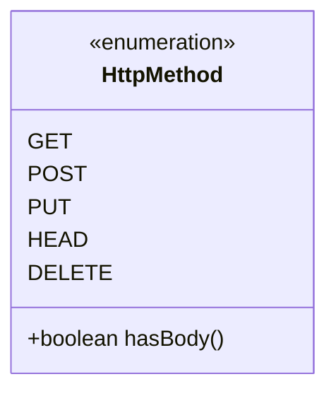
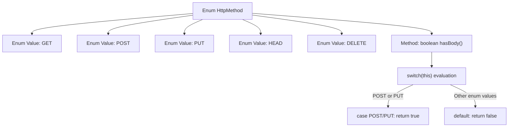

# Basic Information

|      |      |
|------|------|
| Name | HttpMethod |
| Language | .java |
| Code Path | WeFe/common/java/common-lang/src/main/java/com/welab/wefe/common/http/HttpMethod.java |
| Package Name | com.welab.wefe.common.http |
| Dependencies | [] |
| Brief Description | Define an HTTP method enumeration, including GET, POST, PUT, HEAD, DELETE, where POST and PUT allow request bodies. |

# Description

The content defines an enumeration type named HttpMethod, which includes five HTTP request methods: GET, POST, PUT, HEAD, and DELETE. Each method has corresponding annotation descriptions. The enumeration also provides a `hasBody` method to determine whether the request method allows including a request body. According to the implementation logic, only the POST and PUT methods return `true`, indicating that a request body is allowed, while other methods return `false`. This enumeration concisely encapsulates HTTP methods and their related characteristics.

# Class Summary

| Name   | Type  | Description |
|-------|------|-------------|
| HttpMethod | enum | HTTP method enumeration class, including GET, POST, PUT, HEAD, DELETE, where POST and PUT can contain request bodies. |

## Class HttpMethod

|      |      |
|------|------|
| Access Modifier | public |
| Type | enum |
| Name | HttpMethod |
| Description | HTTP method enumeration class, including GET, POST, PUT, HEAD, DELETE, where POST and PUT can contain request bodies. |

### UML Class Diagram

This code defines an HttpMethod enumeration class containing five HTTP methods: GET, POST, PUT, HEAD, and DELETE. The hasBody() method is used to determine whether the current HTTP method allows including a request body, returning true for POST and PUT methods and false for others. The enumeration class is explicitly marked with <<enumeration>> to indicate its type, succinctly representing the finite set of HTTP methods and their core functionality.

### Internal Method Call Graph

This flowchart illustrates the structure and logical flow of the HttpMethod enumeration. The enum defines 5 standard HTTP methods (GET/POST/PUT/HEAD/DELETE) and uses the hasBody() method to determine which methods allow including a request body. The flow starts with the enum definition, branches to show each enum value, and highlights the internal logic of the hasBody() method: returning true when the enum value is POST or PUT, and false otherwise. The entire structure clearly presents the relationship between enum definition and method invocation.

### Field List

| Name  | Type  | Description |
|-------|-------|------|

### Method List

| Name  | Type  | Description |
|-------|-------|------|

