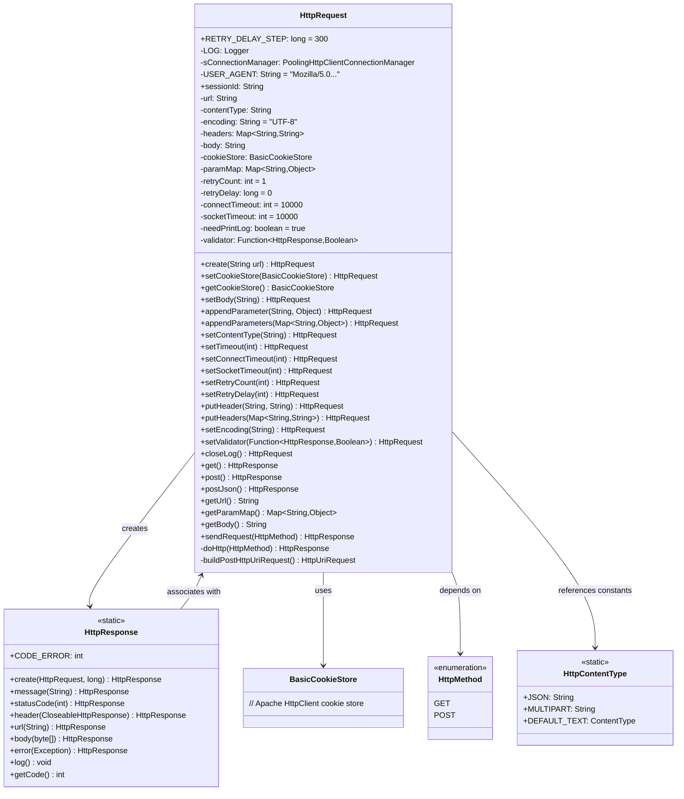
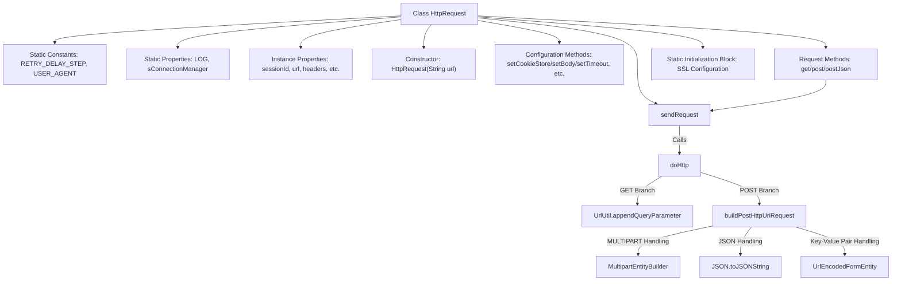
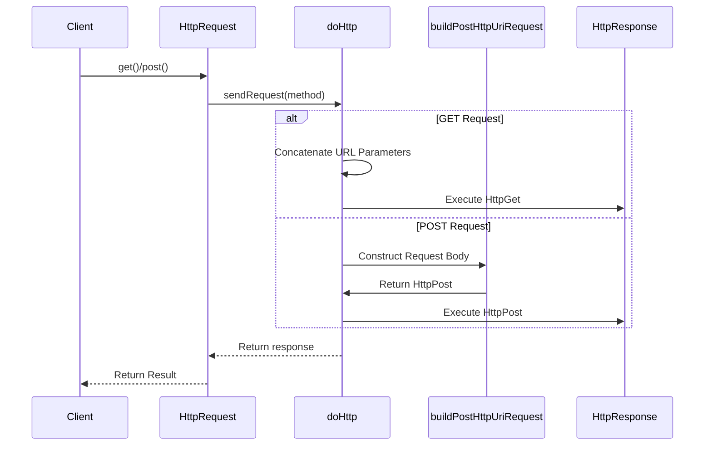

# Basic Information

|      |      |
|------|------|
| Name | HttpRequest |
| Language | .java |
| Code Path | WeFe/common/java/common-lang/src/main/java/com/welab/wefe/common/http/HttpRequest.java |
| Package Name | com.welab.wefe.common.http |
| Dependencies | ['com.alibaba.fastjson.JSON', 'com.welab.wefe.common.util.UrlUtil', 'org.apache.commons.collections4.CollectionUtils', 'org.apache.commons.lang3.StringUtils', 'org.apache.http.HttpEntity', 'org.apache.http.NameValuePair', 'org.apache.http.client.config.RequestConfig', 'org.apache.http.client.entity.UrlEncodedFormEntity', 'org.apache.http.client.methods.CloseableHttpResponse', 'org.apache.http.client.methods.HttpGet', 'org.apache.http.client.methods.HttpPost', 'org.apache.http.client.methods.HttpUriRequest', 'org.apache.http.config.Registry', 'org.apache.http.config.RegistryBuilder', 'org.apache.http.conn.socket.ConnectionSocketFactory', 'org.apache.http.conn.socket.PlainConnectionSocketFactory', 'org.apache.http.conn.ssl.NoopHostnameVerifier', 'org.apache.http.conn.ssl.SSLConnectionSocketFactory', 'org.apache.http.entity.ContentType', 'org.apache.http.entity.StringEntity', 'org.apache.http.entity.mime.MultipartEntityBuilder', 'org.apache.http.entity.mime.content.InputStreamBody', 'org.apache.http.impl.client.BasicCookieStore', 'org.apache.http.impl.client.CloseableHttpClient', 'org.apache.http.impl.client.HttpClients', 'org.apache.http.impl.conn.PoolingHttpClientConnectionManager', 'org.apache.http.message.BasicNameValuePair', 'org.apache.http.ssl.SSLContextBuilder', 'org.apache.http.util.EntityUtils', 'org.slf4j.Logger', 'org.slf4j.LoggerFactory', 'javax.net.ssl.SSLContext', 'java.io.File', 'java.io.InputStream', 'java.io.UnsupportedEncodingException', 'java.nio.charset.Charset', 'java.nio.charset.StandardCharsets', 'java.security.KeyManagementException', 'java.security.KeyStoreException', 'java.security.NoSuchAlgorithmException', 'java.util', 'java.util.function.Function'] |
| Brief Description | The HttpRequest class encapsulates HTTP request functionality, supporting GET/POST methods with configurable timeout, retry, headers, parameters, and cookies. It defaults to UTF-8 encoding and includes SSL support. |

# Description

The HttpRequest class is a utility tool for sending HTTP requests, supporting both GET and POST methods. It features request parameter configuration, header management, timeout settings, retry mechanisms, and response validation. By default, it uses UTF-8 encoding, supports JSON and form-data submissions, allows setting connection and read timeout durations, and enables multi-threaded connection pool management. The class includes attributes such as request URL, parameters, request body, and cookie storage, while providing method chaining for configuration. Upon sending a request, it returns an HttpResponse object containing details like response status code, message headers, and response body. During initialization, the class configures an SSL context to support HTTPS requests and sets connection pool parameters.

# Class Summary

| Name   | Type  | Description |
|-------|------|-------------|
| HttpRequest | class | The HttpRequest class encapsulates HTTP request functionality, supporting GET/POST methods with configurable timeout, retry, encoding, headers, and parameters. It features built-in connection pooling, SSL verification, and provides logging and validator capabilities. |

## Class HttpRequest

|      |      |
|------|------|
| Access Modifier | public |
| Type | class |
| Name | HttpRequest |
| Description | The HttpRequest class encapsulates HTTP request functionality, supporting GET/POST methods with configurable timeout, retry, encoding, headers, and parameters. It features built-in connection pooling, SSL verification, and provides logging and validator capabilities. |

### UML Class Diagram

This code implements a configurable HTTP request utility class supporting GET/POST requests, parameter configuration, retry mechanisms, and response validation. The class diagram shows HttpRequest as the core class, which configures request parameters through method chaining, relies on HttpResponse to handle responses, uses BasicCookieStore to manage session state, and references HttpMethod and HttpContentType enumeration/constant classes. The static connection pool sConnectionManager implements SSL secure connections and connection reuse functionality.

### Internal Method Call Graph

The flowchart illustrates the core structure and invocation relationships of the HttpRequest class. The class includes static configurations, instance properties, constructors, and three types of core methods: configuration methods for setting request parameters, request methods providing GET/POST interfaces, and core methods handling actual HTTP communication. The sequence diagram highlights the branching process of GET/POST requests, covering key steps such as URL parameter concatenation and multi-type POST request body construction. The static initialization block is responsible for initializing the SSL connection pool, ensuring all requests share connection management.

### Field List

| Name  | Type  | Description |
|-------|-------|------|
| contentType | String | Define a string variable contentType to store content type information. |
| socketTimeout = 10 * 1000 | int | The private integer variable socketTimeout has a default value of 10 seconds (10000 milliseconds). |
| body | String | The private string-type variable body. |
| sessionId = UUID.randomUUID().toString().replace("-", "") | String | Generate a random UUID string without hyphens as the session ID. |
| retryDelay = 0 | long | The private long integer variable retryDelay has an initial value of 0 and is used to control the retry delay time. |
| encoding = StandardCharsets.UTF_8.name() | String | Define a string variable encoding with the value being the name of the UTF-8 character set. |
| headers | Map<String, String> | Defined a private Map variable named headers, with both key and value types as String. |
| url | String | Declare a private string variable url. |
| sConnectionManager = null | PoolingHttpClientConnectionManager | Declare a static private connection manager variable sConnectionManager with an initial value of null. |
| USER_AGENT = "Mozilla/5.0 (Macintosh; Intel Mac OS X 10_12_5) AppleWebKit/537.36 (KHTML, like Gecko) Chrome/63.0.3239.132 Safari/537.36" | String | Define the user agent string to simulate the request headers of Chrome browser on Mac OS X 10.12.5. |
| paramMap = new HashMap<>() | Map<String, Object> | Defined a private Map variable named paramMap, with String as the key and Object as the value, initialized as a HashMap instance. |
| connectTimeout = 10 * 1000 | int | The private integer variable connectTimeout has a default value of 10 seconds (10000 milliseconds). |
| needPrintLog = true | boolean | The variable `needPrintLog` is used to control whether to print logs, with a default value of `true`. |
| validator | Function<HttpResponse, Boolean> | Defined a private function `validator` to validate `HttpResponse` and return a boolean value. |
| retryCount = 1 | int | The private integer variable retryCount has an initial value of 1 and is used to record the number of retries. |
| LOG = LoggerFactory.getLogger(HttpRequest.class) | Logger | Declare a private static immutable log object LOG for logging in the HttpRequest class. |
| cookieStore = new BasicCookieStore() | BasicCookieStore | Create a private BasicCookieStore object cookieStore for storing HTTP cookies. |
| RETRY_DELAY_STEP = 300 | long | The static constant RETRY_DELAY_STEP has a value of 300, representing the retry delay step size. |

### Method List

| Name  | Type  | Description |
|-------|-------|------|
| setRetryCount | HttpRequest | Set the number of HTTP request retries. If the input value is non-negative, it will be updated; otherwise, the original value will be retained. Returns the current object to support method chaining. |
| doHttp | HttpResponse | This method executes an HTTP request, supporting GET/POST methods, sets timeout and redirect policies, configures request headers, logs request details, processes the response and validates the result, returning an HttpResponse object containing the status code, message, headers, and response body. |
| setEncoding | HttpRequest | Set the character encoding for the HTTP request and return the current object instance. |
| create | HttpRequest | The static method `create` accepts a `url` parameter and returns an instance of the `HttpRequest` object. |
| postJson | HttpResponse | This method sends a POST request, sets the content type to JSON, and returns the HTTP response. |
| appendParameter | HttpRequest | Add key-value parameter pairs to the HTTP request and return the current object to support method chaining. |
| setBody | HttpRequest | Set the HTTP request body and return the current object instance. |
| appendParameters | HttpRequest | This is a Java method that adds a parameter map to the HttpRequest object and returns the current object to support method chaining. |
| setValidator | HttpRequest | This method sets a validator for the HttpRequest, accepting a function parameter that validates the HttpResponse and returns a boolean value, and finally returns the current HttpRequest instance to enable method chaining. |
| post | HttpResponse | This is a Java method used to send a POST request and return the HTTP response. Internally, it calls the sendRequest function, passing the POST method as a parameter. |
| getUrl | String | Methods to obtain a URL address. |
| setSocketTimeout | HttpRequest | Set the socket timeout for HTTP requests and return the current object. |
| setContentType | HttpRequest | This is a Java method used to set the content type of an HTTP request. The method takes a string parameter contentType, assigns it to a member variable, adds it to the request headers, and finally returns the current object to support method chaining. |
| getCookieStore | BasicCookieStore | Get the current Cookie storage instance. |
| setRetryDelay | HttpRequest | Set the HTTP request retry delay time. If the input value is non-negative, it will be updated; otherwise, the original value is retained. Returns the current object to support method chaining. |
| putHeaders | HttpRequest | This method takes a key-value pair mapping, converts all keys to uppercase, stores them in the headers property of the current object, and returns the current object instance. |
| putHeader | HttpRequest | The method converts the keys of the request headers to uppercase, stores them in `headers`, and returns the current object to support method chaining. |
| buildPostHttpUriRequest | HttpUriRequest | Construct HTTP POST request methods that support multipart, key-value pair, and JSON format parameters, handling different parameter types based on contentType and setting request entities and headers. |
| sendRequest | HttpResponse | This method sends HTTP requests through a cyclic retry mechanism, delays retries upon failure, and returns results upon success or when retry attempts are exhausted, with optional logging. |
| setCookieStore | HttpRequest | Set the HTTP request's cookie storage and return the current request object. |
| getBody | String | Methods to obtain the body string. |
| getParamMap | Map<String, Object> | Method to obtain parameter mapping table, returns a collection of key-value pairs. |
| setTimeout | HttpRequest | Set the HTTP request timeout, including connection and socket timeout, and return the current object. |
| closeLog | HttpRequest | Disable the logging function and return the current HttpRequest object. |
| get | HttpResponse | This is a Java method used to send an HTTP GET request and return the response. The method is named get, with a return type of HttpResponse. Internally, it calls the sendRequest method and passes the GET parameter. |
| setConnectTimeout | HttpRequest | Set the connection timeout for HTTP requests and return the current object instance. |

