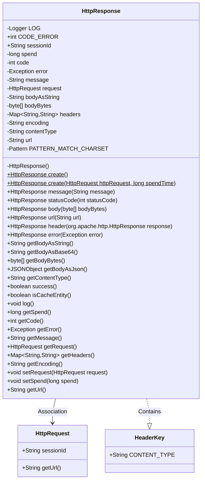

# Basic Information

|      |      |
|------|------|
| Name | HttpResponse |
| Language | .java |
| Code Path | WeFe/common/java/common-lang/src/main/java/com/welab/wefe/common/http/HttpResponse.java |
| Package Name | com.welab.wefe.common.http |
| Dependencies | ['com.alibaba.fastjson.JSON', 'com.alibaba.fastjson.JSONObject', 'com.welab.wefe.common.fastjson.LoggerValueFilter', 'com.welab.wefe.common.util.StringUtil', 'org.apache.commons.codec.binary.Base64', 'org.apache.commons.lang3.StringUtils', 'org.apache.http.Header', 'org.slf4j.Logger', 'org.slf4j.LoggerFactory', 'java.io.UnsupportedEncodingException', 'java.nio.charset.StandardCharsets', 'java.util.HashMap', 'java.util.Map', 'java.util.regex.Matcher', 'java.util.regex.Pattern'] |
| Brief Description | The HttpResponse class encapsulates HTTP response data, including fields such as status code, time elapsed, error message, request headers, and response body, providing functionalities for logging, JSON parsing, and encoding processing. |

# Description

The `HttpResponse` class encapsulates HTTP response data, including attributes such as status code, time elapsed, error message, request body, response headers, and content type. It provides methods for creating response objects, supporting the configuration of status codes, message bodies, URLs, and header information. The class includes methods for parsing the response body into strings, Base64, or JSON, as well as functionality to determine whether the request was successful. It also offers logging methods for outputting response details. Constants such as error codes and content-type headers are defined within the class, and automatic charset encoding detection is supported.

# Class Summary

| Name   | Type  | Description |
|-------|------|-------------|
| HttpResponse | class | The HttpResponse class encapsulates HTTP response data, including status codes, time consumption, error messages, request headers, response bodies, and encoding processing, with support for logging and multiple format conversions. |

## Class HttpResponse

|      |      |
|------|------|
| Access Modifier | public |
| Type | class |
| Name | HttpResponse |
| Description | The HttpResponse class encapsulates HTTP response data, including status codes, time consumption, error messages, request headers, response bodies, and encoding processing, with support for logging and multiple format conversions. |

### UML Class Diagram

This code defines an `HttpResponse` class for encapsulating HTTP response data. The class includes attributes such as response status code, time spent, error messages, request body, response headers, etc., and provides various methods to process and transform response data. `HttpResponse` is associated with `HttpRequest`, indicating the request corresponding to the response. It also contains a static inner class `HeaderKey` for defining commonly used HTTP header fields. The class supports method chaining and offers a rich set of utility methods to handle response content, such as retrieving the response body in JSON format, Base64-encoded response body, etc., and includes logging functionality.

### Internal Method Call Graph

```mermaid
graph TD
    A["Class HttpResponse"]
    B["Static Constant: CODE_ERROR = -1"]
    C["Property: String sessionId"]
    D["Property: long spend"]
    E["Property: int code"]
    F["Property: Exception error"]
    G["Property: String message"]
    H["Property: HttpRequest request"]
    I["Property: String bodyAsString"]
    J["Property: byte[] bodyBytes"]
    K["Property: Map<String,String> headers"]
    L["Property: String encoding"]
    M["Property: String contentType"]
    N["Property: String url"]
    O["Private Constructor: HttpResponse()"]
    P["Static Factory Method: create()"]
    Q["Static Factory Method: create(HttpRequest,long)"]
    R["Fluent Methods: message()/statusCode()/body()/url()/header()/error()"]
    S["Core Method: getBodyAsString()"]
    T["Helper Methods: getBodyAsBase64()/getBodyAsJson()"]
    U["Status Checks: success()/isCacheEntity()"]
    V["Logging: log()"]
    W["Getter/Setter Method Group"]

    A --> B
    A --> C
    A --> D
    A --> E
    A --> F
    A --> G
    A --> H
    A --> I
    A --> J
    A --> K
    A --> L
    A --> M
    A --> N
    A --> O
    A --> P
    P --> Q
    A --> R
    A --> S
    S --> T
    A --> U
    A --> V
    A --> W
    Q -->|Sets| H
    Q -->|Sets| D
    Q -->|Passes| C
    R -->|Updates| G
    R -->|Updates| E
    R -->|Updates| J
    R -->|Updates| N
    R -->|Parses| M
    R -->|Parses| L
    R -->|Records| F
    S -->|Depends on| J
    S -->|Depends on| L
    S -->|Caches| I
    V -->|Invokes| S
    V -->|Invokes| U
```

The flowchart depicts the complete structure of the HttpResponse class, comprising 23 key elements and their relationships. The core features include factory methods for object creation, fluent methods for property configuration, response body processing methods (particularly character encoding handling logic), and formatted logging output functionality. The class design adopts the Builder pattern philosophy, achieving a fluent interface through method chaining while rigorously processing character encoding and content type parsing in HTTP responses. The logging system intelligently handles JSON content and filters sensitive information, with all properties exposed through standardized Getter/Setter methods.

### Field List

| Name  | Type  | Description |
|-------|-------|------|
| headers = new HashMap<>() | Map<String, String> | Defined a private Map variable named headers, with both key and value types as String, initialized as a HashMap instance. |
| spend | long | Private long integer variable `spend`, used to store numerical values such as time or monetary amounts. |
| sessionId | String | Declare a public string variable sessionId. |
| contentType | String | Declare a private string variable contentType. |
| encoding | String | Private string variable encoding. |
| PATTERN_MATCH_CHARSET = Pattern.compile("(?<=charset=)[a-z0-9\\-]+", Pattern.CASE_INSENSITIVE) | Pattern | Define a regular expression pattern to match alphanumeric characters and hyphens after "charset=", case-insensitive. |
| error | Exception | Private exception variable `error`. |
| CODE_ERROR = -1 | int | Define a static constant CODE_ERROR with a value of -1, representing an error code. |
| bodyBytes | byte[] | The private byte array `bodyBytes` is used to store byte data. |
| message | String | Private string variable message. |
| request | HttpRequest | Private HTTP request object. |
| LOG = LoggerFactory.getLogger(HttpResponse.class) | Logger | Declare a private static immutable log object LOG for logging in the HttpResponse class. |
| code | int | Private integer variable code. |
| url | String | Declare a private string variable url. |
| bodyAsString | String | Private string variable, storing the request body content. |

### Method List

| Name  | Type  | Description |
|-------|-------|------|
| header | HttpResponse | The method processes HTTP response headers to extract content type and encoding information. It iterates through all response headers, storing key-value pairs. If the header name is CONTENT_TYPE, it parses the content type and charset encoding. Returns the processed object. |
| getError | Exception | Methods to obtain the exception object, returning the stored error variable. |
| getBodyBytes | byte[] | Get the request body content in byte array form. |
| getBodyAsString | String | The method `getBodyAsString` converts the byte array `bodyBytes` into a string. If `bodyBytes` is empty, it returns null; if `bodyAsString` is already cached, it returns directly; otherwise, it converts using the specified encoding or defaults to UTF-8, logging an error message if an exception occurs. |
| getBodyAsJson | JSONObject | The method getBodyAsJson checks if the request is successful, then parses bodyAsString into a JSONObject; otherwise, it returns an empty object. If successful but bodyAsString is empty, it returns null. |
| create | HttpResponse | The static method `create` takes an `HttpRequest` and a duration parameter, then creates and returns an `HttpResponse` object containing the request, duration, and session ID. |
| error | HttpResponse | Error handling method for HttpResponse, returns itself after setting the error code, exception object, and exception message. |
| url | HttpResponse | Set the HTTP response URL and return the current object. |
| create | HttpResponse | The static method `create` returns an `HttpResponse` object, with default parameters being `null` and `0`. |
| getContentType | String | Methods to obtain the content type, returning the value of the contentType variable as a string type. |
| getBodyAsBase64 | String | This method converts the byte array bodyBytes into a Base64-encoded string and returns it. |
| message | HttpResponse | This is a Java method used to set the response message and return the current object instance. The method is named `message`, takes a `String` parameter `message`, and returns the `HttpResponse` type. |
| getMessage | String | This is a Java method that returns the value of the string-type message variable. |
| success | boolean | The method `success` checks whether `error` is null and returns a boolean value. |
| body | HttpResponse | Set the HTTP response body byte array and return the current object instance. |
| statusCode | HttpResponse | This method sets the HTTP response status code and returns the current object, supporting method chaining. |
| isCacheEntity | boolean | The method `isCacheEntity` checks whether the request is null and returns a boolean value. |
| log | void | This method is used to log HTTP request logs. If the content type is JSON, it formats the output; after removing line breaks, it logs information or error logs based on whether the request succeeds or fails, including the session ID, time taken, URL, status code, message, and content. |
| getSpend | long | This is a public method that returns the value of the long integer variable spend. |
| getRequest | HttpRequest | Methods to Obtain an HTTP Request Object. |
| getHeaders | Map<String, String> | Return the headers map. |
| getEncoding | String | Methods to obtain the current encoded string. |
| setRequest | void | Set the HTTP request object. |
| setSpend | void | The method to set the spending amount assigns the parameter value to the class's spend attribute. |
| getUrl | String | Methods to obtain URL strings. |
| getCode | int | The method getCode returns the value of the integer variable code. |

