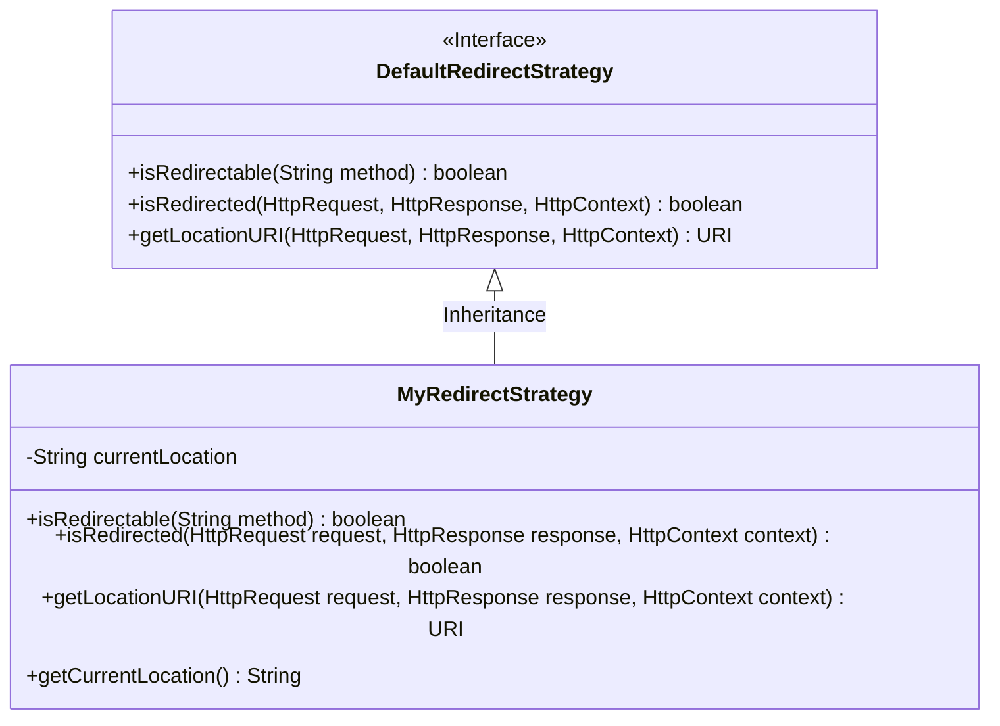
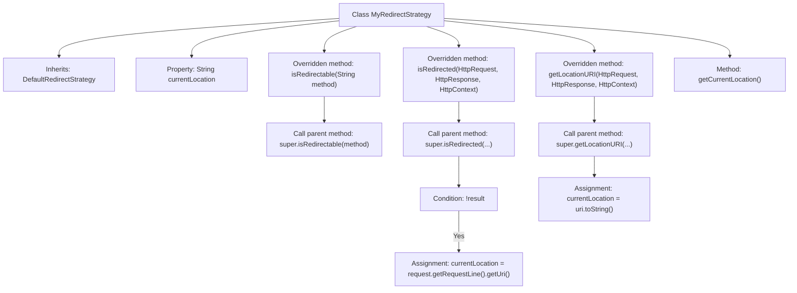

# Basic Information

|      |      |
|------|------|
| Name | MyRedirectStrategy |
| Language | .java |
| Code Path | WeFe/common/java/common-lang/src/main/java/com/welab/wefe/common/http/MyRedirectStrategy.java |
| Package Name | com.welab.wefe.common.http |
| Dependencies | ['org.apache.http.HttpRequest', 'org.apache.http.HttpResponse', 'org.apache.http.ProtocolException', 'org.apache.http.impl.client.DefaultRedirectStrategy', 'org.apache.http.protocol.HttpContext', 'java.net.URI'] |
| Brief Description | The custom redirect strategy class MyRedirectStrategy extends DefaultRedirectStrategy, overriding the isRedirected and getLocationURI methods to track the current request or redirect URL, while providing getCurrentLocation to retrieve the current address. |

# Description

The code defines a class named MyRedirectStrategy, which inherits from DefaultRedirectStrategy and is used to handle HTTP redirection logic. The class contains a currentLocation field to store the current URL address. It overrides three methods: isRedirectable determines whether a request can be redirected, isRedirected checks if redirection is needed and updates currentLocation to the request address when no redirection occurs, and getLocationURI updates currentLocation to the redirection target address during redirection. Finally, it provides a getCurrentLocation method to retrieve the current URL.

# Class Summary

| Name   | Type  | Description |
|-------|------|-------------|
| MyRedirectStrategy | class | Custom redirect strategy class `MyRedirectStrategy`, inherits from `DefaultRedirectStrategy`, tracks the current request URL by overriding methods, and provides a method to retrieve the current URL. |

## Class MyRedirectStrategy

|      |      |
|------|------|
| Access Modifier | public |
| Type | class |
| Name | MyRedirectStrategy |
| Description | Custom redirect strategy class `MyRedirectStrategy`, inherits from `DefaultRedirectStrategy`, tracks the current request URL by overriding methods, and provides a method to retrieve the current URL. |

### UML Class Diagram

This code demonstrates a custom redirect strategy class `MyRedirectStrategy` that inherits from the `DefaultRedirectStrategy` interface. Its primary functionality is tracking the current address of HTTP requests: it updates the location via `getLocationURI` when redirection occurs, and captures the request URI through `isRedirected` when no redirection happens. The class maintains a private field `currentLocation` and exposes this value through the public method `getCurrentLocation`. This design extends basic redirection functionality by adding location tracking capabilities, making it suitable for scenarios requiring monitoring of HTTP request chains.

### Internal Method Call Graph

This code demonstrates an HTTP redirect strategy class MyRedirectStrategy that inherits from DefaultRedirectStrategy. Key functionalities include: determining redirect necessity and logging current URL via isRedirected method; obtaining redirect URI and updating current location through getLocationURI method; providing getCurrentLocation method to retrieve stored location information. The flowchart clearly illustrates method call chains and critical logic branches, particularly the invocation of parent class methods and updates to the currentLocation property.

### Field List

| Name  | Type  | Description |
|-------|-------|------|
| currentLocation | String | The string variable at the current storage location. |

### Method List

| Name  | Type  | Description |
|-------|-------|------|
| getCurrentLocation | String | Get the string value of the current position. |
| getLocationURI | URI | Rewrite the method to obtain the request URI, save the current address, and return the URI. |
| isRedirected | boolean | This method checks whether the HTTP request has been redirected. If no redirection occurs, it sets the current URL as the request address. Finally, it returns the redirection judgment result. |
| isRedirectable | boolean | Rewrite the method `isRedirectable` to directly call the parent class implementation for determining whether the method can be redirected. |

