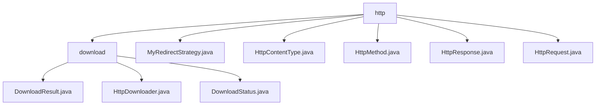

# Basic Information

|      |      |
|------|------|
| Name | http |
| Language | .java |
| Code Path | WeFe/common/java/common-lang/src/main/java/com/welab/wefe/common/http |
| Package Name | docs.common.java.common-lang.src.main.java.com.welab.wefe.common.http |
| Brief Description | The HTTP download module supports multi-threaded chunked downloads, including state management and resumable transfers. It includes core classes such as HttpDownloader and DownloadResult, relying on Apache HttpClient. Supporting utilities include redirect policies, HTTP method enums, content-type constants, and request/response wrapper classes, with support for HTTPS and connection pooling. |

# Description

## Overview  
The core responsibility of this module is to implement end-to-end HTTP communication management, including file downloads, request processing, and response parsing. The interface specifications encompass DownloadResult state encapsulation, HttpRequest/HttpResponse request-response interactions, and protocol control via HttpMethod/HttpContentType. Key data structures include DownloadResult (progress tracking), HttpResponse (status code/response body), and MyRedirectStrategy (URL redirection), functioning similarly to communication middleware. External dependencies include Apache HttpClient and SSL/TLS libraries. For example, large file transfers are achieved through chunked downloads, while HTTP method validity is constrained via enumerations.

## Primary Business Scenarios  
Typical applications include multithreaded file downloads (create → chunk → verify) and RESTful API calls (GET/POST requests). The interaction pattern adopts factory methods (HttpRequest.create) and state callbacks (DownloadResult), resembling a pipes-and-filters architecture. Full functionality supports HTTPS secure transmission, content-type negotiation (JSON/FORM), and automatic redirection (MyRedirectStrategy). API types include command pattern (start download) and builder pattern (chained configuration). Examples include automatic handling of 302 redirects and intelligent parsing of JSON response bodies.

### Package Internal Structure View

This flowchart illustrates the hierarchical structure of the HTTP-related modules in the WeFe project. The top level is the http directory, which contains 5 direct child files (such as MyRedirectStrategy.java) and 1 subdirectory named download. The download subdirectory further contains 3 Java files that implement download-related functionalities. The entire structure clearly reflects the functional division of the HTTP module, with the top level handling general HTTP functionalities and the download subdirectory specifically managing download-related features.

# File List

| Name   | Type  | Description |
|-------|------|-------------|
| [MyRedirectStrategy.java](MyRedirectStrategy.md) | file | The custom redirect strategy class MyRedirectStrategy extends DefaultRedirectStrategy, overriding the isRedirected and getLocationURI methods to track the current request or redirect URL, while providing getCurrentLocation to retrieve the current address. |
| [HttpContentType.java](HttpContentType.md) | file | The HttpContentType class defines four HTTP content type constants: JSON, FORM, MULTIPART, and TEXT. |
| [HttpMethod.java](HttpMethod.md) | file | Define an HTTP method enumeration, including GET, POST, PUT, HEAD, DELETE, where POST and PUT allow request bodies. |
| [HttpResponse.java](HttpResponse.md) | file | The HttpResponse class encapsulates HTTP response data, including fields such as status code, time elapsed, error messages, request headers, and response body. It provides functionalities for logging, JSON parsing, and encoding processing. |
| [HttpRequest.java](HttpRequest.md) | file | The HttpRequest class encapsulates HTTP request functionality, supporting GET/POST methods. It allows configuration of timeout, retry, headers, parameters, cookies, etc., with UTF-8 encoding as default and includes SSL support. |
| [download](download/_module.md) | package | The DownloadResult class records download status, size, files, etc. The HttpDownloader handles HTTP downloads, checks files, writes in chunks, and updates status. The DownloadStatus enum defines five download states: Ready, Downloading, Completed, Failed, Canceled. |

