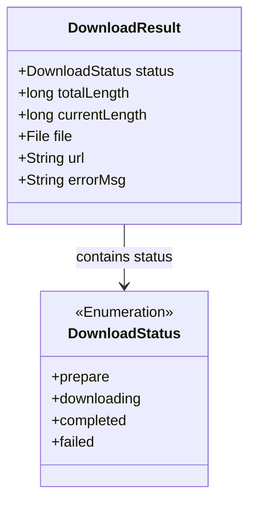
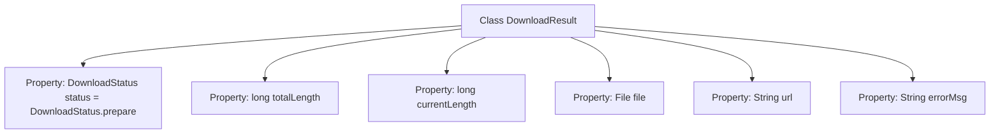

# Basic Information

|      |      |
|------|------|
| Name | DownloadResult |
| Language | .java |
| Code Path | WeFe/common/java/common-lang/src/main/java/com/welab/wefe/common/http/download/DownloadResult.java |
| Package Name | com.welab.wefe.common.http.download |
| Dependencies | ['java.io.File'] |
| Brief Description | The DownloadResult class contains the download status, total file size, current size, file object, URL, and error information. |

# Description

The `DownloadResult` class is used to represent the result status of a download task, including the download status `status` (initialized as `prepare`), total file size `totalLength`, currently downloaded size `currentLength`, downloaded file object `file`, download URL `url`, and error message `errorMsg`. These fields collectively provide comprehensive progress and result information for the download task.

# Class Summary

| Name   | Type  | Description |
|-------|------|-------------|
| DownloadResult | class | The DownloadResult class contains the download status, total file size, current size, file object, URL, and error message. |

## Class DownloadResult

|      |      |
|------|------|
| Access Modifier | public |
| Type | class |
| Name | DownloadResult |
| Description | The DownloadResult class contains the download status, total file size, current size, file object, URL, and error message. |

### UML Class Diagram

This class diagram illustrates the data structure of a download result. The DownloadResult class contains six public fields: status represents the download status enumeration (prepare/downloading/completed/failed), totalLength and currentLength record file size and progress, file stores the target file, url saves the download address, and errorMsg logs error information. DownloadStatus is used as an associated enumeration class, clearly describing the possible state transitions during the download process. This design is suitable for scenarios requiring tracking of download progress and results.

### Internal Method Call Graph

This flowchart illustrates the structure of the DownloadResult class, which contains six core properties: status indicates the download status (initialized as prepare), totalLength and currentLength record the total file size and current progress respectively, file stores the target file object, url holds the download link address, and errorMsg is used to store error messages. All properties are at public access level and can be directly accessed and modified externally.

### Field List

| Name  | Type  | Description |
|-------|-------|------|
| currentLength | long | Current length value, type is long integer. |
| url | String | public string variable url, used to store the web address. |
| totalLength | long | Declare a public long integer variable totalLength. |
| file | File | Declare a public file type variable named file. |
| status = DownloadStatus.prepare | DownloadStatus | Download status initialized to preparing. |
| errorMsg | String | Declare a public string variable errorMsg to store error messages. |

### Method List

| Name  | Type  | Description |
|-------|-------|------|

